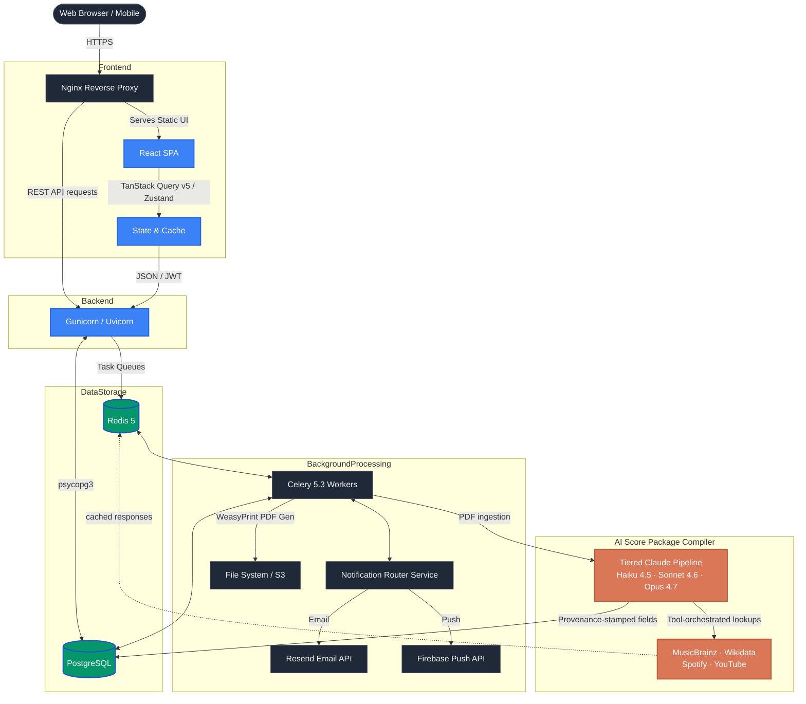

# 🎼 VoctManager | Enterprise Choral OS & Digital Operations Platform

🌍 *Read this in other languages: [English](README.md), [Polski](README.pl.md).*


**VoctManager** is a high-performance, dual-architecture enterprise resource planning (ERP) and digital operations platform. Engineered specifically as the official digital infrastructure for the professional vocal ensemble **VoctEnsemble**, it seamlessly bridges the gap between complex production logistics, secure asset management, and an immersive, cinematic digital experience.

The platform strictly adheres to **Feature-Sliced Design (FSD)** architecture, ensuring massive scalability, domain separation, and robust long-term maintainability.

🌐 **Live Public Experience:** [test.voctensemble.com](https://test.voctensemble.com)
🔐 **Enterprise Panel (Demo):** [test.voctensemble.com/panel](https://test.voctensemble.com/panel)

---

## 🏛️ System Architecture & Engineering Standards

The platform is built on a highly decoupled architecture designed for high availability, offline-resilient caching, and asynchronous background processing. 



---

## ✨ Core Enterprise Features

### 1. Cinematic "Ethereal" UX (Frontend)
- **Zero-Layout-Shift Architecture:** Suspense boundaries + `<EtherealLoader>` + strict skeleton states keep CLS at 0 during async fetches — no jank, ever.
- **60FPS Kinematics:** Animations driven exclusively by `transform` / `opacity` via **Framer Motion v12**, with **Lenis** smooth-scroll synced to the React render cycle. Custom hooks (e.g. `useMouseAndGyro`) map device telemetry to UI micro-interactions.
- **Staggered Bento Dashboards:** All panel views composed with `<StaggeredBentoContainer>` / `<StaggeredBentoItem>` over a shared glassmorphism token set (`shadow-glass-ethereal`) — spatial, predictable, and theme-driven.
- **EAA Accessibility:** Radix UI Primitives + semantic HTML to meet the European Accessibility Act baseline.

### 2. AI-Powered Score Package Compiler
- **Tiered Claude Pipeline:** Multi-stage ingestion that scales the model to the task — Haiku 4.5 for fast classification, Sonnet 4.6 for enrichment, Opus 4.7 for the hardest reasoning. Adaptive thinking + `effort` parameter let Claude allocate compute dynamically.
- **Canonical Identity Resolution:** Composer and work deduplication via **MusicBrainz MBID** and **Wikidata QID** cross-referencing — the AI extracts, but never hallucinates, biographical facts or canonical IDs.
- **External Metadata Enrichment:** Tool-orchestrated lookups across MusicBrainz, Wikidata, Spotify Web API, and YouTube Data API v3, with Redis-cached responses, exponential-backoff retries, and graceful degradation when any source is unavailable.
- **Audit-Grade Provenance:** Every AI- or API-sourced field is stamped with `(model, prompt_version, source_reference, confidence, retrieved_at)` in a generic-FK `ProvenanceRecord` table — enabling one-click regeneration and forensic compliance review.
- **Cost-Aware by Construction:** End-to-end ingestion of a single PDF score averages **~$0.20** (composer + work + program note + IPA + singing translation). Per-entity hard ceilings enforced at the Celery task boundary prevent runaway spend; Anthropic prompt caching (`cache_control: ephemeral`) drives cache-read tokens to dominate on repeat runs, slashing cost ≥80%.
- **Conductor-in-the-Loop:** AI suggests, conductor decides. Every extraction surfaces a confidence score and a review screen — the platform never silently mutates canonical repertoire.

### 3. Enterprise OS & Logistics (Backend)
- **Granular RBAC:** Deep, Role-Based Access Control matrix (Admin, Manager, Artist, Crew) securing endpoints, data payloads, and UI visibility.
- **Web Push & Real-Time Alerts:** Native-like, real-time push notifications built on the W3C VAPID standard. Handled asynchronously via Celery alongside a robust transactional email engine, keeping artists instantly updated on casting and schedule changes.
- **Calendar Synchronization (iCal):** Seamless external calendar integration, providing auto-generated iCal feeds for Google Calendar and Apple Calendar synchronization.
- **Optimistic UI:** Aggressive server-state caching using **@tanstack/react-query v5.91+**, delivering a zero-latency feel for critical mutations (e.g., attendance confirmation, casting updates).
- **Asynchronous Document Engine:** Production workflows, such as dynamic Contract generation and Run Sheet compilation, are offloaded to **Celery workers** and **WeasyPrint**, guaranteeing the main thread remains unblocked.
- **Smart Archive & Asset Protection:** Secure, token-gated distribution of sensitive repertoire assets (Sheet Music PDFs, Reference Audio) tied strictly to active project casting.
- **Micro-Casting System:** Touch-ready Drag & Drop interfaces (`@dnd-kit/core`) for building complex concert programs and managing individual artist assignments.
- **Internationalization (i18n):** Full localization support (English, French, Polish) tailored for international touring and diverse artist rosters.

---

## 🛠️ Tech Stack (2026 Standards)

### Frontend Environment
* **Core:** React 19.2+, Vite 7.3+, TypeScript 5.9+
* **Architecture:** Feature-Sliced Design (FSD)
* **Styling:** Tailwind CSS v4.2+ (with Ethereal Design System tokens), `clsx`, `tailwind-merge`
* **State & Fetching:** Zustand 5+, `@tanstack/react-query` v5.91+
* **Motion & Interactions:** Framer Motion v12+, `@dnd-kit/core` v6+ (TouchSensor)
* **Forms:** React Hook Form v7+ combined with Zod v4.3+

### Backend Environment
* **Core:** Python 3.12+, Django 6.0+, Django REST Framework (DRF) 3.16+
* **Validation & Typing:** Strict Python Type Hints, Pydantic 
* **Database:** PostgreSQL (via `psycopg` v3 driver)
* **Authentication:** JWT via `djangorestframework-simplejwt`
* **Message Broker & Workers:** Redis 5+, Celery 5.3+
* **Document Generation:** WeasyPrint v68+, pypdf v5+
* **AI / Repertoire Intelligence:** Anthropic Python SDK (Claude Opus 4.7 / Sonnet 4.6 / Haiku 4.5), adaptive thinking, prompt caching, structured output via Pydantic schemas

### Infrastructure & DevOps
* **Containerization:** Docker & Docker Compose (Zero-parity between Dev and Prod)
* **Web Server:** Nginx, Gunicorn 21+ (Uvicorn for async)
* **Static Asset Management:** WhiteNoise

---

## 🔒 Security & Data Compliance

Processing artist contracts, rehearsal schedules, and copyrighted musical material requires uncompromising security:

### Authentication & Access Control
* **Stateless Authentication:** Secure, `httpOnly` cookie strategies with JWT rotation to mitigate XSS and CSRF vectors.
* **Granular RBAC:** Role-based access matrices (Admin, Manager, Artist, Crew) with fine-grained endpoint and payload restrictions.
* **Token-Gated Asset Distribution:** Sensitive repertoire (Sheet Music PDFs, Reference Audio) secured with time-limited, signed tokens tied exclusively to active project participation.

### Data Protection & Privacy
* **GDPR Compliance:** Built-in data minimization workflows and soft-deletion mechanisms to preserve production history while meeting strict privacy regulations.
* **Field-Level Encryption:** Sensitive fields (contracts, payroll data) encrypted at rest using FERNET cipher.
* **Audit Logging:** Immutable transaction logs for all mutations on HR and financial records, enabling forensic analysis and compliance reporting.

### Domain Integrity
* **Relational Constraints:** Strict foreign key and check constraints at the database layer prevent data corruption during complex multi-entity operations (e.g., casting rollbacks, contract terminations).
* **Pydantic Validation:** Service-layer DTOs enforce type safety and business rule validation before persistence, eliminating silent data degradation.

---

## 🚦 Engineering Roadmap (2026 Vision)

VoctManager is architected for continuous evolution toward production-grade observability and resilience:

- [x] **Core ERP & Logistics:** Complete domain models for projects, rosters, contracts, and scheduling.
- [x] **Event-Driven Notifications:** Async notification routing with Resend (email) and Firebase (push) providers.
- [x] **Containerization & Orchestration:** Docker & Docker Compose with zero-parity between Dev and Prod environments.
- [x] **Asynchronous Processing:** Celery + Redis for background tasks (document generation, batch notifications, data export).
- [x] **Score Compiler — Foundations:** Canonical domain schema (`Composer.mbid`, `Piece.mbid_work`, `ScoreEdition`, `Movement`, `Translation`, `Recording`, `Annotation`, `ProgramNote`, `ProvenanceRecord`), tiered Claude wrapper with adaptive thinking + cost tracking + prompt caching, and Redis-cached external clients (MusicBrainz, Wikidata, Spotify, YouTube).
- [ ] **Score Compiler — Ingestion Pipeline:** Celery chain that extracts PDF metadata, resolves composers/works against MusicBrainz, generates program notes + IPA + singing translations, and surfaces a conductor review screen.
- [ ] **Score Compiler — Concert Assembly:** WeasyPrint + pypdf workflow producing a polished concert binder (cover, TOC, per-piece front matter, original scores) on demand.
- [ ] **Score Compiler — Annotation Editor:** PDF.js + Konva overlay for in-browser markup (highlight, comment, freehand, page reorder) with versioned, layer-aware persistence and export-time flattening.
- [ ] **Observability & APM:** Sentry for error tracking, Prometheus + Grafana for metrics and dashboards.
- [ ] **Distributed Tracing:** OpenTelemetry instrumentation for end-to-end request tracing across services and external APIs.
- [ ] **Automated Testing:** PyTest coverage for critical business paths (contract generation, payroll calculations, casting algorithms).
- [ ] **CI/CD Pipelines:** GitHub Actions for automated lint, build, test, and zero-downtime deploys.
- [ ] **Advanced Caching:** Redis cluster for session management and distributed cache invalidation.
- [ ] **Rate Limiting & DDoS Protection:** CloudFlare + WAF rules for API abuse prevention.
- [ ] **Database Replication:** PostgreSQL streaming replication for high availability and disaster recovery.
- [ ] **SMS & Voice:** Twilio integration for rehearsal reminders and critical schedule alerts.

---

## 🎬 Landing Experience (Public Site)

The marketing site is a fully custom React port of a hand-authored vanilla HTML page (kept side-by-side as the nginx fallback). It composes a preloader → threshold gate → sticky chrome → hero → manifest → three "aether interludes" weaving through past concerts → final support → coda — all running at a sustained 60 FPS over Lenis-driven smooth scroll.

The full experience relies on scroll-linked kinematics, audio cues, parallax, custom cursor, and threshold-gate physics. **Static screenshots and GIFs cannot do it justice** — they capture frames, not flow. The live site is publicly accessible:

### ▶ [voctensemble.com](https://voctensemble.com) — open in a desktop browser with sound on

> The stable production landing at `/` is the hand-authored vanilla [`LandingPage.html`](frontend/src/pages/marketing/LandingPage.html). The React port lives at [`/home`](https://voctensemble.com/home) (preview path while the migration finalizes) — same composition, now driven by `<ReactLenis>`, Framer Motion v12, and Suspense-aware code splitting.

| Section | What to watch for |
|---|---|
| **Preloader → Threshold Gate** | Chant audio fade-in, gate physics, first-paint orchestration |
| **Hero → Manifest** | Custom cursor, scroll-linked typography reveal, noise overlay |
| **Aether Interludes I / II / III** | Rite-glow synced to scroll progress, Roman-numeral Latin motifs |
| **Path of Past Concerts** | Parallax stack, smooth-details accordion |
| **Final Support / Vault Flow** | Multi-step donation sheet with regulamin + gratitude/failure modals |

> **Source:** [`HomePage.tsx`](frontend/src/pages/marketing/HomePage.tsx) — composes 14 widgets under a `<VaultProvider>` and `<ReactLenis root>`. The hand-authored fallback at [`LandingPage.html`](frontend/src/pages/marketing/LandingPage.html) is intentionally kept side-by-side as the nginx default for users who block JS.

---

## 🤖 AI Score Package Compiler

| Score Ingestion (Upload & Tiered Analysis) | Conductor Review (AI-Extracted Repertoire) |
|:---:|:---:|
|  |  |

---

## 📸 System Interface (Ethereal Design System)

| Main Dashboard (Staggered Bento OS) | Project & Logistics Editor |
|:---:|:---:|
|  |  |
| **Locations Management** | **Notifications Center** |
|  |  |
| **System Settings** | **Knowledge Base** |
|  |  |
| **Locations Atlas (Map View)** | **Sheet Music Archive** |
|  |  |

---

## 📊 Performance Budget & AI Cost Telemetry

The platform enforces explicit budgets at both the frontend (perceived performance) and backend (AI spend) layers. Numbers below are target ceilings measured in production.

### Frontend Lighthouse

The cinematic entry gate is bypassed with `?nogate` so the auditor measures the page itself, not the modal overlay.

| Route | Performance | Accessibility | Best Practices | SEO | Source |
|---|:---:|:---:|:---:|:---:|---|
| `/home` &nbsp;(`HomePage.tsx`, React 19 SPA) | **90** | 91 | 96 | 92 | [PageSpeed Insights ↗](https://pagespeed.web.dev/analysis?url=https%3A%2F%2Fvoctensemble.com%2Fhome%3Fnogate) |
| `/` &nbsp;(`LandingPage.html`, vanilla static) | 98 | 91 | 100 | 92 | local Lighthouse\* |

<sub>\*The static landing uses its own inline vanilla entry-gate (separate localStorage key) that PageSpeed cannot pre-dismiss, so its score is from local Lighthouse rather than PageSpeed. Both routes share the same foundation — self-hosted variable fonts (zero third-party CDN), `scrollbar-gutter: stable` for layout stability, and `transform`/`opacity`-only animation. The static page scores higher because a single hand-authored HTML page ships no SPA runtime; the React port trades ~8 performance points for component reuse, type safety, and multi-page maintainability across the VoctEnsemble + VoctFoundation surface — a deliberate architectural call.</sub>

**Render-time targets enforced regardless of route:**

| Metric | Target | Notes |
|---|---|---|
| **CLS** (Cumulative Layout Shift) | < 0.1 | Measured **0.003** on `/home` — pinned via `scrollbar-gutter: stable` + `contain` on full-viewport overlays |
| **INP** (Interaction to Next Paint) | ≤ 200 ms | |
| **JS bundle (gzipped, route-split)** | ≤ 180 kB per route chunk | Maps SDK (~350 kB) scoped to authenticated panel only |
| **Animation frame rate** | 60 FPS sustained | `transform` / `opacity` only |

### AI Score Compiler (Per-Piece Ingestion)

| Stage | Model | Avg. cost | Cache-read share |
|---|---|---|---|
| PDF metadata classification | Haiku 4.5 | ~$0.01 | _placeholder_ |
| Composer + work resolution (MusicBrainz / Wikidata) | Sonnet 4.6 | ~$0.04 | _placeholder_ |
| Program note + IPA + singing translation | Opus 4.7 | ~$0.13 | _placeholder_ |
| Provenance stamping + persistence | — (no LLM) | ~$0.02 (DB/API) | n/a |
| **End-to-end average per PDF** | mixed | **~$0.20** | ≥80% on repeat runs |

> Anthropic prompt caching (`cache_control: ephemeral`) is enabled on every tiered call, so cache-read tokens dominate after the first ingestion of a given piece — slashing marginal cost on re-runs and review iterations.

---

## 🚀 Quickstart (Local Infrastructure)

The project utilizes Docker Compose for a standardized development environment.

### Prerequisites
* Docker and Docker Compose (v2)
* GNU Make

### Initialization

1. **Clone the repository:**
   ```bash
   git clone https://github.com/bedikryst/voctmanager.git
   cd voctmanager
   ```

2. **Environment Configuration:**
   ```bash
   cp .env.example .env
   cp frontend/.env.example frontend/.env
   ```

3. **Orchestrate Infrastructure:**
   Using the provided Makefile for streamlined execution:
   ```bash
   make up
   ```

4. **Database Provisioning:**
   ```bash
   make migrate
   make seed
   make superuser
   ```

5. **Frontend Development Server (Optional for UI engineering):**
   ```bash
   cd frontend
   npm install
   npm run dev
   ```

   * API Access: `http://localhost:8000/api/`
   * Frontend Application: `http://localhost:5173`

### 📖 API Documentation
The backend provides fully interactive, automatically generated OpenAPI (Swagger) documentation. Once the containers are running, access it at:
👉 **[http://localhost:8000/api/docs](http://localhost:8000/api/docs)**

---

## 👨‍💻 Engineering Leadership

**Krystian Bugalski**  
Software Engineer & UI/UX Specialist  
* [LinkedIn](https://www.linkedin.com/in/krystian-bugalski)  
* [GitHub](https://github.com/bedikryst)  

*Designed and engineered with strict adherence to the VoctManager 2026 AI directives and Ethereal design principles.*
