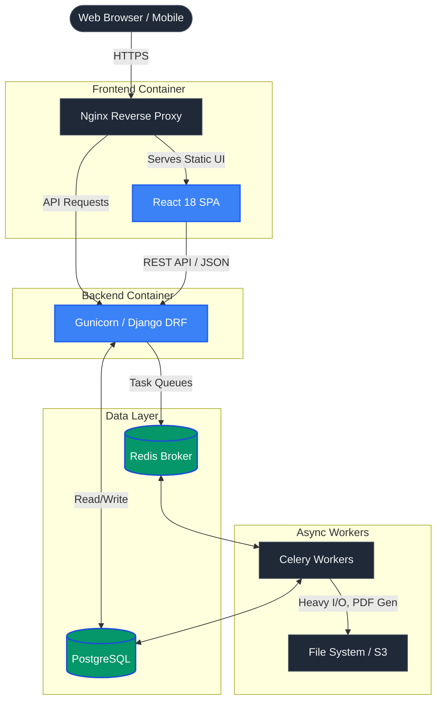
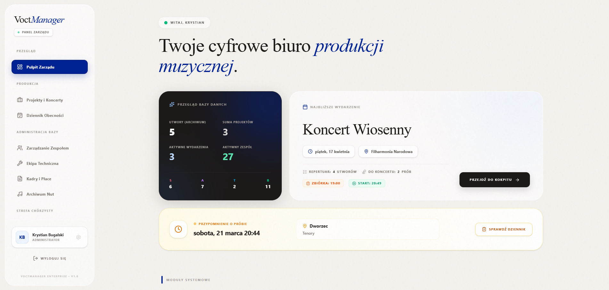
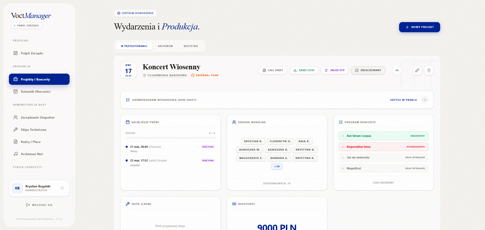
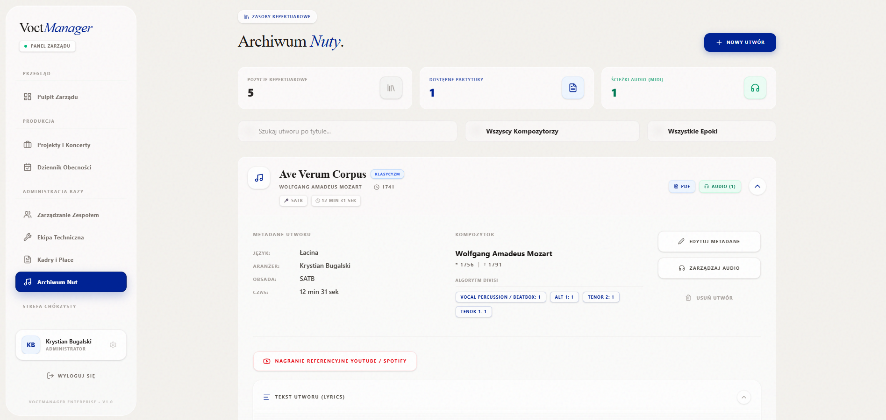
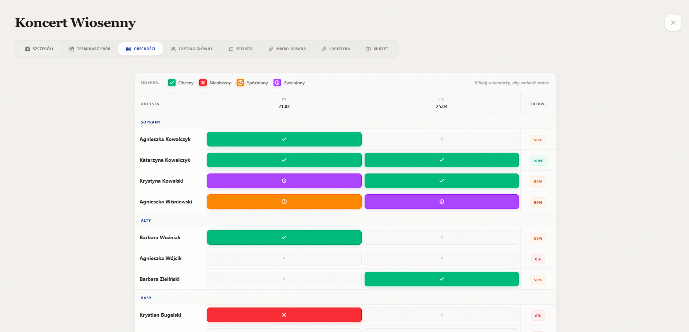

# 🎼 VoctManager | Enterprise Choral Operating System & Digital Experience


**VoctManager** is a high-performance, dual-architecture platform designed to bridge the gap between immersive digital storytelling and robust enterprise resource planning (ERP). Built as the official digital infrastructure for the professional vocal ensemble **VoctEnsemble**.

🌐 **Live Public Experience (Beta):** [test.voctensemble.com](https://test.voctensemble.com)

---

## 🏛️ System Architecture

The application relies on a modern, decoupled architecture designed for high availability, zero-layout-shift caching, and asynchronous background processing.



## 🎭 Part I: The Public Face (Immersive Web Experience)
A highly optimized, cinematic interface built for storytelling and brand building, delivering a premium user experience.

* 🎬 **Scrollytelling & Kinematics:** Complex mathematical scroll kinematics using **Framer Motion**. Elements dynamically react to scroll positions, controlling video scaling, opacity masks, and architectural grids.
* 🌊 **Fluid Mechanics:** Integrated **Lenis** for 60FPS fluid scrolling mechanics, ensuring animations remain perfectly synced and buttery smooth across all devices.
* 🎛️ **Hardware-Accelerated Physics:** Custom interactive hooks (`useMouseAndGyro`, `useScrollyAudio`) bridging hardware inputs (gyroscope, cursor velocity) with UI micro-interactions.
* ♿ **Accessibility (WCAG):** UI engineered with European Accessibility Act (EAA) compliance in mind, including semantic HTML and aria-attributes for screen readers.

---

## 🏢 Part II: The Enterprise OS (Core Engineering)
A secured, scalable ERP/CRM platform that digitizes and automates production workflows for management and artists.

* 🛡️ **Role-Based Access Control (RBAC):** Granular security policies ensuring that sensitive contracts, payroll data, and intellectual property remain strictly isolated.
* 🗄️ **Smart Archive & Asset Protection:** Digital repertoire management with secure distribution of sheet music (PDFs) and practice tracks. 
* 📅 **Production Automation:** Automated generation of complex documents, including *Call Sheets* and *Contracts*, offloaded to background **Celery** workers to keep the main thread unblocked.
* 🎵 **Micro-Casting & Setlists:** Interactive concert program builder using a fluid, touch-ready Drag & Drop interface (`@hello-pangea/dnd`).
* ⚡ **Optimistic UI & Caching:** Deep integration of **Zustand** and **React Query** for aggressive server-state caching, providing a zero-latency feel even on poor mobile networks during backstage use.

---

## 🔒 Security, Privacy & Data Compliance

Processing HR records, financial agreements, and copyrighted artistic materials requires enterprise-grade security.

* **GDPR Ready:** Designed with data minimization and soft-deletion mechanisms to preserve historical concert integrity while complying with privacy regulations.
* **Authentication:** Secure stateless authentication using HttpOnly strategies and JWT token rotation.
* **Data Integrity:** Strict database-level constraints combined with application-level validation to prevent junction-table corruption during complex casting operations.

---

## 🚦 Observability & Roadmap (2026 Vision)

VoctManager is continuously evolving toward a fully automated, observable infrastructure.

- [x] **Containerization:** Full Docker support for identical Dev/Prod environments.
- [x] **Async Processing:** Celery + Redis architecture implemented.
- [ ] **Telemetry & Error Tracking:** Pre-configured **Sentry** integration (awaiting organizational infrastructure deployment) for real-time frontend/backend error monitoring.
- [ ] **Automated QA:** Implementation of PyTest suites for critical path testing (contract generation, payroll calculations).
- [ ] **CI/CD Pipelines:** GitHub Actions deployment pipelines for automated linting, building, and zero-downtime releases.

---

## 📸 System Interface

| Main Dashboard (Bento OS) | Project Editor (Slide-over Panel) |
|:---:|:---:|
|  |  |
| **Smart Archive (Asset Management)** | **High-Density Attendance Matrix** |
|  |  |

*(Note: Replace `docs/assets/...` paths with actual screenshots of your application)*

---

## 🚀 Quickstart (Local Development)

The project relies on Docker, simplifying the bootstrapping process to just a few commands.

### Prerequisites
* Docker and Docker Compose
* Node.js (optional, for local frontend development outside the container)

### Installation

1. **Clone the repository:**
   ```bash
   git clone https://github.com/bedikryst/voctmanager.git
   cd voctmanager
   ```

2. **Set up environment variables:**
   ```bash
   cp .env.example .env
   cp backend/.env.example backend/.env
   cp frontend/.env.example frontend/.env
   ```

3. **Spin up the infrastructure:**
   ```bash
   docker compose -f docker-compose.yml -f docker-compose.prod.yml up --build -d
   ```

4. **Initialize database & seed data:**
   ```bash
   docker compose exec web python manage.py migrate
   docker compose exec web python manage.py seed_db
   docker compose exec web python manage.py createsuperuser
   ```
   * API: `http://localhost:8000/api/`
   * Frontend: `http://localhost:5173`

### 📖 API Documentation
The backend provides fully interactive OpenAPI (Swagger) documentation. Once the containers are running, access it at:
👉 **[http://localhost:8000/api/docs](http://localhost:8000/api/docs)**

---

## 👨‍💻 Author & Lead Engineer

**Krystian Bugalski**
* [LinkedIn](https://www.linkedin.com/in/krystian-bugalski)
* [GitHub](https://github.com/bedikryst)

*Engineered with precision for the future of choral management.*
