# 🎼 VoctManager | Enterprise Choral OS & Digital Operations Platform

🌍 *Read this in other languages: [English](README.md), [Polski](README.pl.md).*


**VoctManager** is a dual-architecture ERP and digital operations platform — the official digital infrastructure for the professional vocal ensemble **VoctEnsemble**. It connects production logistics, secure asset management, and a cinematic public-facing experience under one backend.

The frontend follows **Feature-Sliced Design (FSD)** and the Django backend is layered into services + selectors, keeping domains isolated and the codebase maintainable as it grows.

🌐 **Live Public Experience:** [voctensemble.com](https://voctensemble.com)

---

## 🏛️ System Architecture & Engineering Standards

The platform is built on a decoupled architecture: asynchronous background processing, client-side cache resilience (query persistence), and a clean split between the public site and the authenticated panel. 

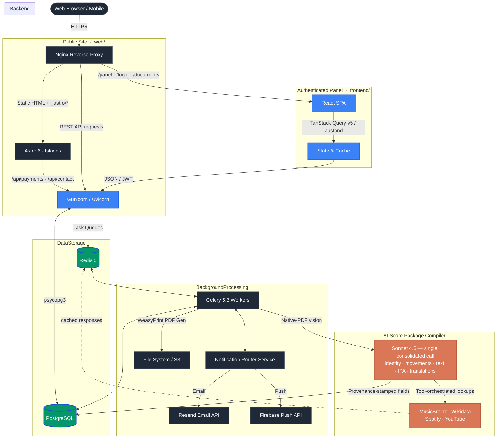

---

## ✨ Core Enterprise Features

### 1. Dual Frontend — Panel (React SPA) + Public Site (Astro)

The platform ships **two independent frontends** that share a single Django backend:

* **Panel SPA — [`frontend/`](frontend/README.md):** authenticated ERP for managers, artists, and crew (`/panel/*`). React 19 + TanStack Query + Framer Motion, strict FSD, Ethereal design system. Owns the cinematic, glassmorphic operational surface.
* **Public site — [`web/`](web/README.md):** the voctensemble.com / voctfoundation.pl landing + subpages (`/`, `/koncerty`, `/o-nas`, `/kontakt`, `/polityka-prywatnosci`). **Astro 6** (static HTML + React islands + native View Transitions), Lenis smooth-scroll, sacred-minimalism art direction in the spirit of *"Nawa światła"*. Crawlable and Ad-Grants-ready by construction.

Frontend engineering pillars:

- **Zero-Layout-Shift Architecture:** Suspense boundaries + `<EtherealLoader>` + strict skeleton states keep CLS at 0 during async fetches.
- **60FPS Kinematics:** Animations driven exclusively by `transform` / `opacity` via **Framer Motion v12** (panel) and hand-authored CSS choreography + JS rAF loops (public site). The public site runs **Lenis v1.3+** window-level smooth-scroll synced to View Transitions; the panel uses native platform scrolling.
- **Cinematic Page Transitions:** The Astro public site composes native `::view-transition-old/new(root)` keyframes (sacred fade + Y-drift + blur, 320ms / 540ms) with a shared `view-transition-name: voct-brand` so the candle mark morphs across navigations instead of cross-fading.
- **Staggered Bento Dashboards:** All panel views composed with `<StaggeredBentoContainer>` / `<StaggeredBentoItem>` over a shared glassmorphism token set (`shadow-glass-ethereal`) — spatial, predictable, and theme-driven.
- **EAA Accessibility:** Radix UI Primitives + semantic HTML to meet the European Accessibility Act baseline; the public site adds `prefers-reduced-motion` opt-outs on every animated surface.

### 2. AI-Powered Score Package Compiler
- **Native-PDF Vision Analysis:** One consolidated Sonnet 4.6 call reads the **whole** uploaded PDF visually (text layer *and* scanned pages) and returns work identity — including the key inferred from the key signature, a composer-vs-arranger split, and the stylistic period — plus movements, the printed sung text transcribed **faithfully** (no canonical-text substitution for famous hymns), line-aligned IPA, and prose translations, all together. Handles scans and real page layout instead of brittle text scraping; the PDF is cached (`cache_control: ephemeral`) so escalation retries read it back cheaply.
- **Overload-Resilient:** Anthropic capacity blips (HTTP 529 / 5xx / 429 / timeout) are classified as transient and retried **patiently** (tens of seconds → minutes), with a live "service busy, retrying" state — never a hammer-then-fail retry storm. Truncations and 4xx stay terminal and never burn budget on a doomed retry.
- **Canonical Identity Resolution:** Composer and work deduplication via **MusicBrainz MBID** and **Wikidata QID** cross-referencing — the AI extracts, but never hallucinates, biographical facts or canonical IDs.
- **External Metadata Enrichment:** Tool-orchestrated lookups across MusicBrainz, Wikidata, Spotify Web API, and YouTube Data API v3, with Redis-cached responses, exponential-backoff retries, and graceful degradation when any source is unavailable.
- **Audit-Grade Provenance — surfaced, not just stored:** Every AI- or API-sourced field is stamped with `(model, prompt_version, source_reference, confidence, retrieved_at)` in a generic-FK `ProvenanceRecord` table — and the review cockpit renders it **per field**: an *AI · 95%* chip, a *MusicBrainz* canonical chip, or a *Verified* chip once a human edits the value, so the conductor knows exactly what to trust.
- **Cost-Governed by Construction:** A native-PDF ingest averages **~$0.10–0.22**. Three independent ceilings are enforced at the Celery task boundary — a **per-run** cap, a **never-reset lifetime** cap per edition, and an **org-wide daily budget** circuit breaker (every Claude charge bills both the run and lifetime counters). Re-uploading an identical PDF (same SHA-256) is **deduplicated** — it attaches to the already-resolved work and skips the AI entirely. The audience **programme note is generated eagerly in the ensemble's language** at `effort: low` (~1¢); the cockpit regenerates it or adds another language on demand.
- **Real-Time Progress (SSE):** An async (ASGI) Server-Sent-Events endpoint streams the live step, cost, and status of each ingestion the instant the worker writes it; the browser subscribes via `EventSource` (cookie JWT) with a polling fallback. The conductor sees the AI working step-by-step from the moment of upload, on desktop and mobile.
- **Conductor Review Cockpit:** AI suggests, conductor decides. A split PDF-and-fields surface shows per-field provenance + confidence, lets the conductor **correct or delete** the AI's most error-prone outputs inline (movements, translations, reference recordings), regenerate the programme note, **cancel an in-flight run** when the wrong PDF went up, and **approve-to-publish** in one action (AWAITING → READY). Cheap hallucination guards flag impossible composition years, IPA-vs-lyrics line-count drift, and low-confidence fields — the platform never silently mutates canonical repertoire.

### 3. Enterprise OS & Logistics (Backend)
- **Granular RBAC:** Deep, Role-Based Access Control matrix (Admin, Manager, Artist, Crew) securing endpoints, data payloads, and UI visibility.
- **Web Push & Real-Time Alerts:** Native-like, real-time push notifications built on the W3C VAPID standard. Handled asynchronously via Celery alongside a robust transactional email engine, keeping artists instantly updated on casting and schedule changes.
- **Internal Messaging:** Async two-way threads between choristers and the conducting/management pool, plus per-project broadcast channels — delivered in-app + email + push with unread badges and a unified inbox. Managers get a triage workflow (assign / resolve), a searchable inbox with status filters, an idle-pane **conductor briefing deck** that surfaces what needs attention (derived client-side, zero extra fetch), and pinned channel announcements. Day-grouped streams carry sender avatars and optimistic-send cues; deliberately **not** a real-time chat (no presence/typing) — the store (`messaging` app) is decoupled from delivery (`notifications`), so each message reuses the existing notification pipeline.
- **Calendar Synchronization (iCal):** Seamless external calendar integration, providing auto-generated iCal feeds for Google Calendar and Apple Calendar synchronization.
- **Optimistic UI:** Aggressive server-state caching using **@tanstack/react-query v5.91+**, delivering a zero-latency feel for critical mutations (e.g., attendance confirmation, casting updates).
- **Asynchronous Document Engine:** Production workflows, such as dynamic Contract generation and Run Sheet compilation, are offloaded to **Celery workers** and **WeasyPrint**, guaranteeing the main thread remains unblocked.
- **Concert Score-Book Generator:** One-click, print-ready singers' book assembled from a project's repertoire — engraved editions bound behind an auto-generated title page, dotted-leader TOC, per-piece frontispiece cards (sung text · IPA · translation · programme note, drawn from the AI-resolved archive), continuous folios, and PDF bookmarks. A conductor build cockpit adds per-piece edition selection, thumbnail page-trimming, provenance-confidence readiness, and a live preview; the token-gated output is version-tracked (distribution-aware overwrite warnings) with an optional double-sided print mode. Deterministic WeasyPrint + pypdf — **zero AI at assembly time**.
- **Smart Archive & Licensed-Score Protection:** Secure, token-gated distribution of sensitive repertoire assets (Sheet Music PDFs, Reference Audio) tied strictly to active project casting. Each edition carries a **licence status** (public domain · licensed physical copies · publisher-digital · unclassified — with *unclassified treated as protected* by a safe default), driving a role-aware policy: public-domain scores export freely, while a protected edition is **in-app-only** for choristers (open / share / download withheld) and served through a **per-recipient server-side watermark** — a page-margin footer stamping *copy number · singer · concert · date*, merged on the fly without shifting page count or PDF bookmarks. Both delivery paths are covered — the single edition **and** the compiled concert score-book that physically embeds those licensed pages. Every serve (choristers and managers) is written to an append-only **access log** — the due-diligence trail a publisher review would ask for — and the build cockpit warns when a licensed edition is bound for more singers than the ensemble owns copies of. Public-domain repertoire stays completely unencumbered.
- **Digital Music Stand (In-App Score Viewer):** A performance-grade PDF reader built for a tablet on a music stand — prefetched, loader-free page turns; edge-tap / swipe navigation with out-of-the-box Bluetooth page-pedal support (arrows, PageUp/PageDown, Space); a Screen Wake Lock so the score never sleeps mid-rehearsal; an immersive fullscreen performance mode; and focal-point pinch / ctrl+wheel zoom with a live CSS preview. On top sits a **role-aware annotation engine**: the conductor writes the shared layer every cast chorister sees (plus private cues), and each singer gets a personal pencil-mark layer nobody else can read — enforced server-side, invisible even to managers. Marking is musician-native: a musical stamp palette (breath marks, dynamics, hairpins, fermata, caesura, "watch the conductor"), freehand ink + highlighter with stylus-first routing (pen draws, finger pans), pinned/inline notes, undo/redo and optimistic persistence. The stand doubles as a **rehearsal instrument**: a pitch dock plays the piece's per-voice starting pitches ("give the pitches" as a top-down arpeggio, conductor-editable inline), a compact transport remotely drives the multitrack practice player underneath the open score, and PDF bookmarks become a jump-to-piece contents drawer.
- **Micro-Casting System:** Touch-ready Drag & Drop interfaces (`@dnd-kit/core`) for building complex concert programs and managing individual artist assignments.
- **Internationalization (i18n):** Full localization support (English, French, Polish) tailored for international touring and diverse artist rosters.

---

## 🛠️ Tech Stack (2026 Standards)

### Panel SPA — [`frontend/`](frontend/README.md)
* **Core:** React 19.2+, Vite 7.3+, TypeScript 5.9+
* **Architecture:** Feature-Sliced Design (FSD)
* **Styling:** Tailwind CSS v4.2+ (with Ethereal Design System tokens), `clsx`, `tailwind-merge`
* **State & Fetching:** Zustand 5+, `@tanstack/react-query` v5.91+
* **Motion & Interactions:** Framer Motion v12+, `@dnd-kit/core` v6+ (TouchSensor)
* **Forms:** React Hook Form v7+ combined with Zod v4.3+

### Public Site (Astro) — [`web/`](web/README.md)
* **Core:** Astro 6.3+ (`build.format: "file"`), `@astrojs/react` 5+, React 19, TypeScript 6+
* **Architecture:** Astro islands — server-rendered HTML by default, React hydrated only for the donation Vault, audio Threshold gate, sticky chrome, and site cursor
* **Styling:** Hand-authored sacred-minimalism CSS — no Tailwind here, no third-party CSS framework. CSS custom-property tokens (`--candle`, `--ink`, `--paper`), self-hosted variable fonts (GDPR-strict, zero third-party)
* **Motion:** `lenis@1.3+` window-level smooth-scroll, native View Transitions API, IntersectionObserver-driven reveal pipeline, JS rAF parallax (cross-browser fallback for partial `animation-timeline` support)
* **Content:** Astro Content Collections (`concerts.yaml`, `repertoire.yaml`) + hand-curated TS modules (manifest, paths)

### Backend Environment
* **Core:** Python 3.12+, Django 6.0+, Django REST Framework (DRF) 3.16+
* **Validation & Typing:** Strict Python Type Hints, Pydantic 
* **Database:** PostgreSQL (via `psycopg` v3 driver)
* **Authentication:** JWT via `djangorestframework-simplejwt`
* **Message Broker & Workers:** Redis 5+, Celery 5.3+
* **Document Generation:** WeasyPrint v68+, pypdf v5+, pypdfium2 v4.30+ (score-thumbnail rasterisation)
* **AI / Repertoire Intelligence:** Anthropic Python SDK — ingestion runs on **Claude Sonnet 4.6** (Opus 4.8 / Haiku 4.5 wired as higher/cheaper tiers), adaptive thinking, prompt caching, Pydantic-validated structured/JSON output

### Infrastructure & DevOps
* **Containerization:** Docker & Docker Compose (Zero-parity between Dev and Prod)
* **Web Server:** Nginx, Gunicorn 21+ (Uvicorn for async)
* **Static Asset Management:** WhiteNoise

---

## 🔒 Security & Data Compliance

Processing artist contracts, rehearsal schedules, and copyrighted musical material is treated as a first-class security concern:

### Authentication & Access Control
* **Cookie-Based JWT:** Access + refresh tokens delivered exclusively in `httpOnly`, `Secure`, `SameSite=Lax` cookies (`CookieJWTAuthentication`) — the SPA never reads the token, closing the XSS exfiltration vector, with CSRF double-submit on top.
* **Granular RBAC:** Role-based access matrices (Admin, Manager, Artist, Crew) with fine-grained endpoint and payload restrictions.
* **Token-Gated Asset Distribution:** Sensitive repertoire (Sheet Music PDFs, Reference Audio) secured with time-limited, signed tokens tied exclusively to active project participation.
* **Licensed-Score Protection & Access Log:** A per-edition copyright status drives a role-aware delivery policy — public-domain scores export freely; protected editions are in-app-only for choristers and served with a **personal, server-rendered watermark** (copy number · name · concert · date). Both choke points are covered — the single edition *and* the compiled score-book binder that embeds the licensed pages — and every serve is recorded in an **append-only access log** for publisher-audit due diligence.

### Data Protection & Privacy
* **GDPR-Minded by Default:** Data-minimization workflows and a `SoftDeleteModel` (`is_deleted` + filtered default manager) that preserves production history without leaking removed records into active queries.
* **No Third-Party Font CDN:** The public site self-hosts every variable font (woff2) — zero user-IP leakage to Google Fonts / Bunny — matching the stated privacy policy.
* **Watermark by Name, Not Email:** The personal score watermark deliberately carries the singer's *name* — never their email — because the file is printed and left on music stands; the copyright layer never becomes a data-leak channel.

### Domain Integrity
* **Relational Constraints:** Foreign-key and `CheckConstraint`s at the database layer guard against corruption during multi-entity operations (e.g. casting rollbacks, contract terminations).
* **Pydantic Validation:** Service-layer DTOs enforce type safety and business-rule validation before persistence, preventing silent data degradation.

---

## 🚦 Engineering Roadmap (2026 Vision)

VoctManager is architected for continuous evolution toward production-grade observability and resilience:

- [x] **Core ERP & Logistics:** Complete domain models for projects, rosters, contracts, and scheduling.
- [x] **Event-Driven Notifications:** Async notification routing with Resend (email) and Firebase (push) — plus daily digests, rehearsal reminders, and ESP bounce/complaint suppression.
- [x] **Asynchronous Processing:** Celery + Redis for background tasks (document generation, batch notifications, reminder/digest beats).
- [x] **Containerization & Orchestration:** Docker & Docker Compose with zero-parity between Dev and Prod environments.
- [x] **Error Tracking:** Sentry SDK wired into Django for production error capture and release-health monitoring.
- [x] **Automated Testing:** Django/PyTest suite (~160 tests) across the critical paths — roster, payments, messaging, notifications, documents, archive, logistics, core — including contract generation and the AI provenance pipeline.
- [x] **CI (Backend):** GitHub Actions runs Ruff, mypy (strict), and the full test suite on PostgreSQL for every push and PR.
- [x] **AI Score Compiler — Schema, Ingestion Pipeline & Review Cockpit:** Canonical domain schema (`Composer.mbid`, `Piece.mbid_work`, `ScoreEdition`, `Movement`, `Translation`, `Recording`, `Annotation`, `ProgramNote`, `ProvenanceRecord`) plus the live Celery ingestion chain — a native-PDF Claude wrapper (vision, adaptive thinking, dual per-run/lifetime cost tracking, prompt caching, patient 529-overload retries, lenient JSON parsing, SHA-256 re-upload dedup) that reads the whole score in one consolidated call, resolves composers/works against MusicBrainz & Wikidata, extracts IPA + singing translations plus a programme note in the ensemble language, and streams live progress over SSE. A conductor **review cockpit** surfaces per-field provenance + confidence, inline correction/deletion of the AI's movements/translations/recordings, a cancel-in-flight control, and a single approve-to-publish. External clients (MusicBrainz, Wikidata, Spotify, YouTube) are Redis-cached.
- [x] **AI Score Compiler — Concert Score-Book Assembly:** WeasyPrint + pypdf binder (title page, TOC, per-piece frontispiece cards, original scores, continuous numbering, PDF bookmarks) with a conductor build cockpit — per-piece edition selection, thumbnail-driven page-range trimming, provenance-confidence readiness, live preview, distribution-aware version tracking, and a double-sided print mode (recto-start openings + outer-corner folios).
- [x] **Licensed-Score Protection:** Per-edition copyright classification driving a role-aware access policy, a per-recipient server-side watermark (footer: copy № · name · concert · date, applied at both the single-edition and score-book-binder delivery choke points without shifting page count or outline anchors), and an append-only access log for publisher due diligence — public-domain repertoire left untouched.
- [x] **Digital Music Stand — In-Browser Score Annotation:** PDF.js viewer with a custom SVG annotation overlay — freehand ink, highlighter, pinned/inline notes and a musical stamp palette (breath, dynamics, hairpins, fermata, caesura, "watch the conductor") — persisted layer-aware with server-enforced scopes: conductor shared/private layers plus a per-user personal layer that stays invisible even to managers. Stylus-first input routing, undo/redo, optimistic writes with rollback. The viewer itself is performance-grade: prefetched instant page turns, Bluetooth pedal keys, screen wake lock, immersive fullscreen mode, focal pinch zoom.
- [ ] **Score Annotation — Export-Time Flattening:** burn the shared annotation layer into the concert score-book at assembly time, plus in-viewer page reorder.
- [ ] **Field-Level Encryption & Audit Trail:** Fernet at-rest encryption for contract/financial fields and an immutable mutation log over HR/financial records for forensic review.
- [ ] **Frontend CI & End-to-End Tests:** Lint / typecheck / build pipelines for both frontends, plus Playwright E2E coverage building on the existing screenshot harness.
- [ ] **Metrics & Distributed Tracing:** Prometheus + Grafana dashboards and OpenTelemetry instrumentation for end-to-end request tracing across services and external APIs.
- [ ] **Automated Backups & Disaster Recovery:** Scheduled PostgreSQL + media backups with rotation (`infra/backup.sh`; on-droplet today, off-site copy still TODO for true DR). Media persistence + nginx delivery already ship via host bind-mounts.
- [ ] **Advanced Caching:** Redis cluster for session management and distributed cache invalidation.
- [ ] **Rate Limiting & DDoS Protection:** CloudFlare + WAF rules and DRF throttling for API abuse prevention.
- [ ] **Database Replication:** PostgreSQL streaming replication for high availability and disaster recovery.
- [ ] **EAA Accessibility Conformance:** Automated accessibility testing (axe / Playwright) to certify the European Accessibility Act baseline the UI is built against.
- [ ] **Zero-Downtime Deploys:** Blue-green / rolling release automation on top of the current single-command prod build.

---

## 🎬 Public Site — `web/` (Astro)

The voctensemble.com / voctfoundation.pl public surface is an **Astro 6** app built around a sacred-minimalism art direction ("Nawa światła") — server-rendered HTML by default, React islands hydrated only where genuine state lives. It composes a once-per-session preloader → threshold gate → sticky chrome → hero → manifest → three "aether interludes" weaving through past concerts → final support → coda. Choreography runs at a sustained 60 FPS over Lenis-driven smooth scroll, with native View Transitions API for between-page swaps.

The full experience relies on scroll-linked kinematics, audio cues, parallax, custom cursor, magnetic-snap hover, View Transitions, and threshold-gate physics. **Static screenshots and GIFs cannot do it justice** — they capture frames, not flow. The live site is publicly accessible:

### ▶ [voctensemble.com](https://voctensemble.com) — open in a desktop browser with sound on

> **Why a separate Astro app?** The panel CSR shell was a SEO/perf regression for a charity site chasing Google Ad Grants. Astro emits crawlable static HTML, ships React only where needed (donation Vault, audio gate, sticky chrome), and uses the native View Transitions API for polished cross-page animation without a CSR runtime tax. Source-of-truth docs: [`web/README.md`](web/README.md).

| Section | What to watch for |
|---|---|
| **Preloader → Threshold Gate** | Sacred rite (once-per-session), localStorage-gated audio choice, first-paint orchestration |
| **Hero → Manifest** | Custom cursor with magnetic snap, variable-font wght breath + per-word stagger, text-emanating gold bloom |
| **Aether Interludes I / II / III** | Audio-reactive knot intensity (Web Audio analyser), Roman-numeral Latin motifs |
| **Path of Past Concerts** | Parallax stack (cross-browser JS), smooth-details accordion |
| **Final Support / Vault Flow** | Multi-step donation sheet, Axepta gateway redirect, gratitude/failure result modals |
| **Cross-page navigation** | Native `::view-transition-*` keyframes with shared `voct-brand` candle mark morphing between pages |

> **Source:** [`web/src/pages/index.astro`](web/src/pages/index.astro) — composes 9 section components and 6 React islands (Preloader, ThresholdGate, AudioController, StickyHeader, SiteCursor, SiteFooter, VaultIsland). Subpages (`/koncerty`, `/o-nas`, `/kontakt`) reuse `SiteChrome` + `SiteFooter` and mount only the Vault island for in-place donations.

> **Public-site source photos** (`web/src/assets/photos/*.jpg`) are intentionally gitignored — they're 5-12 MB collaborator-owned originals uploaded directly to the build host. See [`web/README.md`](web/README.md) §Conventions for the deploy contract.

---

## 🤖 AI Score Package Compiler

| Score Ingestion (Upload & Tiered Analysis) | Conductor Review (AI-Extracted Repertoire) |
|:---:|:---:|
|  |  |

---

## 📸 System Interface (Ethereal Design System)

| Admin Main Dashboard | Artist Main Dashboard |
|:---:|:---:|
| 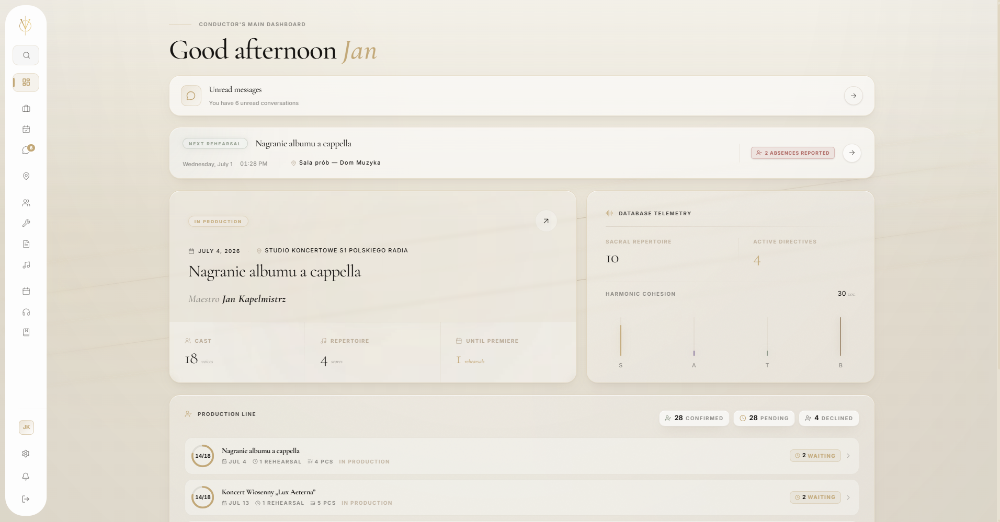 | 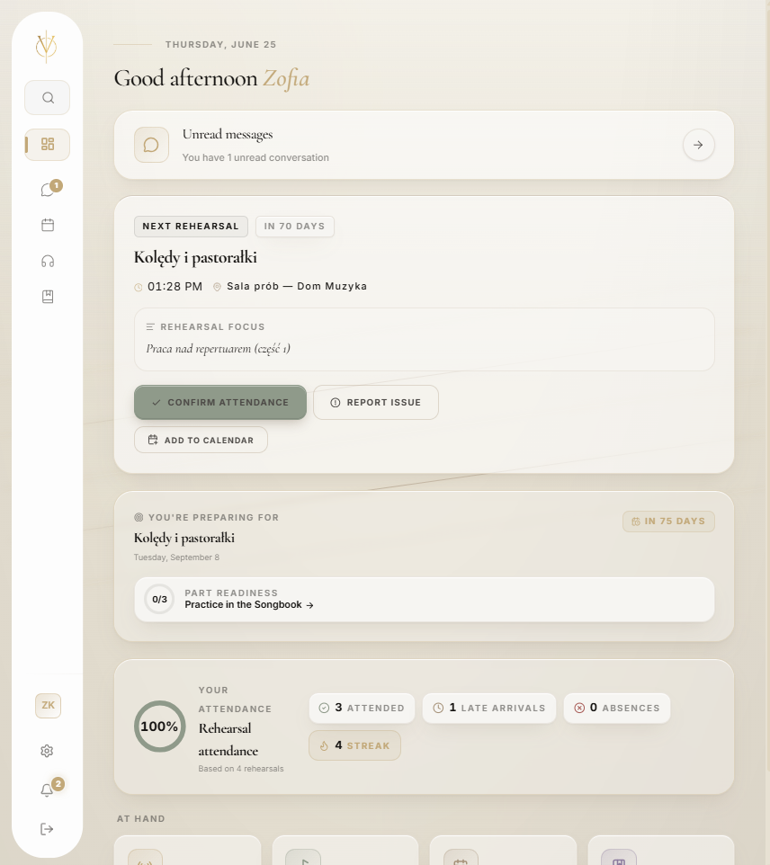 |
| **Project Editor** | **Program Tab** |
| 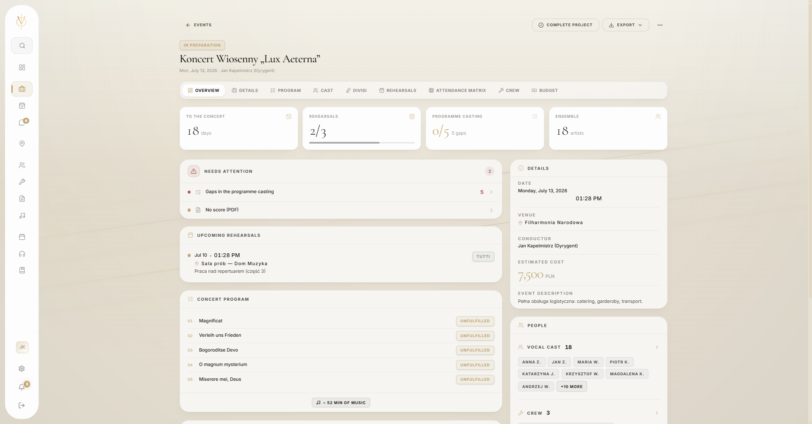 | 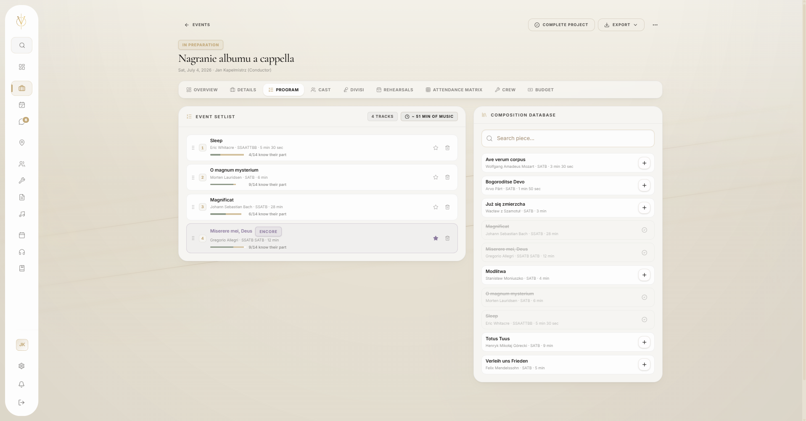 |
| **Divisi Tab** | **Settlements** |
| 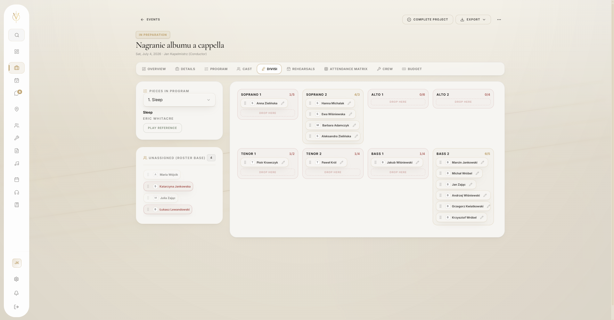 | 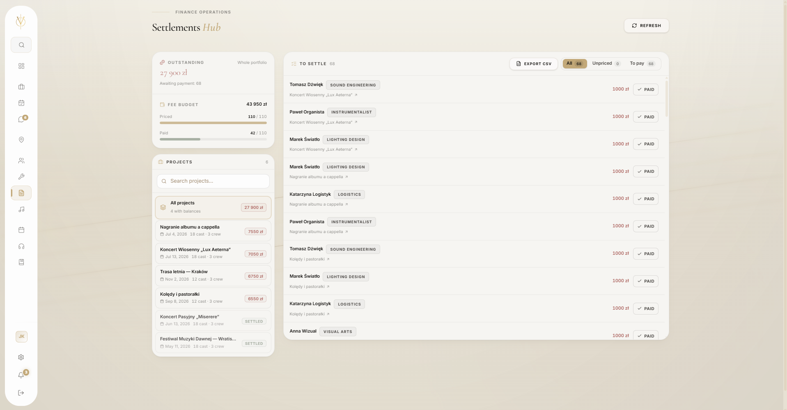 |
| **Locations Management** | **Messages View** |
|  | 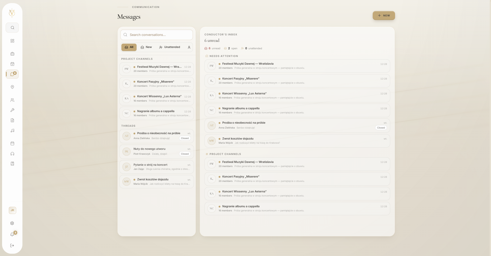 |
| **Privacy Tab** | **Notifications Center** |
| 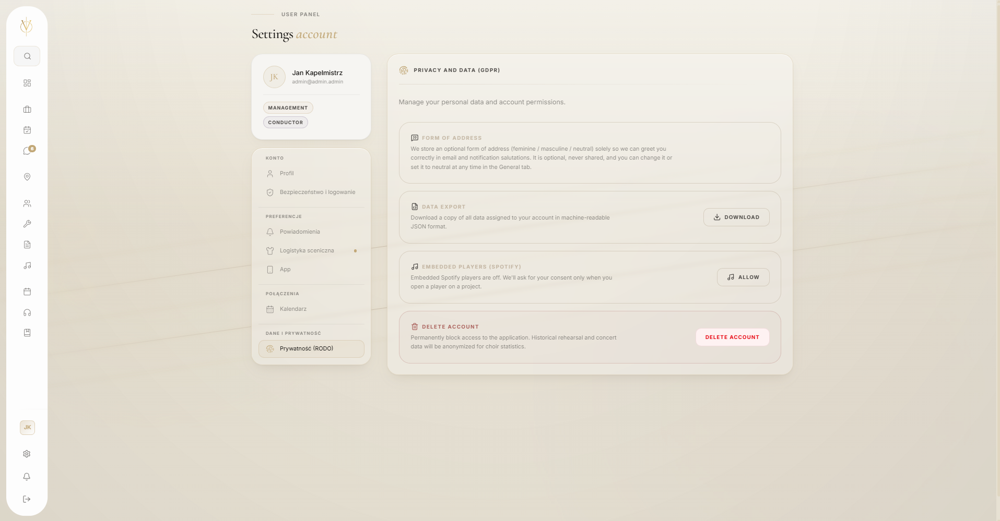 | 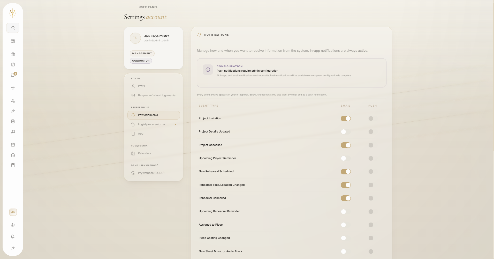 |
| **Materials View** | **Chorister Hub** |
| 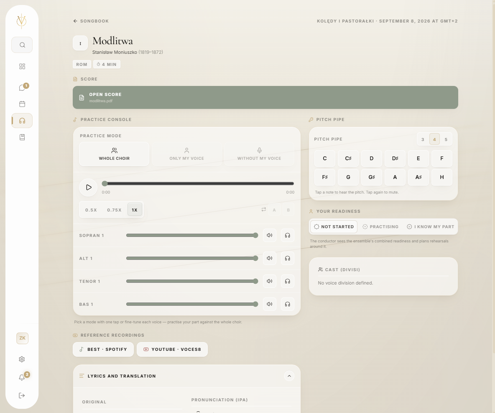 |  |
| **Artist's Dossier** | **Artists Management View** |
| 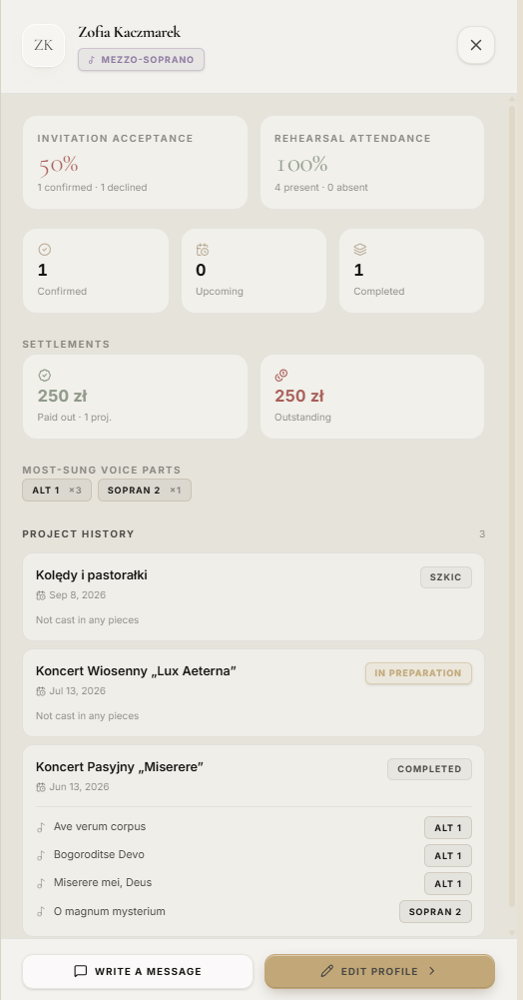 | 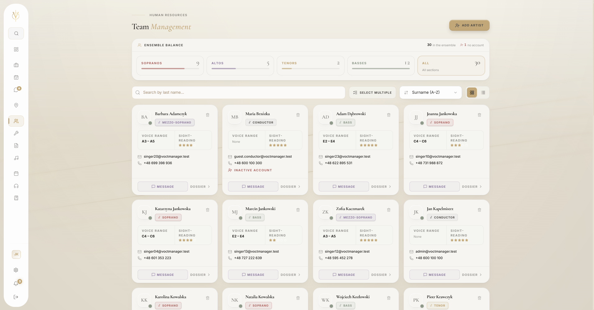 |
| **Composers Management View** | **Artist's Schedule View** |
| 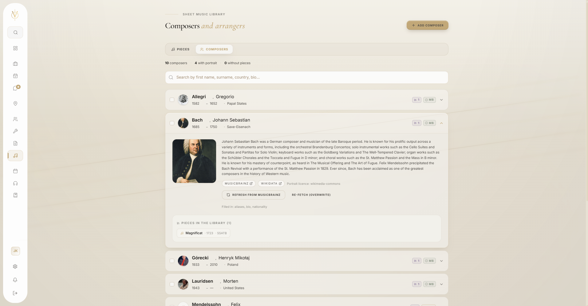 | 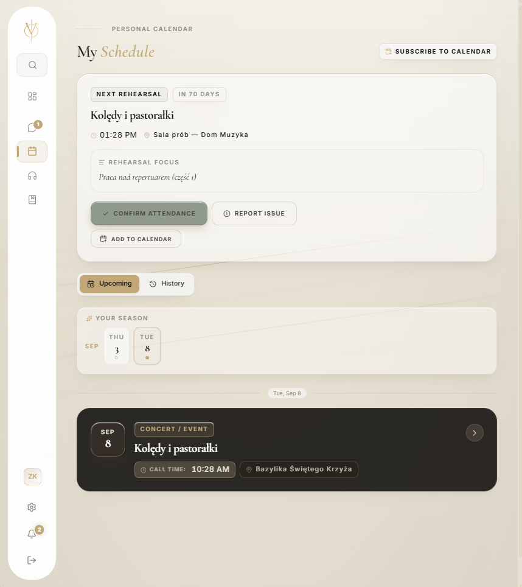 |
| **Rehearsals View** | **Attendance Logs** |
| 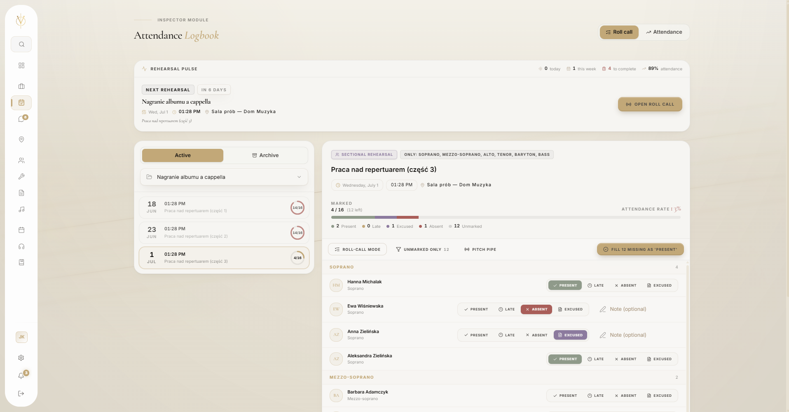 | 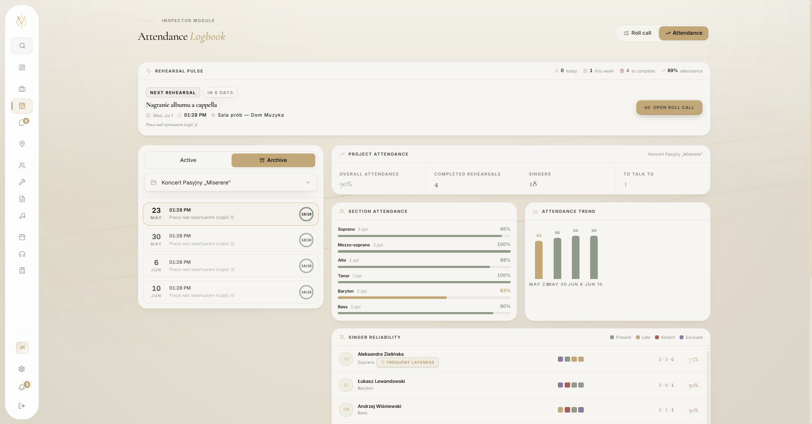 |

---

## 📊 Performance Budget & AI Cost Telemetry

The platform enforces explicit budgets at both the frontend (perceived performance) and backend (AI spend) layers. Numbers below are the target ceilings the project holds itself to.

### Frontend Lighthouse

The cinematic entry gate is bypassed with `?nogate` so the auditor measures the page itself, not the modal overlay.

| Route | Stack | Notes |
|---|---|---|
| `/` &nbsp;(homepage, sacred-minimalism rite) | Astro 6 static HTML + React islands | Once-per-session preloader, audio gate, donation Vault — islands hydrate only when needed. JS budget per page ≈ 80 kB gzipped. |
| `/koncerty`, `/o-nas`, `/kontakt` | Astro 6 static HTML + Vault island only | Server-rendered content, the donation Vault is `client:idle`; the Threshold gate and audio engine are scoped to `/`. |
| `/panel/*` | React 19 SPA (lazy-loaded) | `<EtherealLoader>` Suspense fallback; Maps SDK (~350 kB) scoped to logistics routes only. |

<sub>The Astro public site is built around the same foundation as the prior hand-authored landing — self-hosted variable fonts (zero third-party CDN), `scrollbar-gutter: stable` for layout stability, `transform`/`opacity`-only animation — and trades the SPA runtime tax for static HTML + selective hydration. AVIF/WebP responsive images via the Astro asset pipeline (1920px WebP fallback ``); ambient audio (`/ambient.m4a`) lazy-loaded only on `"voice"` choice.</sub>

**Render-time targets enforced regardless of route:**

| Metric | Target | Notes |
|---|---|---|
| **CLS** (Cumulative Layout Shift) | < 0.1 | Astro static HTML + `scrollbar-gutter: stable` + `contain` on full-viewport overlays keep the public site at effectively 0; the panel SPA holds < 0.1 via Suspense skeletons. |
| **INP** (Interaction to Next Paint) | ≤ 200 ms | |
| **JS bundle (gzipped, route-split)** | ≤ 180 kB per route chunk | Maps SDK (~350 kB) scoped to authenticated panel only |
| **Animation frame rate** | 60 FPS sustained | `transform` / `opacity` only |

### AI Score Compiler (Per-Piece Ingestion)

Celery chain (v2, native-PDF): `prepare_document → analyze_score → resolve_composer_and_piece → persist_analysis → generate_program_note → lookup_spotify → lookup_youtube → finalize_edition`.

| Stage | Model | Avg. cost |
|---|---|---|
| Score analysis — whole PDF by vision (identity + movements + text + IPA + translations) | Sonnet 4.6 | ~$0.08–0.18 |
| Composer + work resolution (MusicBrainz / Wikidata) | — (no LLM) | ~$0.00 |
| Programme note — eager, in the ensemble language | Sonnet 4.6 (`effort: low`) | ~$0.01 |
| Provenance stamping + persistence + recordings | — (no LLM) | ~$0.02 (DB/API) |
| **End-to-end average per ingest** | mixed | **~$0.11–0.22** |
| Re-upload of an identical PDF (SHA-256 dedup) | — (skips AI) | **~$0.00** |

> The PDF is sent as a native `document` block with `cache_control: ephemeral`, so a `max_tokens` escalation or a quick re-ingest reads it back at cache-read rates. Spend is bounded by three ceilings — per-run, never-reset lifetime per edition, and an org-wide daily budget (`INGESTION_COST_CEILING_CENTS`, `INGESTION_LIFETIME_CEILING_CENTS`, `INGESTION_DAILY_BUDGET_CENTS`).

> **Real-time progress** streams over Server-Sent Events from an async (ASGI) endpoint — `GET /api/archive/editions/<id>/events/` — so production runs the backend under `gunicorn config.asgi -k uvicorn.workers.UvicornWorker`.

---

## 🚀 Quickstart (Local Infrastructure)

The project utilizes Docker Compose for a standardized development environment.

### Prerequisites
* Docker and Docker Compose (v2)
* GNU Make

### Initialization

1. **Clone the repository:**
   ```bash
   git clone https://github.com/bedikryst/voctmanager.git
   cd voctmanager
   ```

2. **Environment Configuration:**
   ```bash
   cp .env.example .env
   cp frontend/.env.example frontend/.env
   ```

3. **Orchestrate Infrastructure:**
   Using the provided Makefile for streamlined execution:
   ```bash
   make up
   ```

4. **Database Provisioning:**
   ```bash
   make migrate
   make seed
   make superuser
   ```

   **Seeder Details (`make seed`):**
   
   The seeder generates a rich, realistic test database for local development, demos, and QA. It covers all application contexts:
   - **logistics:** 5 locations (concert halls, church, studio, rehearsal room, tour stop)
   - **archive:** 10 composers, 10 pieces with movements, translations, recordings, score editions (PDF), audio tracks, program notes
   - **roster:** 28 singers (full vocal spectrum), 2 conductors, 5 collaborators (crew), 6 projects in every lifecycle state, castings, rehearsals, attendance, piece readiness
   - **documents:** Knowledge Base (categories + role-gated documents)
   - **messaging:** 1:1 threads (artist ↔ management), project channels with messages
   - **payments:** donations, patron leads
   - **notifications:** inbox items, push devices, delivery preferences
   
   The seeder is **idempotent** — re-running it does not duplicate data. Default login credentials:
   ```
   admin / admin123     (Administrator)
   manager / manager123 (Production Manager)
   ```
   
   **Available Flags:**
   ```bash
   python manage.py seed_db [OPTIONS]
   
   --artists N      number of singers to generate (default 28)
   --seed N         RNG seed for reproducibility (default 2026)
   --clear          hard-wipe previously-seeded data before re-seeding
   --no-media       skip generating files (audio, PDFs, documents) — faster
   --quiet          only print the final summary
   ```
   
   **Examples:**
   ```bash
   # Default — full dataset, 28 singers, placeholder media
   python manage.py seed_db
   
   # Small dataset without files (fast)
   python manage.py seed_db --artists 12 --no-media
   
   # Reset and reseed
   python manage.py seed_db --clear
   
   # Reproducible seed (same RNG → identical names/data)
   python manage.py seed_db --seed 2026
   ```

5. **Frontend Development Servers (Optional for UI engineering):**
   The two frontends are independent — run whichever surface you're building. They both proxy to the same Django backend.

   ```bash
   # Authenticated panel SPA (frontend/) — port 5173
   cd frontend && npm install && npm run dev

   # Public Astro site (web/) — port 4321
   cd web && npm install && npm run dev
   ```

   > For `web/` you must first place the source photos under `web/src/assets/photos/` (gitignored — they live on the build host only; see [`web/README.md`](web/README.md) §Conventions). The Astro build will throw a clear `[photos] No image …` error if a referenced photo is missing.

   * API Access: `http://localhost:8000/api/`
   * Panel SPA: `http://localhost:5173/panel`
   * Public Astro site: `http://localhost:4321`

### 📖 API Documentation
The backend provides fully interactive, automatically generated OpenAPI (Swagger) documentation. Once the containers are running, access it at:
👉 **[http://localhost:8000/api/docs](http://localhost:8000/api/docs)**

---

## 🚢 Production Deployment

Prod is single-command. `frontend/Dockerfile` is a **3-stage multi-stage build** rooted at the repo root:

```
panel-builder  (node:22-alpine) → frontend/ → /app/dist (Vite + React SPA)
web-builder    (node:22-alpine) → web/      → /app/dist (Astro + Sharp image pipeline)
runtime        (nginx:1.27)     → COPY from both → /usr/share/nginx/html/{app,marketing}
```

The nginx container therefore ships **both** the panel SPA and the Astro public site baked in — no `npm` on the host, no `web/dist` bind-mount.

```bash
# One-off, on first deploy (or whenever photos change):
mkdir -p ~/VoctManager/web/src/assets/photos/
# rsync / scp / sftp the original JPGs here — they are .gitignored and live
# only on the build host (collaborator-owned, 5-12 MB each).

# Every deploy:
cd ~/VoctManager
git pull
docker compose -f docker-compose.yml -f docker-compose.prod.yml build frontend
docker compose -f docker-compose.yml -f docker-compose.prod.yml up -d
```

**Build-host requirements:** Docker + Compose v2, ≥ ~3 GB free RAM during build (rollup graph for the panel SPA peaks at ~2 GB; Sharp for the Astro pipeline adds ~500 MB). No Node.js, no npm, no host-side lockfile. The root `.dockerignore` keeps `voct_data/`, `**/node_modules`, `.git`, etc. out of the build context so context transfer stays under a few MB. If the photos directory is missing or incomplete, the Astro stage fails fast with `[photos] No image "<name>"`.

---

## 👨‍💻 Engineering Leadership

**Krystian Bugalski**  
Software Engineer & UI/UX Specialist  
* [LinkedIn](https://www.linkedin.com/in/krystian-bugalski)  
* [GitHub](https://github.com/bedikryst)  

*Designed and engineered with strict adherence to the VoctManager 2026 AI directives and Ethereal design principles.*
