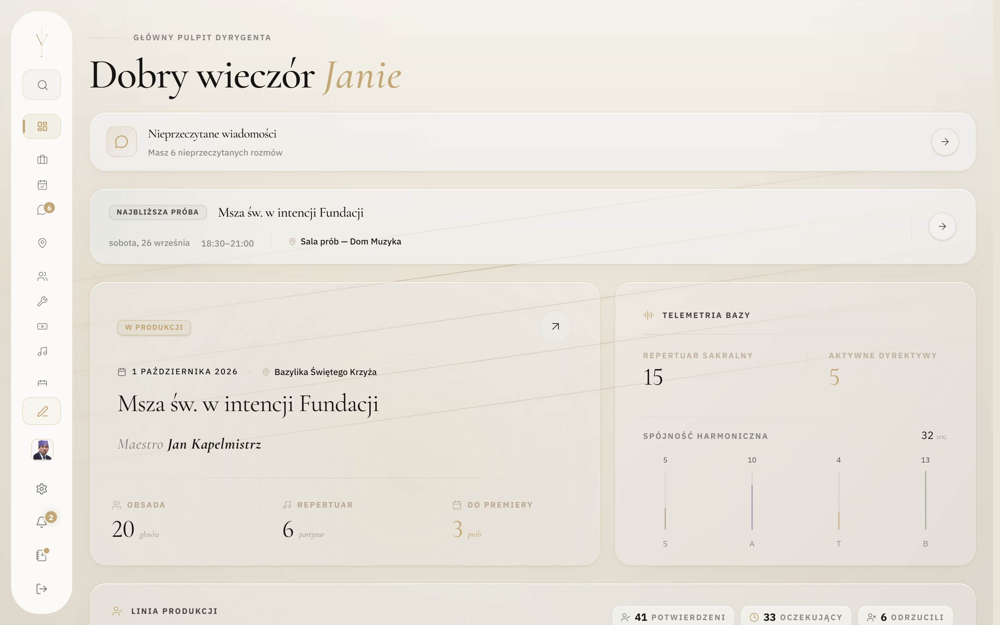
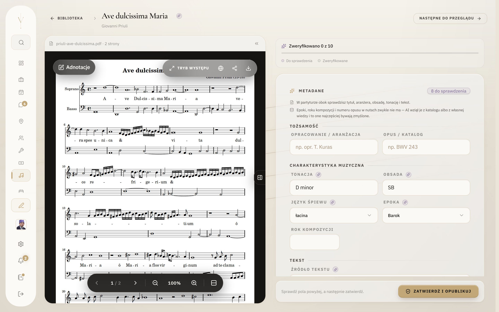
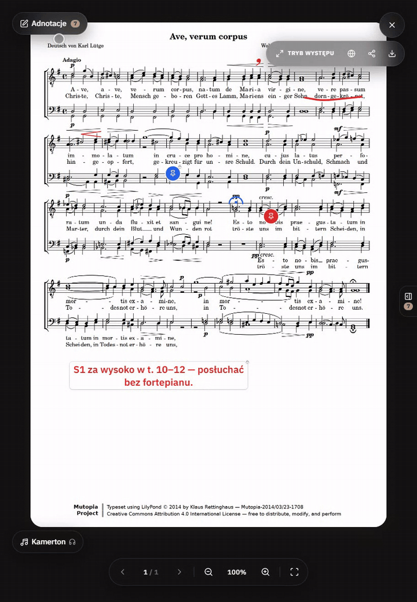
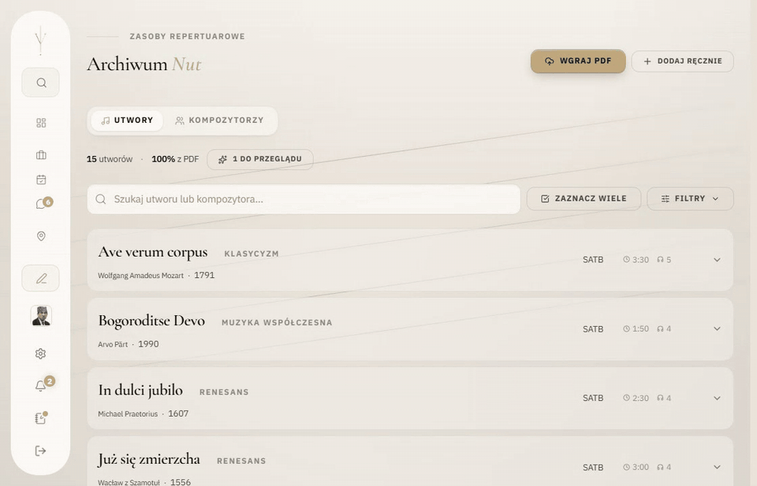
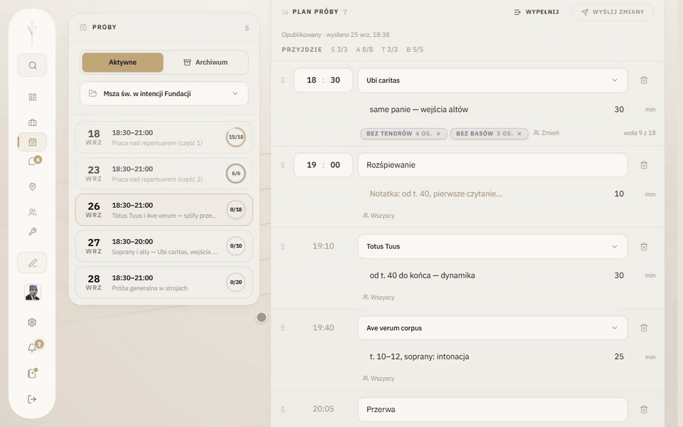
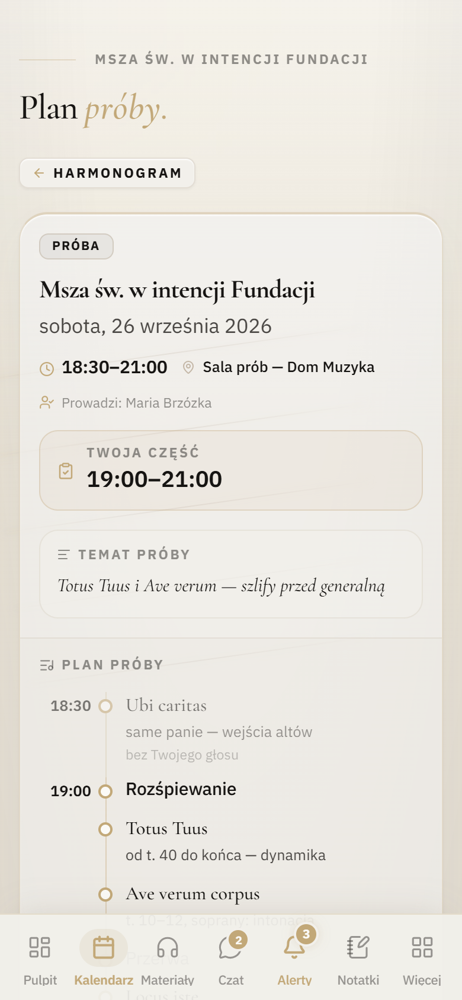
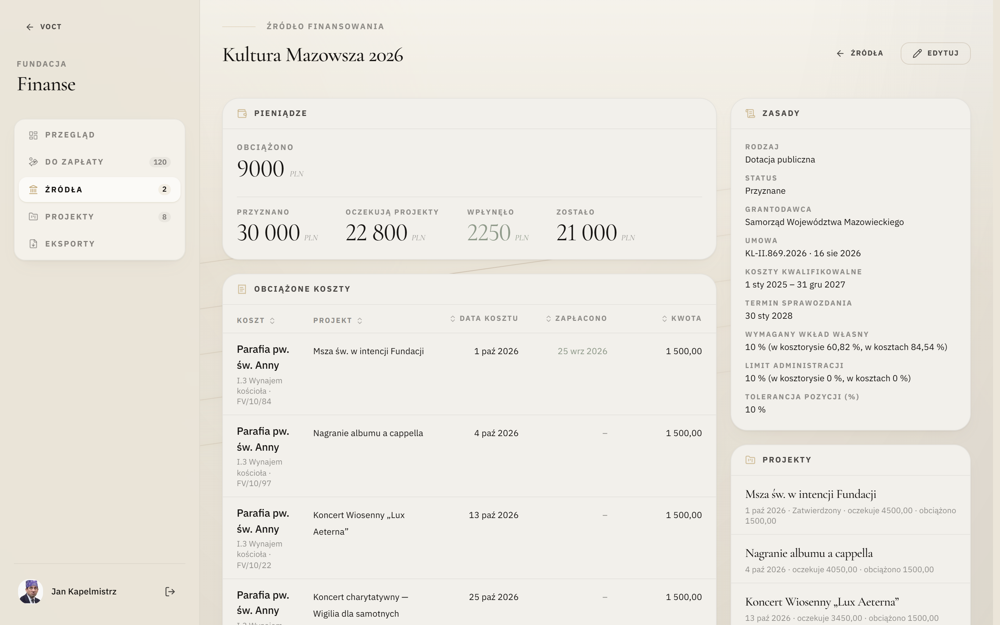
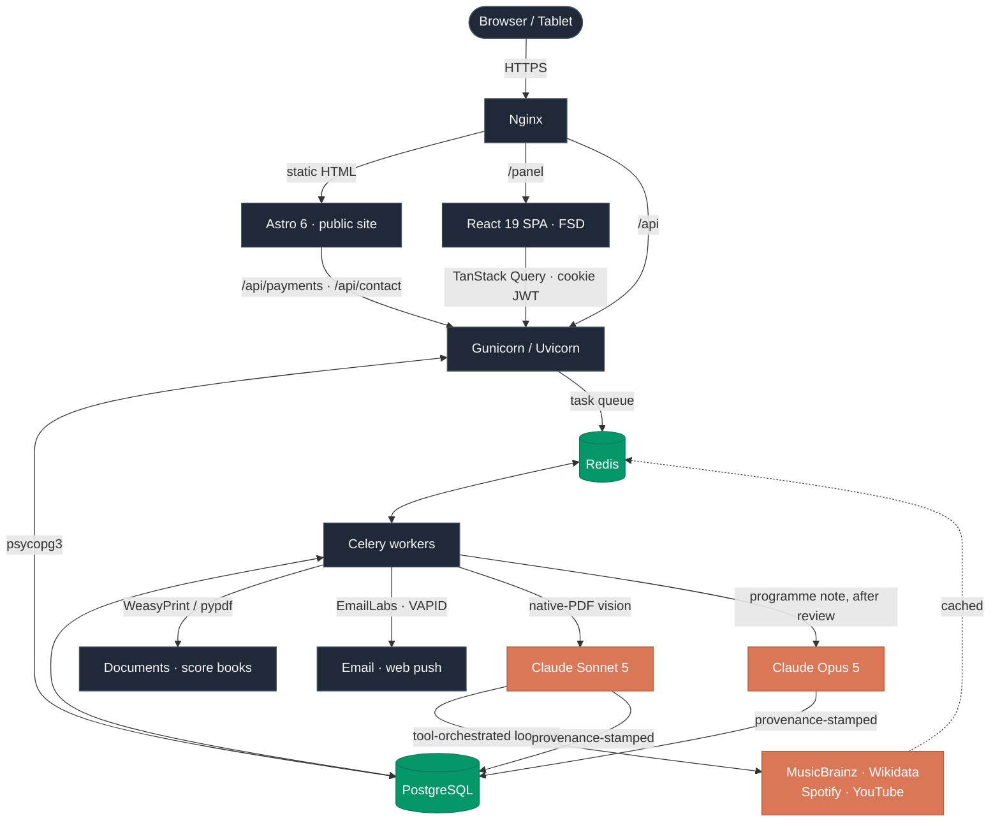

# VoctManager

*Read this in [Polski](README.pl.md).*


VoctManager runs the day-to-day work of VoctEnsemble, a professional vocal ensemble: casting, rehearsal plans, scores and annotations, contracts and project finance. It also includes an AI pipeline that turns a PDF score into a catalogued archive entry.

I co-founded the foundation behind the ensemble and I'm the only developer on this project, which I started in February 2026. Before it, the artistic director (who also conducts) did all of this by hand: deciding who sings which part, preparing contracts, putting together a score book for every concert and copying metadata out of PDF scores.

**Public site:** [voctensemble.com](https://voctensemble.com) · **Status:** in production, used by the ensemble since August ([details](#status))

| Conductor dashboard | AI score review |
|:---:|:---:|
| <picture><source media="(prefers-color-scheme: dark)" srcset="docs/assets/admin-dashboard-dark.png"></picture> | <picture><source media="(prefers-color-scheme: dark)" srcset="docs/assets/score-compiler-review-dark.png"></picture> |

---

## Status

The first concert in the system (St. Andrew Bobola, May 2026) was mostly data I entered myself to test the workflow. The workflow held up, but the conductor didn't use it. He's very good at his job and has no time to learn new tools between rehearsals, which I hadn't planned for. Getting him to open the app on an ordinary weekday turned out to be harder than anything on the engineering side.

He ran the end-of-August concert through the app himself, and the singers used it during the concert. The next programme is in rehearsal now, and both he and the choir are working in it. He sends me feedback as he goes; the rehearsal planner described below came from two of his reports.

## What's in it

- **Casting.** Drag and drop, grouped by section, with section leaders and seat order. Instrumentalists get accounts and parts the same way singers do.
- **Rehearsal plans.** The running order for each rehearsal, with a personal time window for every singer. [More below](#rehearsal-plans).
- **Digital music stand.** A PDF reader for tablets: prefetched page turns, Bluetooth pedal support, screen wake lock, pinch zoom. Singers and the conductor can mark up the score with breath marks, dynamics, hairpins, fermatas and freehand ink (a stylus draws, a finger scrolls). Marks live on four layers: the whole choir, the rehearsal leader, the management, and a private layer for each singer that managers can't read either. This is enforced on the server.
- **Score books.** A print-ready binder built from a project's repertoire: title page, table of contents, a title card for each piece, continuous page numbers, PDF bookmarks, optional duplex layout.
- **Licensed scores.** Every edition has a copyright status, and unclassified ones count as protected. Protected scores stay inside the app and get a per-recipient watermark rendered on the server: copy number, name, concert, date. It leaves out the email address, because these pages get printed and left on music stands. Every download is logged, and the score-book builder warns when a licensed edition would be printed for more singers than the ensemble has copies.
- **Finance.** Budgets, fees, expenses and grants per project. [More below](#finance).
- **Messaging.** Threads between singers and management and a broadcast channel per project, delivered in the app, by email (EmailLabs) and by web push. There are no presence or typing indicators, on purpose.
- **Donations** through Axepta BNP Paribas, with MAC signature checks and reconciliation in Celery.
- iCal feeds, light and dark themes, four roles (admin, manager, artist, crew) enforced by the API.

<p align="center"></p>

## Score pipeline

Upload a PDF score and a few minutes later the archive has a catalogued work: the composer matched to MusicBrainz and Wikidata, movements, the sung text, IPA line by line and singing translations. The conductor reviews and corrects it. The programme note is generated only after that, from the corrected record.

```
upload PDF
  → Celery chain starts, browser subscribes to Server-Sent Events
  → one Sonnet 5 call reads the whole document
    (text layer or scan; key, composer vs arranger, movements,
     sung text, IPA, translations)
  → composer and work resolved against MusicBrainz (MBID) and Wikidata (QID)
  → reference recordings looked up on Spotify and YouTube
  → every field stored with its provenance
  → conductor reviews, corrects, approves → published
  → programme note written by Opus 5, on request, from the reviewed record
```

Every field that came from a model or an external API stores where it came from (model, prompt version, source, confidence, timestamp). The review screen marks each field with a coloured dot for how far it can be trusted: checked by hand, matched in MusicBrainz or Wikidata, or read by the model and not checked yet. Clicking the dot on a field that is already right confirms it without retyping. The model's own confidence isn't shown, because it came back at about 95% whether the field was right or wrong. Canonical IDs come only from MusicBrainz or Wikidata.

Retries depend on whether the failed call was billed ([`ai_client.py`](backend/archive/infrastructure/ai_client.py)):

| Failure | Billed? | What happens |
|---|---|---|
| 529 overloaded, 5xx, 429, connection timeout | no | Retry after tens of seconds to minutes. The UI shows "service busy, retrying". |
| Truncated at `max_tokens` | yes | Double the output budget and retry, at most twice. The same budget would truncate in the same place. |
| 400, auth, permission | no | Stop the chain. Retrying can't help. |

An ingest costs $0.04–0.20. A score sung entirely in Polish is at the low end, since it needs no IPA or translation. There are three spend caps: per run, per edition over its lifetime, and a daily budget for the whole organisation that trips a circuit breaker. A PDF that has already been processed is recognised by its SHA-256 and never reaches the model. The PDF is sent with prompt caching, so a retry after a truncation reads it at the cache rate.



<sub>Recorded from a real run; the pipeline's 51 seconds are shown in three. Score: Giovanni Priuli, <i>Ave dulcissima Maria</i>, engraved by the <a href="https://www.mutopiaproject.org/">Mutopia Project</a> (CC BY-SA 3.0). The music stand above shows Mozart's <i>Ave verum corpus</i> in Carl Reinecke's arrangement, also from Mutopia (CC BY 4.0).</sub>

Details: [`docs/archive-ai-ingestion-pipeline.md`](docs/archive-ai-ingestion-pipeline.md).

## Rehearsal plans

The conductor lists the pieces for a rehearsal in order. Each row can have a length in minutes, a note ("from bar 40, first read") and the voice lines it doesn't need. A sectional is defined by voice letters (S, A, T, B), so a singer added to the cast later is called automatically. From the plan, every singer gets their own window, for example "your part 19:00–20:15", so nobody sits through pieces they don't sing. That was the conductor's request. He called it respect for people's time.

The plan reaches the choir only when he sends it, not on every edit. After the rehearsal he ticks off what was covered, and a grid of pieces by rehearsals shows how often each piece has been worked on. He can hand a rehearsal to an assistant with specific permissions: taking attendance, marking the choir's scores, opening materials.

| Editing the plan | What a tenor sees |
|:---:|:---:|
|  | <picture><source media="(prefers-color-scheme: dark)" srcset="docs/assets/rehearsal-singer-dark.png"></picture> |

## Finance

Budgets, fees, expenses and grants for each project, in one ledger approved by the board. It replaced three screens that each calculated fees their own way.

- Every write goes through a service and is recorded in an append-only `FinanceEvent` table. The table has no soft delete, so entries can't be hidden.
- A contract stores the amount and payee as of the day it was issued. Changing either means annulling it and issuing a new one, and the annulled number stays used.
- Contract numbers come from a counter per year and contract type, locked with `select_for_update()` inside the issuing transaction.
- Grant money is allocated to budget lines and individual costs. Own-contribution and administration limits are checked per grant agreement, and the plan exports as a cost sheet for grant applications.
- Singers see no amounts in the app, including their own.

<picture><source media="(prefers-color-scheme: dark)" srcset="docs/assets/funding-grant-dark.png"></picture>

## Some decisions

**Two frontends.** The panel is a React SPA and the public site is a separate Astro app. Google Ad Grants required crawlable pages, and the SPA served crawlers an empty div. Astro renders static HTML and loads React only where there's state: the donation flow, the audio gate and the sticky header.

**Programme notes come after review.** They used to be generated at the end of the pipeline from unreviewed metadata, so a wrong composer or period could end up in a printed concert programme. Now the note is a separate task, started from the review screen or on approval.

**Sonnet 5 reads, Opus 5 writes the notes.** The programme note is the only text the audience reads word for word, so it gets the stronger model, for about a cent more per note. Moving to the new generation took more than changing a constant: on Sonnet 5 a missing `thinking` key means adaptive thinking is on, so a plain swap would have turned it back on in the one call that disables it.

**Annotations refresh by polling.** An open music stand checks a small fingerprint endpoint every 20 seconds and refetches the marks only when it changes. Server-Sent Events would have kept around thirty connections open for a whole rehearsal to save a second or two.

## What I got wrong

**The first ingestion pipeline was a chain of small model calls** (identity, movements, lyrics, translations). Each call saw only its own part, so for well-known hymns the model returned the standard text instead of what was printed. One call over the whole document fixed that and was cheaper too.

**My evaluator had no data for two months.** The golden-set evaluator shipped in June and the golden set arrived in August. When I finally measured the move to Sonnet 5, my reason for it (better reading of scanned scores) turned out not to matter, because almost the whole archive is born-digital PDFs. Sonnet 5 stayed because it was cheaper and faster at the same accuracy. The set still scores 100% on every configuration, so it can't tell them apart yet.

**Offline annotations didn't work, and I thought they did.** Annotation writes went straight to the API. When a write failed, the optimistic update was rolled back and the error swallowed, so a mark made without signal simply disappeared. Downloading a concert for offline use skipped the annotations as well. Now the client generates each mark's ID, so a mark can be edited or erased before the server has seen it. Queued writes to the same mark are merged (create followed by erase sends nothing), and replaying a create never brings back an erased mark. I still haven't tested the whole offline-to-online cycle on a real tablet.

**I wrote tests for the AI pipeline first**, because that's where the interesting failures were. Contracts, attendance and fees got tests late, and that's where the real bugs turned up.

## Operations

- Two health endpoints: `/api/health/` for liveness (touches nothing) and `/api/health/ready/` for readiness (Postgres and Redis). The Redis check writes and reads a key, because a Redis at `maxmemory` with `noeviction` still answers `PING`.
- A Celery beat task pings an external heartbeat monitor, and the alert fires when the pings stop.
- Sentry, uptime checks and TLS expiry checks.
- Daily off-site backups and a restore drill ([`infra/restore-drill.sh`](infra/restore-drill.sh)) that restores them into a scratch database and checks row counts, media files and migration state. Runbooks: [`docs/backups.md`](docs/backups.md), [`docs/monitoring.md`](docs/monitoring.md).
- CI runs ruff, mypy (strict) and the backend tests against PostgreSQL 16 on every push.
- Frontend tests cover the writes that can't be undone (publishing a project emails the whole choir; RSVP, attendance and account activation act on someone else's behalf) and logic that has to match the server, such as fee calculation. The rest of the panel I check by hand.
- A golden-set evaluator runs real scores through the live pipeline and reports accuracy per field, cost and time.

## Not doing

- **Prometheus, Grafana, OpenTelemetry.** One droplet, one maintainer, no SLO. Sentry and the health checks tell me what I need to know.
- **Postgres replication.** A replica on the same droplet shares its disk and power supply. Losing the instance is covered by backups, and the restore has been tested.
- **A Redis cluster.** One instance is enough for the cache and the Celery broker.

## Open

- [ ] Golden-set cases that actually separate one model configuration from another
- [ ] Print the shared annotation layer into the score book
- [ ] Fernet encryption at rest for contract and finance fields; make the finance log immutable at the database level
- [ ] Frontend CI and Playwright end-to-end tests
- [ ] Rate limiting at the edge (Cloudflare + WAF) on top of DRF throttling
- [ ] Automated accessibility tests against the EAA baseline
- [ ] Zero-downtime deploys

## Stack

**Backend:** Python 3.13, Django 6, DRF, PostgreSQL (psycopg 3), Redis, Celery, Pydantic DTOs at the service boundary. Auth is a JWT in an `httpOnly`, `Secure`, `SameSite=Lax` cookie with CSRF double-submit, so the SPA never handles the token.

**Panel:** React 19, Vite 7, TypeScript 5.9, Feature-Sliced Design, TanStack Query v5, Zustand, Tailwind v4, Framer Motion, React Hook Form + Zod, Radix.

**Public site:** Astro 6 with React islands, hand-written CSS, self-hosted fonts (no font CDN, so visitors' IP addresses don't go to a third party), View Transitions.

**Documents and AI:** WeasyPrint, pypdf, pypdfium2. The Anthropic SDK is pinned to an exact version, because the pipeline depends on version-specific behaviour: native PDF input, structured outputs, prompt caching, adaptive thinking.

**Infrastructure:** Docker Compose (the same setup in dev and prod), Nginx, Gunicorn with Uvicorn workers, GitHub Actions, Sentry.

## Architecture


```mermaid
graph TD
    Client([Browser / Tablet]) -->|HTTPS| Nginx[Nginx]

    Nginx -->|static HTML| Astro[Astro 6 · public site]
    Nginx -->|/panel| React[React 19 SPA · FSD]
    Nginx -->|/api| Gunicorn[Gunicorn / Uvicorn]

    Astro -->|/api/payments · /api/contact| Gunicorn
    React -->|TanStack Query · cookie JWT| Gunicorn

    Gunicorn <-->|psycopg3| DB[(PostgreSQL)]
    Gunicorn -->|task queue| Redis[(Redis)]

    Redis <--> Celery[Celery workers]
    Celery <--> DB
    Celery -->|WeasyPrint / pypdf| Files[Documents · score books]
    Celery -->|EmailLabs · VAPID| Notify[Email · web push]

    Celery -->|native-PDF vision| Claude[Claude Sonnet 5]
    Claude -->|tool-orchestrated lookups| Ext[MusicBrainz · Wikidata<br/>Spotify · YouTube]
    Ext -.->|cached| Redis
    Claude -->|provenance-stamped| DB

    Celery -->|programme note, after review| Opus[Claude Opus 5]
    Opus -->|provenance-stamped| DB

    classDef default fill:#1f2937,stroke:#4b5563,color:#f3f4f6;
    classDef db fill:#059669,stroke:#047857,color:#ffffff;
    classDef ai fill:#D97757,stroke:#b85c3e,color:#ffffff;
    class DB,Redis db;
    class Claude,Ext,Opus ai;
```

The ingestion chain is `prepare_document → analyze_score → resolve_composer_and_piece → persist_analysis → lookup_spotify → lookup_youtube → finalize_edition`. `generate_program_note` runs on its own after review. Progress streams from an async ASGI endpoint (`GET /api/archive/editions/<id>/events/`), so production runs `gunicorn config.asgi -k uvicorn.workers.UvicornWorker`.

## Running locally

Requires Docker, Compose v2 and GNU Make.

```bash
git clone https://github.com/bedikryst/VoctManager.git
cd VoctManager
cp .env.example .env
cp frontend/.env.example frontend/.env
make up
make migrate && make seed && make superuser
```

`make seed` creates a realistic dataset: 28 singers in every account state (active, invited, archived), an organist and a pianist, 2 conductors, 5 crew members, and 8 projects across the whole lifecycle with their score books. One of them, a Mass a few days out, carries the newer features: a line-up read by section with section leaders, an assistant conductor, rehearsal plans (two past evenings ticked off with a debrief, the next one sent to the choir, a sectional, a dress rehearsal that calls the players) and a score marked on all four annotation layers. Finance covers every budget state: a finished concert with its books closed, signed contracts numbered in sequence and a settled grant, the Mass with an approved plan and part of its costs paid, and drafts still in planning. There are also messages, donations, pending announcements, notifications and a notebook. It's safe to run again. You sign in with an email: `admin@voctmanager.test / admin123`, `manager@voctmanager.test / manager123`, `crew@voctmanager.test / crew123`, and singers as `singer00@voctmanager.test / password123` and up. An `admin` user that already exists keeps its own email.

```bash
python manage.py seed_db --artists 12 --no-media   # smaller and faster
python manage.py seed_db --clear                   # wipe and reseed
python manage.py seed_db --seed 2026               # reproducible
```

- API: `http://localhost:8000/api/`
- OpenAPI docs: `http://localhost:8000/api/docs`
- Panel: `http://localhost:5173/panel` (`cd frontend && npm install && npm run dev`)
- Public site: `http://localhost:4321` (`cd web && npm install && npm run dev`)

The Astro build needs source photos in `web/src/assets/photos/` and videos in `web/src/assets/videos/`. Both are gitignored (the originals belong to collaborators), and the build stops with an error if they're missing.

## Deploying

```bash
cd ~/VoctManager && git pull && make deploy
```

`make deploy` runs `gc → build → up -d → migrate → migrate --check → gc` and stops at the first failure. Nothing applies migrations automatically, and `migrate --check` fails the deploy if any are left. `frontend/Dockerfile` builds the panel (Vite) and the public site (Astro + Sharp) and serves both from one `nginx:1.27` image, so the host needs no Node. The build needs about 3 GB of free RAM, and [`infra/docker-gc.sh`](infra/docker-gc.sh) clears old build layers before and after.

## Built with Claude Code

I use Claude Code every day, and many commits are co-authored with it. The product decisions, the architecture, the cost limits and what stays out are mine.

---

**Krystian Bugalski** · [GitHub](https://github.com/bedikryst) · [LinkedIn](https://www.linkedin.com/in/krystian-bugalski) · krystian@bugalski.dev
