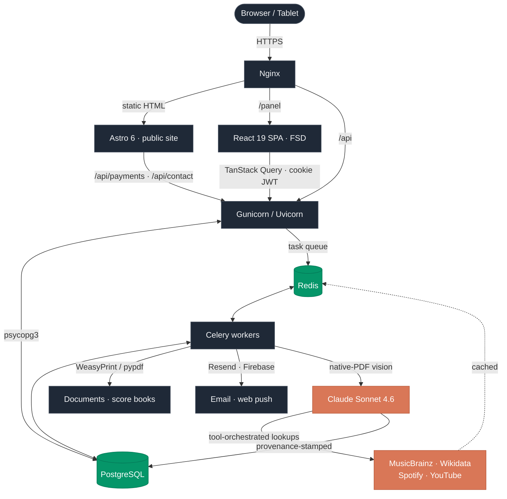

# VoctManager

*Read this in [Polski](README.pl.md).*


An ERP for a professional vocal ensemble, and the AI pipeline that catalogues its sheet music.

I co-founded a foundation around **VoctEnsemble**. Its artistic director was doing a lot of work by hand that software should have been doing for him: who sings which part, contracts, assembling a singers' score book before every concert, and typing metadata off PDF scores one field at a time. So I built this.

One person, 711 commits, first one 26 February 2026.

**Public site:** [voctensemble.com](https://voctensemble.com) · **Status:** deployed and running, adoption still in progress ([details](#where-this-actually-stands))

| Conductor dashboard | AI score review cockpit |
|:---:|:---:|
|  |  |

---

## The score pipeline

Upload a PDF score. A few minutes later the archive holds a catalogued work: composer resolved to a canonical ID, movements split out, the sung text transcribed, IPA aligned line by line, singing translations, and a programme note in the ensemble's language. The conductor reads it over, fixes what's wrong, approves. An afternoon of typing becomes a few minutes of checking.

```
upload PDF
  → Celery chain starts, browser subscribes to Server-Sent Events
  → one consolidated Sonnet call reads the whole document by vision
    (text layer and scans both; the key inferred from the key signature,
     composer split from arranger, movements, sung text, IPA, translations)
  → composer + work resolved against MusicBrainz (MBID) and Wikidata (QID)
  → Spotify / YouTube looked up for reference recordings
  → every field stamped with provenance, persisted
  → conductor reviews, corrects, approves → published
```

### Three things I'd point at

**Provenance on every field.** Anything the model or an external API produced carries `(model, prompt_version, source_reference, confidence, retrieved_at)` in a `ProvenanceRecord`, and the review screen shows it per field: an `AI · 95%` chip, a `MusicBrainz` chip, or a `Verified` chip once a human has edited the value. Canonical identifiers always come from MusicBrainz or Wikidata, never from the model. The point is that a conductor shouldn't have to guess which fields deserve a second look. Whether the chips are legible enough to actually do that, I don't know yet. Nobody has used them under time pressure.

**Retry policy follows the billing, not the status code.** The exception taxonomy in [`archive/infrastructure/ai_client.py`](backend/archive/infrastructure/ai_client.py) splits failures two ways at once: can retrying possibly help, and was the failed attempt billed?

| Failure | Billed? | Policy |
|---|---|---|
| 529 overloaded / 5xx / 429 / connection timeout | no | Retryable. Wait tens of seconds to minutes and show a "service busy, retrying" state while waiting. |
| `stop_reason='max_tokens'` truncation | yes | Double the budget, retry up to 2 escalations, then give up. A fixed budget truncates deterministically, so re-issuing the identical call buys the same failure twice. |
| 400 / auth / permission | no | Terminal. Abort the chain instead of burning autoretry cycles on a request Anthropic already rejected. |

`retry(3)` on everything would have been half a day's less work. It also turns a capacity blip into a retry storm and a truncation into three identical bills.

**Three spend ceilings, enforced at the task boundary.** Per-run, a lifetime cap per edition that never resets, and an org-wide daily budget that trips a circuit breaker. Defaults are $1.00, $5.00 and $20.00. Re-uploading a PDF that's already been processed hits a SHA-256 check and skips the model entirely. An ingest ends up costing **$0.11–0.22**. The PDF goes up as a native `document` block with `cache_control: ephemeral`, so if a truncation forces an escalation, the second attempt reads it back at cache rates instead of paying full input again.


---

## Decisions

Including the ones where the decision was not to build something. The rest are listed under [Out of scope](#out-of-scope).

**Two frontends.** The panel is a React SPA. The public site is a separate Astro app. That split came out of applying for Google Ad Grants: the audit wanted crawlable content and the SPA shell served crawlers an empty div. Astro emits static HTML and hydrates React only where there's real state: the donation flow, the audio gate, the sticky header. Two builds, one backend, one deploy. It's more moving parts than I wanted, and I'd make the same call again.

**Liveness and readiness are different questions.** `/api/health/` touches nothing and backs the Docker healthcheck. `/api/health/ready/` hits Postgres and Redis and returns 503 if it can't serve. Keeping them separate matters more than it looks: restart a container because Postgres is slow and you get a container that comes back equally degraded, then `depends_on` cascades the restart into Celery. The Redis half is a write-then-read rather than a `PING`. A Redis sitting at `maxmemory` under `noeviction` will answer `PING` perfectly while refusing every write, and I'd rather find that out from a probe than from a lost task.

**Alert on silence.** A dead Celery beat scheduler doesn't throw an exception. It just stops, quietly, and everything downstream looks fine until someone notices the digests stopped arriving. So a periodic task pings an external heartbeat monitor and the alert fires when the ping *doesn't* arrive. It's an end-to-end proof: beat has to have scheduled it, the broker has to have delivered it, a worker has to have run it. The ping task swallows its own errors on purpose. A flaky monitor shouldn't be able to page me about itself.

---

## Where this actually stands

The system is deployed and running. Whether it's *used* is a separate question and the honest answer is: barely, so far.

One concert has gone through it — St. Andrew Bobola, May 2026 — and I entered most of that data myself to see whether the workflow held up end to end. It did. But the artistic director hasn't adopted it yet. He does his own job extremely well and has close to zero patience for learning a new tool between rehearsals, which is completely reasonable and which I did not plan for at all. Getting him from "this is impressive" to "I opened it on Tuesday" has been harder than any part of the engineering.

He's committed to running the end-of-August date through it himself. That'll be the first honest test.

I'm leaving this section in because it's the most useful thing the project has taught me. I can build the thing. Getting it into somebody else's working habits is a different discipline, and I badly underestimated it. The features I'm proudest of here, the provenance chips and the score-book builder and the annotation layers, are all worth nothing until someone opens the app on a Tuesday because it's easier than not opening it. I don't think I've built that yet.

## What I got wrong

**The first ingestion pipeline was a chain of small model calls.** Identity in one call, movements in another, then lyrics, then translations. Each call only saw its own slice, so the model kept falling back on what it knew instead of what was printed — for a well-known hymn it would produce the canonical text rather than the words actually on the page, which is exactly wrong for an archive. Consolidating into one call that reads the whole document fixed the accuracy problem and cut the bill at the same time. I should have seen it coming from first principles. I didn't.

**I under-tested the dull paths.** Test coverage grew around the AI pipeline first, because that's where the interesting failures lived. Contracts, attendance, settlements got covered late. Those are where the actual bugs came from.

---

## How this was built, and where the AI stops

I use Claude Code every day. A project this size doesn't get built by one person in five months without it, and the git history says so plainly: some commits are co-authored.

What it didn't do: split the frontend after the Ad Grants audit came back. Decide that retry policy should key off billing rather than status codes. Decide that Prometheus, a Postgres replica and a Redis cluster all stay out on a single-droplet, single-maintainer deployment. Decide that the watermark carries a singer's name and never their email, because these pages get printed and left on a music stand where anyone can read them.

Architecture, cost, priorities, and what stays out are mine. Those are the parts worth holding me to.

---

## The rest of the platform

**Roster and production.** Four roles (admin, manager, artist, crew) with access enforced at the endpoint, in the payload and in the UI. Drag-and-drop casting, rehearsals, attendance, per-project budgets and settlements. iCal feeds so singers get their dates in whatever calendar they already use.

**Documents.** Contracts and run sheets generated in the background through Celery and WeasyPrint. The bigger job is the concert score book: a print-ready binder assembled from a project's repertoire with a title page, dotted-leader contents, a frontispiece card per piece pulled from the archive, continuous folios, PDF bookmarks and an optional double-sided mode that starts every opening on a recto. Assembly is deterministic. No model runs at build time.

**Licensed-score protection.** This one came from a real constraint rather than a design idea. Choirs buy a fixed number of physical copies of copyrighted music, and handing singers a PDF quietly breaks that. So every edition carries a copyright status, with *unclassified* treated as protected by default. Public-domain scores export freely. Protected ones stay in-app for singers and get a watermark rendered server-side per recipient — copy number, name, concert, date — applied without shifting the page count or breaking the PDF outline anchors, at both places a file can leave the system. Every serve lands in an append-only log, which is what a publisher would ask to see. The build cockpit warns when a licensed edition is about to be bound for more singers than the ensemble owns copies of.

**Digital music stand.** A PDF reader for a tablet propped on a music stand: page turns prefetched so there's no loader mid-phrase, Bluetooth pedal support, a screen wake lock, pinch zoom around a focal point. On top of it sits a role-aware annotation layer. The conductor writes a shared layer that every cast singer sees, and each singer also gets a personal layer that nobody else can read, managers included, enforced on the server rather than hidden in the UI. Marking up is musician-native: breath marks, dynamics, hairpins, fermata, caesura, freehand ink with stylus-first routing so a pen draws and a finger pans.

**Messaging and notifications.** Threads between singers and management, plus per-project broadcast channels, delivered in-app, by email through Resend and by web push over VAPID. Managers get a triage workflow. It is not a real-time chat and won't become one: no presence, no typing indicators. The message store is decoupled from delivery, so messages reuse the notification pipeline that already existed.

**Payments.** Donations through Axepta BNP Paribas, with MAC signature validation and asynchronous reconciliation in Celery.

---

## Stack

**Backend** — Python 3.13, Django 6, DRF, PostgreSQL (psycopg 3), Redis, Celery 5.3, Pydantic DTOs at the service boundary, cookie-based JWT (`httpOnly` + `Secure` + `SameSite=Lax`, so the SPA never touches the token) with CSRF double-submit. Layered into services and selectors.

**Panel** — React 19, Vite 7, TypeScript 5.9, Feature-Sliced Design, TanStack Query v5, Zustand, Tailwind v4, Framer Motion, React Hook Form + Zod, Radix primitives.

**Public site** — Astro 6 with React islands, hand-authored CSS, self-hosted variable fonts (no third-party font CDN, so no user-IP leakage), native View Transitions.

**Documents & AI** — WeasyPrint, pypdf, pypdfium2, Anthropic SDK (vision over native PDF, structured outputs, prompt caching, adaptive thinking).

**Infrastructure** — Docker Compose with dev/prod parity, Nginx, Gunicorn/Uvicorn, GitHub Actions, Sentry.

---

## Quality and operations

**Tests.** Around 676 of them, across roster, archive, payments, messaging, notifications, documents and core. Contract generation, the score-package cockpit, licensed-score protection and the provenance pipeline are covered. Frontend coverage is thin and that's next.

**CI.** Ruff, mypy in strict mode, and the full suite against PostgreSQL 16 on every push and pull request.

**Backups.** Restore-tested rather than assumed. [`infra/restore-drill.sh`](infra/restore-drill.sh) replays the off-site archive into a throwaway database and a scratch directory, then checks archive integrity, row counts against live, media completeness, migration state, and how long the whole thing took. Production is never touched. Runbook in [`docs/backups.md`](docs/backups.md).

**Monitoring.** Sentry, the two health probes above, external uptime and TLS-expiry polling, and the beat heartbeat. Runbook in [`docs/monitoring.md`](docs/monitoring.md).

**Data integrity.** Soft deletes keep production history without letting removed rows leak into active queries. Foreign keys and check constraints do the guarding at the database layer rather than in application code that can be bypassed.

### Out of scope

Written down so they don't come back as bug reports.

**Prometheus / Grafana / OpenTelemetry.** Metrics answer *how much*. A single-tenant install on one droplet with one maintainer has no SLO, no on-call rotation and no traffic to ask that of. The questions that actually get asked here are "is it down" and "what threw", and the health probes and Sentry answer both for a fraction of the operating cost, on a host where RAM is already the binding constraint during a build. Worth revisiting if a second ensemble ever shares the deployment.

**PostgreSQL streaming replication.** A hot standby protects against losing the instance. Daily off-site backups already cover that, and unlike the standby, the restore has been measured. On one droplet a replica is a second stateful service sharing the same disk and the same power supply, which is correlated failure dressed up as redundancy.

**Redis cluster.** One instance backs the cache and the Celery broker. Clustering solves a coordination problem this deployment doesn't have.

### Open

- [ ] Burn the shared annotation layer into the score book at assembly time
- [ ] Fernet at-rest encryption for contract and financial fields, plus an immutable mutation log
- [ ] Frontend CI and Playwright end-to-end coverage
- [ ] Rate limiting at the edge (CloudFlare + WAF) on top of the DRF throttling in place
- [ ] Automated accessibility testing against the EAA baseline the UI is built to
- [ ] Zero-downtime deploys

---

## Architecture


```mermaid
graph TD
    Client([Browser / Tablet]) -->|HTTPS| Nginx[Nginx]

    Nginx -->|static HTML| Astro[Astro 6 · public site]
    Nginx -->|/panel| React[React 19 SPA · FSD]
    Nginx -->|/api| Gunicorn[Gunicorn / Uvicorn]

    Astro -->|/api/payments · /api/contact| Gunicorn
    React -->|TanStack Query · cookie JWT| Gunicorn

    Gunicorn <-->|psycopg3| DB[(PostgreSQL)]
    Gunicorn -->|task queue| Redis[(Redis)]

    Redis <--> Celery[Celery workers]
    Celery <--> DB
    Celery -->|WeasyPrint / pypdf| Files[Documents · score books]
    Celery -->|Resend · Firebase| Notify[Email · web push]

    Celery -->|native-PDF vision| Claude[Claude Sonnet 4.6]
    Claude -->|tool-orchestrated lookups| Ext[MusicBrainz · Wikidata<br/>Spotify · YouTube]
    Ext -.->|cached| Redis
    Claude -->|provenance-stamped| DB

    classDef default fill:#1f2937,stroke:#4b5563,color:#f3f4f6;
    classDef db fill:#059669,stroke:#047857,color:#ffffff;
    classDef ai fill:#D97757,stroke:#b85c3e,color:#ffffff;
    class DB,Redis db;
    class Claude,Ext ai;
```

The Celery ingestion chain: `prepare_document → analyze_score → resolve_composer_and_piece → persist_analysis → generate_program_note → lookup_spotify → lookup_youtube → finalize_edition`. Progress streams from an async ASGI endpoint at `GET /api/archive/editions/<id>/events/`, so production runs under `gunicorn config.asgi -k uvicorn.workers.UvicornWorker`.

Deep dive on the pipeline: [`docs/archive-ai-ingestion-pipeline.md`](docs/archive-ai-ingestion-pipeline.md).

---

## Running it locally

Requires Docker, Compose v2 and GNU Make.

```bash
git clone https://github.com/bedikryst/VoctManager.git
cd VoctManager
cp .env.example .env
cp frontend/.env.example frontend/.env
make up
make migrate && make seed && make superuser
```

`make seed` builds a full realistic dataset — 28 singers across the vocal spectrum in every account state (active, invited-but-not-activated, archived), 2 conductors, 6 crew, 8 projects covering every lifecycle state with their score books, 14 composers with movements, translations and editions across the whole licence spectrum, conductor markup layers, plus the knowledge base, messaging, payments, the pending announcement queue and a notification inbox spanning every message type. It's idempotent. Logins: `admin / admin123`, `manager / manager123`, `crew / crew123`.

```bash
python manage.py seed_db --artists 12 --no-media   # smaller and faster
python manage.py seed_db --clear                   # wipe and reseed
python manage.py seed_db --seed 2026               # reproducible
```

- API: `http://localhost:8000/api/`
- OpenAPI docs: `http://localhost:8000/api/docs`
- Panel: `http://localhost:5173/panel` (`cd frontend && npm install && npm run dev`)
- Public site: `http://localhost:4321` (`cd web && npm install && npm run dev`)

The Astro build needs source photos in `web/src/assets/photos/` and videos in `web/src/assets/videos/`. Both are gitignored — they're collaborator-owned originals that live on the build host. The build fails with a clear error if one is missing.

---

## Deploying

```bash
cd ~/VoctManager && git pull && make deploy
```

`make deploy` is `gc → build → up -d → migrate → migrate --check → gc`, and each step earns its place:

- **`build` with no service name rebuilds the backend too.** `build frontend` alone leaves `web` and `celery` on the previous image, so a backend change silently doesn't ship.
- **Nothing applies migrations for you.** Not `entrypoint.sh` (it only runs `collectstatic`), not `up`. A deploy that stops after `up` leaves new code against the old schema.
- **`migrate --check` is the receipt.** Non-zero if anything is outstanding, so the deploy fails loudly instead of looking successful.

Make aborts on the first failure, so a broken build never reaches the database.

`frontend/Dockerfile` is a three-stage build rooted at the repo root: `panel-builder` (Vite) and `web-builder` (Astro + Sharp) both feed an `nginx:1.27` runtime, so one image ships both frontends. No Node on the host. Needs ~3 GB free RAM during the build — the rollup graph peaks around 2 GB and Sharp adds ~500 MB. [`infra/docker-gc.sh`](infra/docker-gc.sh) runs before and after the build, because nothing evicts the previous build's layers on its own.

---

**Krystian Bugalski** — [GitHub](https://github.com/bedikryst) · [LinkedIn](https://www.linkedin.com/in/krystian-bugalski) · krystian@bugalski.dev
