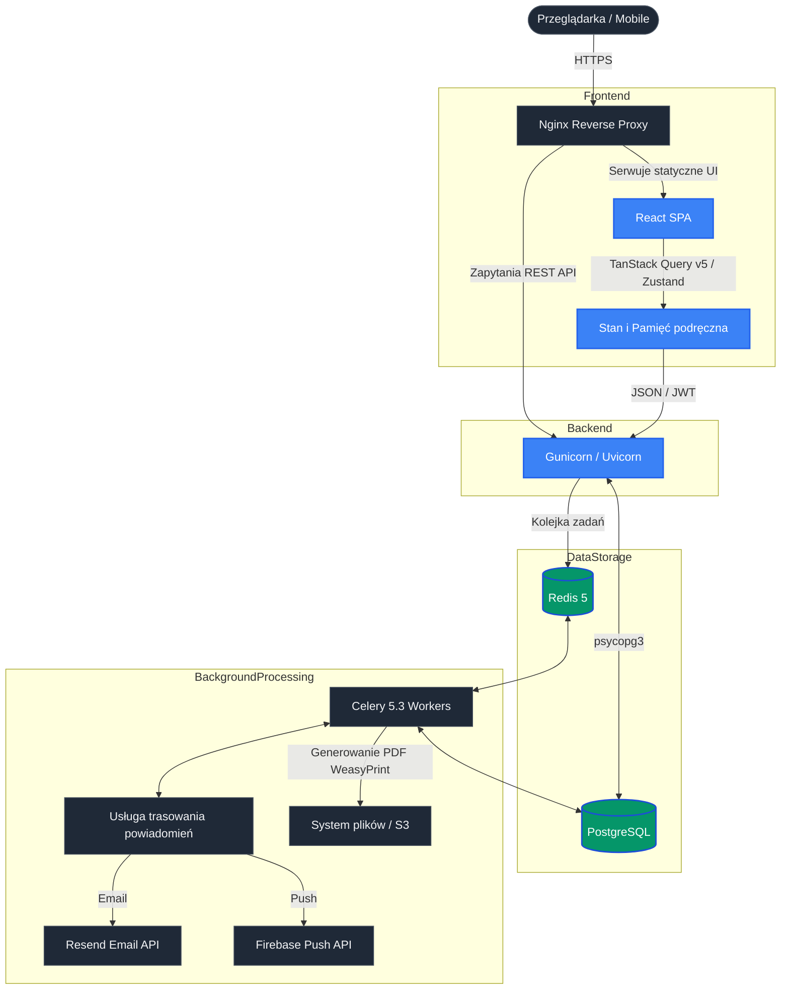

# 🎼 VoctManager | Korporacyjny System Operacyjny dla Chóru i Platforma Operacji Cyfrowych

🌍 *Przeczytaj w innych językach: [English](README.md), [Polski](README.pl.md).* 


**VoctManager** to wysokowydajna platforma o podwójnej architekturze, zaprojektowana jako oficjalna cyfrowa infrastruktura dla profesjonalnego zespołu wokalnego **VoctEnsemble**. Łączy w sobie złożoną logistykę produkcji, bezpieczne zarządzanie zasobami i immersyjne, kinowe doświadczenie cyfrowe.

Platforma ściśle przestrzega architektury **Feature-Sliced Design (FSD)**, co zapewnia skalowalność, separację domeny i długoterminową odporność.

🌐 **Wersja Publiczna Live:** [test.voctensemble.com](https://test.voctensemble.com)
🔐 **Panel Enterprise (Demo):** [test.voctensemble.com/panel](https://test.voctensemble.com/panel)

---

## 🏛️ Architektura Systemu i Standardy Inżynieryjne

Platforma jest zbudowana na wysoko zdekomponowanej architekturze zaprojektowanej z myślą o wysokiej dostępności, odpornym na offline buforowaniu oraz asynchronicznym przetwarzaniu w tle.



---

## ✨ Podstawowe Funkcje Enterprise

### 1. Kinowy UX "Ethereal" (Frontend)
- **Architektura Zero-Layout-Shift:** Obowiązkowe użycie boundary suspense, `EtherealLoader` i rygorystycznych stanów skeleton, zapewniających absolutną stabilność układu przy asynchronicznym pobieraniu danych.
- **Sprzętowo akcelerowana kinematyka:** Złożone animacje 60FPS na bazie **Framer Motion v12** i **Three.js**. Autorskie hooki React (`useMouseAndGyro`) mapują telemetrię sprzętu na mikrointerakcje UI.
- **Siatki Bento:** Panele Dashboard są organizowane za pomocą matematycznego, stopniowanego układu bento (`<StaggeredBentoContainer>`), tworząc przestrzenny, wielowarstwowy interfejs 3D z własnymi wariantami glassmorphism.
- **Dostępność EAA:** Primitwy Radix i semantyczny HTML gwarantują zgodność z Europejskim Aktem o Dostępności.

### 2. System Enterprise i Logistyka (Backend)
- **Granularny RBAC:** Głęboka kontrola dostępu oparta na rolach (Admin, Manager, Artysta, Crew), zabezpieczająca endpointy, payloady i widoczność interfejsu.
- **Web Push i alerty w czasie rzeczywistym:** Rodzaj natywnej komunikacji push oparty na standardzie W3C VAPID. Obsługiwany asynchronicznie przez Celery wraz z transakcyjnym systemem email.
- **Synchronizacja kalendarzy (iCal):** Bezproblemowa integracja z zewnętrznymi kalendarzami, automatycznie generująca feedy iCal do Google i Apple Calendar.
- **Optimistic UI:** Agresywne buforowanie stanu serwera przy użyciu **@tanstack/react-query v5.91+**, zapewniające odczucie zerowego opóźnienia dla krytycznych mutacji (potwierdzenie obecności, zmiany castingu).
- **Asynchroniczny silnik dokumentów:** Produkcyjne przepływy pracy, takie jak dynamiczne generowanie umów i arkuszy produkcyjnych, są obsługiwane przez **Celery workers** i **WeasyPrint**, co chroni główny wątek przed blokowaniem.
- **Smart Archive i ochrona zasobów:** Bezpieczna, tokenowana dystrybucja wrażliwych zasobów repertuarowych (PDF-y nut, pliki referencyjne audio) skojarzona z aktywnym obsadzeniem projektu.
- **Mikro-casting:** Interfejsy Drag & Drop przystosowane do obsługi dotykowej (`@dnd-kit/core`), do budowy programów koncertowych i zarządzania przypisaniami artystów.
- **Internacjonalizacja (i18n):** Pełne wsparcie lokalizacyjne (angielski, francuski, polski) przygotowane dla międzynarodowych tras i różnorodnych zespołów.

---

## 🛠️ Stos technologiczny (standardy 2026)

### Środowisko frontendu
* **Rdzeń:** React 19.2+, Vite 7.3+, TypeScript 6.0+
* **Architektura:** Feature-Sliced Design (FSD)
* **Styling:** Tailwind CSS v4.2+ (z tokenami Ethereal Design System), `clsx`, `tailwind-merge`
* **Stan i pobieranie:** Zustand 5+, `@tanstack/react-query` v5.91+
* **Ruch i interakcje:** Framer Motion v12+, `@dnd-kit/core` v6+ (TouchSensor)
* **Formularze:** React Hook Form v7+ z Zod v4.3+

### Środowisko backendowe
* **Rdzeń:** Python 3.12+, Django 6.0+, Django REST Framework (DRF) 3.16+
* **Walidacja i typy:** Surowe adnotacje typów Pythona, Pydantic
* **Baza danych:** PostgreSQL (przez sterownik `psycopg` v3)
* **Uwierzytelnianie:** JWT przez `djangorestframework-simplejwt`
* **Broker i workerzy:** Redis 5+, Celery 5.3+
* **Generowanie dokumentów:** WeasyPrint v68+

### Infrastruktura i DevOps
* **Konteneryzacja:** Docker i Docker Compose (Zero-parity między Dev a Prod)
* **Serwer WWW:** Nginx, Gunicorn 21+ (Uvicorn dla asynchronicznego ruchu)
* **Zarządzanie zasobami statycznymi:** WhiteNoise

---

## 🔒 Bezpieczeństwo, prywatność i zgodność danych

Przetwarzanie umów artystycznych, harmonogramów prób i chronionych materiałów muzycznych wymaga najwyższej klasy zabezpieczeń:

### Uwierzytelnianie i kontrola dostępu
* **Uwierzytelnianie bezstanowe:** Bezpieczna strategia oparta na ciasteczkach HttpOnly i rotacji tokenów JWT, ograniczająca ryzyko XSS i CSRF.
* **Granularny RBAC:** Macierze kontroli dostępu oparte na rolach (Admin, Manager, Artysta, Crew) z restrykcjami na poziomie endpointu i payloadu.
* **Dystrybucja zasobów z zabezpieczeniem tokenem:** Wrażliwe zasoby repertuarowe (PDF-y nut, pliki referencyjne audio) zabezpieczone czasowo ograniczonymi, podpisanymi tokenami powiązanymi wyłącznie z aktywnym uczestnictwem w projekcie.

### Ochrona danych i prywatność
* **Zgodność z RODO:** Zbudowane przepływy minimalizacji danych i mechanizmy miękkiego usuwania, aby zachować historię produkcji, spełniając ścisłe przepisy dotyczące prywatności.
* **Szyfrowanie na poziomie pola:** Wrażliwe pola (umowy, dane wynagrodzenia) są szyfrowane w spoczynku przy użyciu szyfru FERNET.
* **Dziennik audytu:** Niezmienne logi transakcji dla wszystkich mutacji dotyczących danych HR i finansowych, umożliwiające analizę kryminalistyczną i raportowanie zgodności.

### Integralność domeny
* **Ograniczenia relacyjne:** Ścisłe ograniczenia klucza obcego i sprawdzenia na poziomie bazy danych zapobiegają uszkodzeniu danych podczas złożonych operacji wieloentityowych (np. wycofywanie castingu, rozwiązywanie umów).
* **Walidacja Pydantic:** Usługowe DTO wymuszają bezpieczeństwo typów i walidację reguł biznesowych przed utrwalieniem, eliminując cichą degradację danych.

---

## 🚦 Mapa drogi inżynierii (Wizja 2026)

VoctManager jest zaprojektowany do ciągłej ewolucji w kierunku obserwowalności i odporności klasy produkcyjnej:

- [x] **Podstawowe ERP i logistyka:** Kompletne modele domeny dla projektów, zespołów, umów i planowania.
- [x] **Powiadomienia oparte na zdarzeniach:** Asynchroniczne trasowanie powiadomień z dostawcami Resend (email) i Firebase (push).
- [x] **Konteneryzacja i orkiestracja:** Docker i Docker Compose z zerową parytetem między środowiskami Dev i Prod.
- [x] **Przetwarzanie asynchroniczne:** Celery + Redis dla zadań w tle (generowanie dokumentów, powiadomienia grupowe, eksport danych).
- [ ] **Obserwowalność i APM:** Sentry do śledzenia błędów, Prometheus + Grafana do metryk i dashboardów.
- [ ] **Rozproszone śledzenie:** Instrumentacja OpenTelemetry do śledzenia żądań end-to-end między usługami i zewnętrznymi API.
- [ ] **Automatyczne testowanie:** Pokrycie PyTest dla krytycznych ścieżek biznesowych (generowanie umów, kalkulacje wynagrodzeń, algorytmy castingu).
- [ ] **Pipelines CI/CD:** GitHub Actions do zautomatyzowanego lint, build, test i wdrożeń bez przestojów.
- [ ] **Zaawansowane buforowanie:** Klaster Redis do zarządzania sesją i unieważniania rozproszonej pamięci podręcznej.
- [ ] **Limitowanie szybkości i ochrona DDoS:** Reguły CloudFlare + WAF do zapobiegania nadużywaniu API.
- [ ] **Replikacja bazy danych:** Replikacja przesyłania PostgreSQL w celu zapewnienia wysokiej dostępności i odzyskiwania po awarii.
- [ ] **SMS i połączenia głosowe:** Integracja Twilio dla przypomnień o próbach i krytycznych alertów harmonogramu.

---

## 📸 Interfejs systemu (Ethereal Design System)

| Główny Dashboard (Staggered Bento OS) | Projekt i edytor logistyki |
|:---:|:---:|
|  |  |
| **Smart Archive (Zarządzanie zasobami)** | **Macierz obecności o wysokiej gęstości** |
|  |  |

---

## 🚀 Szybki start (lokalne środowisko)

Projekt wykorzystuje Docker Compose do standaryzowanego środowiska deweloperskiego.

### Wymagania
* Docker oraz Docker Compose (v2)
* GNU Make

### Inicjalizacja

1. **Sklonuj repozytorium:**
   ```bash
   git clone https://github.com/bedikryst/voctmanager.git
   cd voctmanager
   ```

2. **Konfiguracja środowiska:**
   ```bash
   cp .env.example .env
   cp frontend/.env.example frontend/.env
   ```

3. **Orkiestracja infrastruktury:**
   Korzystając z dołączonego Makefile:
   ```bash
   make up
   ```

4. **Provisioning bazy danych:**
   ```bash
   make migrate
   make seed
   make superuser
   ```

5. **Lokalny serwer frontendowy (opcjonalnie dla inżynierii UI):**
   ```bash
   cd frontend
   npm install
   npm run dev
   ```

   * API: `http://localhost:8000/api/`
   * Frontend: `http://localhost:5173`

### 📖 Dokumentacja API
Backend udostępnia w pełni interaktywną dokumentację OpenAPI (Swagger). Po uruchomieniu kontenerów jest dostępna pod adresem:
👉 **[http://localhost:8000/api/docs](http://localhost:8000/api/docs)**

---

## 👨‍💻 Kierownictwo inżynieryjne

**Krystian Bugalski**
* [LinkedIn](https://www.linkedin.com/in/krystian-bugalski)
* [GitHub](https://github.com/bedikryst)

*Zaprojektowane z precyzją dla przyszłości zarządzania chórem.*
'''
with open(r'c:\Users\kryst\VoctManager\README.pl.md','w',encoding='utf-8') as f:
    f.write(content)"