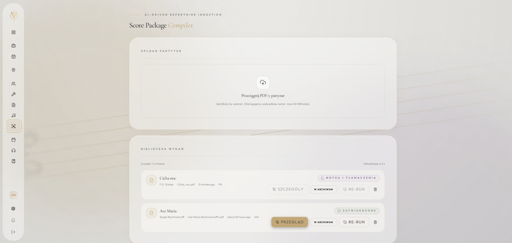
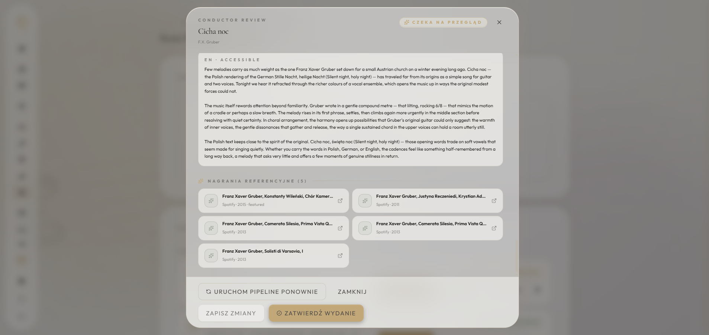
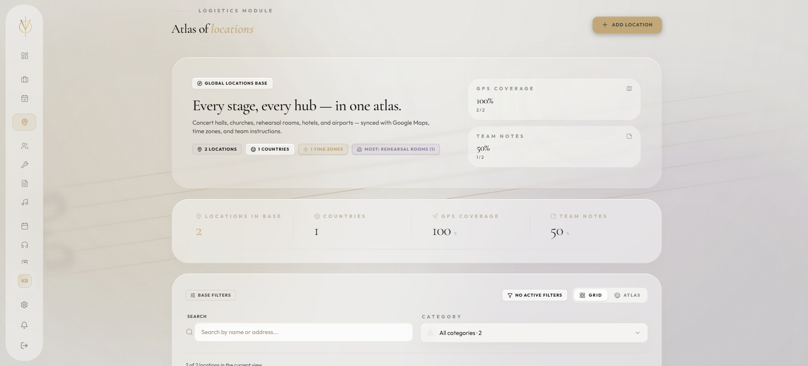
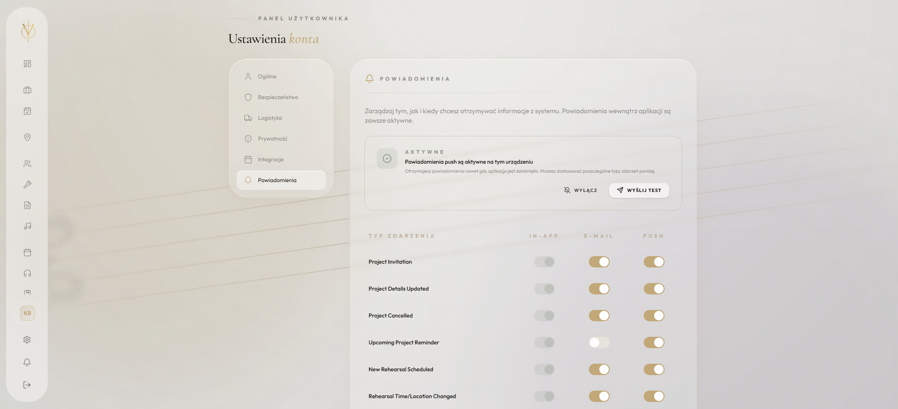
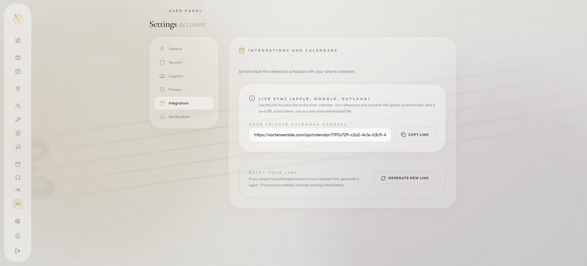
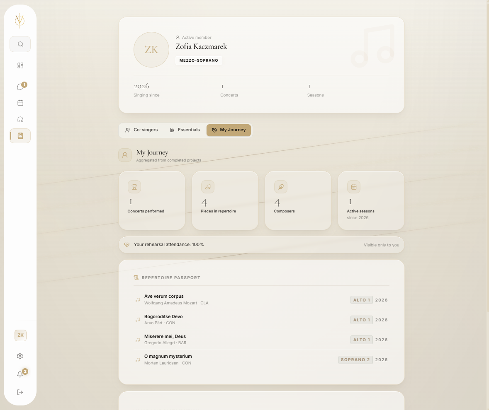
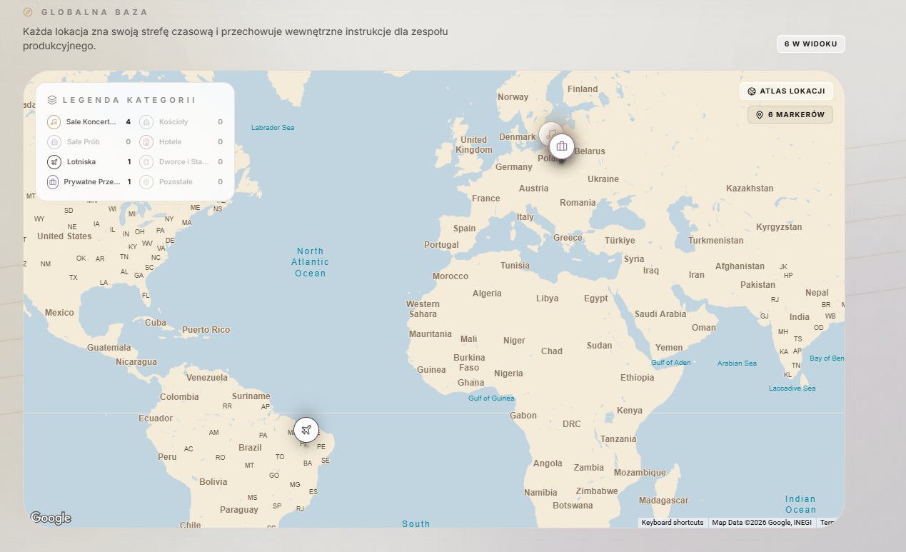
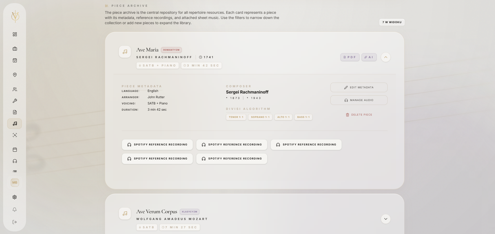

# 🎼 VoctManager | Korporacyjny System Operacyjny dla Chóru i Platforma Operacji Cyfrowych

🌍 *Przeczytaj w innych językach: [English](README.md), [Polski](README.pl.md).*


**VoctManager** to platforma o podwójnej architekturze, łącząca ERP z operacjami cyfrowymi — oficjalna cyfrowa infrastruktura profesjonalnego zespołu wokalnego **VoctEnsemble**. Łączy logistykę produkcji, bezpieczne zarządzanie zasobami i kinowe doświadczenie publiczne pod jednym backendem.

Frontend stosuje **Feature-Sliced Design (FSD)**, a backend Django jest podzielony na warstwy usług i selektorów — domeny pozostają odizolowane, a baza kodu utrzymywalna w miarę wzrostu.

🌐 **Wersja Publiczna Live:** [voctensemble.com](https://voctensemble.com)

---

## 🏛️ Architektura Systemu i Standardy Inżynieryjne

Platforma jest zbudowana na zdekomponowanej architekturze: asynchroniczne przetwarzanie w tle, odporność cache po stronie klienta (persystencja zapytań) oraz czysty rozdział strony publicznej od uwierzytelnionego panelu.

```mermaid
graph TD
    Client([Przeglądarka / Mobile]) -->|HTTPS| Nginx[Nginx Reverse Proxy]

    subgraph PublicWeb [Strona Publiczna &nbsp;·&nbsp; web/]
        Nginx -->|Statyczny HTML + _astro/*| Astro[Astro 6 · Islands]
        Astro -->|/api/payments · /api/contact| Gunicorn
    end

    subgraph Panel [Panel uwierzytelniony &nbsp;·&nbsp; frontend/]
        Nginx -->|/panel · /login · /documents| React[React SPA]
        React -->|TanStack Query v5 / Zustand| StateManager[Stan i Pamięć podręczna]
    end

    subgraph Backend
        Nginx -->|Zapytania REST API| Gunicorn[Gunicorn / Uvicorn]
        StateManager -->|JSON / JWT| Gunicorn
    end

    subgraph DataStorage
        Gunicorn <-->|psycopg3| DB[(PostgreSQL)]
        Gunicorn -->|Kolejka zadań| Redis[(Redis 5)]
    end

    subgraph BackgroundProcessing
        Redis <--> Celery[Celery 5.3 Workers]
        Celery <--> NotificationService[Usługa trasowania powiadomień]
        NotificationService -->|Email| Resend[Resend Email API]
        NotificationService -->|Push| Firebase[Firebase Push API]
        Celery <--> DB
        Celery -->|Generowanie PDF WeasyPrint| Ext[System plików / S3]
    end

    subgraph AIScoreCompiler[Kompilator Pakietów Partytur AI]
        Celery -->|Natywny PDF (wizja)| Claude["Sonnet 4.6 — jedno skonsolidowane wywołanie<br/>tożsamość · części · tekst · IPA · tłumaczenia"]
        Claude -->|Zapytania orkiestrowane narzędziami| ExtMeta["MusicBrainz · Wikidata<br/>Spotify · YouTube"]
        ExtMeta -.->|buforowane odpowiedzi| Redis
        Claude -->|Pola stemplowane proweniencją| DB
    end

    classDef default fill:#1f2937,stroke:#4b5563,stroke-width:1px,color:#f3f4f6;
    classDef highlight fill:#3b82f6,stroke:#2563eb,stroke-width:2px,color:#ffffff;
    classDef db fill:#059669,stroke:#1d4ed8,stroke-width:2px,color:#ffffff;
    classDef ai fill:#D97757,stroke:#b85c3e,stroke-width:2px,color:#ffffff;

    class React,StateManager,Gunicorn highlight;
    class DB,Redis db;
    class Claude,ExtMeta ai;
```

---

## ✨ Podstawowe Funkcje Enterprise

### 1. Dwa frontendy — Panel (React SPA) + Strona publiczna (Astro)

Platforma dostarcza **dwa niezależne frontendy** współdzielące jeden backend Django:

* **Panel SPA — [`frontend/`](frontend/README.pl.md):** uwierzytelniony ERP dla menedżerów, artystów i ekipy (`/panel/*`). React 19 + TanStack Query + Framer Motion, ścisły FSD, system projektowy Ethereal. Odpowiada za kinową, glassmorphic powierzchnię operacyjną.
* **Strona publiczna — [`web/`](web/README.pl.md):** landing voctensemble.com / voctfoundation.pl + podstrony (`/`, `/koncerty`, `/o-nas`, `/kontakt`, `/polityka-prywatnosci`). **Astro 6** (statyczny HTML + wyspy React + natywne View Transitions), płynne przewijanie Lenis, art-direction sakralny minimalizm w duchu *„Nawy światła"*. Crawlable i gotowe pod Ad Grants z założenia.

Filary inżynieryjne frontendu:

- **Architektura Zero-Layout-Shift:** Boundary suspense + `<EtherealLoader>` + rygorystyczne stany skeleton utrzymują CLS na poziomie 0 podczas asynchronicznego pobierania danych.
- **Kinematyka 60FPS:** Animacje napędzane wyłącznie przez `transform` / `opacity` za pomocą **Framer Motion v12** (panel) i ręcznie pisanej choreografii CSS + pętli rAF w JS (strona publiczna). Strona publiczna używa **Lenis v1.3+** smooth-scrolla na poziomie okna zsynchronizowanego z View Transitions; panel korzysta z natywnego scrolla platformy.
- **Kinowe przejścia między stronami:** Strona publiczna Astro komponuje natywne keyframes `::view-transition-old/new(root)` (sakralny fade + Y-drift + blur, 320ms / 540ms) z shared `view-transition-name: voct-brand`, więc znak świecy morphuje płynnie między nawigacjami zamiast cross-fadeu.
- **Stopniowane panele Bento:** Wszystkie widoki panelu komponowane przez `<StaggeredBentoContainer>` / `<StaggeredBentoItem>` na wspólnym zestawie tokenów glassmorphism (`shadow-glass-ethereal`) — przestrzenne, przewidywalne, sterowane motywem.
- **Dostępność EAA:** Primitywy Radix UI + semantyczny HTML spełniające bazowe wymogi Europejskiego Aktu o Dostępności; strona publiczna dodaje opt-outy `prefers-reduced-motion` na każdej animowanej powierzchni.

### 2. Kompilator Pakietów Partytur napędzany AI
- **Analiza natywnego PDF (wizja):** Jedno skonsolidowane wywołanie Sonnet 4.6 czyta **cały** wgrany PDF wzrokowo (warstwa tekstowa *oraz* skany) i zwraca naraz tożsamość utworu, części, tekst śpiewany, IPA linia-w-linię i tłumaczenia prozą — radząc sobie ze skanami i realnym układem strony zamiast kruchego zgrywania tekstu. PDF jest buforowany (`cache_control: ephemeral`), więc ponowienia z eskalacją czytają go taniej.
- **Odporność na przeciążenie:** Chwilowe przeciążenia Anthropica (HTTP 529 / 5xx / 429 / timeout) są klasyfikowane jako przejściowe i ponawiane **cierpliwie** (dziesiątki sekund → minuty), ze stanem „usługa zajęta, ponawiam" na żywo — koniec z burzą „ponów-i-padnij". Truncation i błędy 4xx zostają terminalne i nie palą budżetu na skazane ponowienie.
- **Rozwiązywanie tożsamości kanonicznej:** Deduplikacja kompozytorów i utworów przez krzyżowe odniesienia **MusicBrainz MBID** i **Wikidata QID** — AI ekstrahuje, ale nigdy nie halucynuje faktów biograficznych ani identyfikatorów kanonicznych.
- **Wzbogacanie metadanych zewnętrznych:** Orkiestrowane narzędziami zapytania do MusicBrainz, Wikidata, Spotify Web API i YouTube Data API v3, z odpowiedziami buforowanymi w Redis, ponowieniami z wykładniczym backoffem i łagodną degradacją, gdy któreś źródło jest niedostępne.
- **Proweniencja klasy audytowej:** Każde pole pochodzące z AI lub API jest stemplowane `(model, prompt_version, source_reference, confidence, retrieved_at)` w tabeli `ProvenanceRecord` z generycznym kluczem obcym — umożliwiając regenerację jednym kliknięciem i kryminalistyczny przegląd zgodności.
- **Kontrola kosztów w architekturze:** Natywne przetworzenie PDF kosztuje średnio **~0,10–0,30 USD**. Trzy niezależne limity wymuszane na granicy zadania Celery: **per-przebieg**, **dożywotni** per wydanie (nigdy nie zerowany — re-przetwarzany PDF nie wydrenuje konta) oraz **dzienny budżet org** jako bezpiecznik — każde obciążenie Claude nalicza licznik przebiegu i dożywotni.
- **Postęp na żywo (SSE):** Asynchroniczny (ASGI) endpoint Server-Sent-Events strumieniuje krok, koszt i status każdego przetwarzania w chwili zapisu przez workera; przeglądarka subskrybuje przez `EventSource` (cookie JWT) z fallbackiem na polling. Dyrygent widzi pracę AI krok po kroku od momentu uploadu — na desktopie i telefonie.
- **Dyrygent w pętli decyzyjnej:** AI sugeruje, dyrygent decyduje. Każda ekstrakcja prezentuje wskaźnik pewności i ekran przeglądu — platforma nigdy po cichu nie modyfikuje kanonicznego repertuaru.

### 3. System Enterprise i Logistyka (Backend)
- **Granularny RBAC:** Głęboka macierz kontroli dostępu opartej na rolach (Admin, Manager, Artysta, Crew), zabezpieczająca endpointy, payloady danych i widoczność interfejsu.
- **Web Push i alerty w czasie rzeczywistym:** Natywno-podobne powiadomienia push w czasie rzeczywistym oparte na standardzie W3C VAPID. Obsługiwane asynchronicznie przez Celery wraz z solidnym transakcyjnym silnikiem email, utrzymujące artystów na bieżąco ze zmianami castingu i harmonogramu.
- **Komunikacja wewnętrzna:** Asynchroniczne, dwukierunkowe wątki między chórzystami a pulą dyrygentów/zarządu oraz kanały rozgłoszeniowe per projekt — dostarczane in-app + e-mail + push, z licznikiem nieprzeczytanych i wspólną skrzynką. Menedżerowie dostają workflow triage (przydziel / zamknij), przeszukiwalną skrzynkę z filtrami statusu, **skrzynkę dyrygenta** w bezczynnym panelu, która wydobywa to, co wymaga uwagi (wyliczane po stronie klienta, bez dodatkowych zapytań), oraz przypięte ogłoszenia kanałowe. Strumienie pogrupowane dniami niosą awatary nadawców i sygnały optymistycznego wysyłania; świadomie **nie** czat w czasie rzeczywistym (bez presence/„pisze…") — magazyn (`messaging`) jest oddzielony od dostarczania (`notifications`), więc każda wiadomość korzysta z istniejącego pipeline'u powiadomień.
- **Synchronizacja kalendarzy (iCal):** Bezproblemowa integracja z zewnętrznymi kalendarzami, automatycznie generująca feedy iCal do synchronizacji z Google i Apple Calendar.
- **Optimistic UI:** Agresywne buforowanie stanu serwera przy użyciu **@tanstack/react-query v5.91+**, zapewniające odczucie zerowego opóźnienia dla krytycznych mutacji (potwierdzenie obecności, zmiany castingu).
- **Asynchroniczny silnik dokumentów:** Produkcyjne przepływy pracy, takie jak dynamiczne generowanie umów i kompilacja arkuszy produkcyjnych, są przekazywane do **Celery workers** i **WeasyPrint**, gwarantując, że główny wątek pozostaje nieblokowany.
- **Smart Archive i ochrona zasobów:** Bezpieczna, tokenowana dystrybucja wrażliwych zasobów repertuarowych (PDF-y nut, audio referencyjne) ściśle powiązana z aktywnym obsadzeniem projektu.
- **System mikro-castingu:** Interfejsy Drag & Drop gotowe na dotyk (`@dnd-kit/core`) do budowy złożonych programów koncertowych i zarządzania indywidualnymi przypisaniami artystów.
- **Internacjonalizacja (i18n):** Pełne wsparcie lokalizacyjne (angielski, francuski, polski) przygotowane dla międzynarodowych tras i różnorodnych zespołów artystów.

---

## 🛠️ Stos technologiczny (standardy 2026)

### Panel SPA — [`frontend/`](frontend/README.pl.md)
* **Rdzeń:** React 19.2+, Vite 7.3+, TypeScript 5.9+
* **Architektura:** Feature-Sliced Design (FSD)
* **Styling:** Tailwind CSS v4.2+ (z tokenami Ethereal Design System), `clsx`, `tailwind-merge`
* **Stan i pobieranie:** Zustand 5+, `@tanstack/react-query` v5.91+
* **Ruch i interakcje:** Framer Motion v12+, `@dnd-kit/core` v6+ (TouchSensor)
* **Formularze:** React Hook Form v7+ z Zod v4.3+

### Strona publiczna (Astro) — [`web/`](web/README.pl.md)
* **Rdzeń:** Astro 6.3+ (`build.format: "file"`), `@astrojs/react` 5+, React 19, TypeScript 6+
* **Architektura:** Wyspy Astro — domyślnie server-rendered HTML, React hydratowany tylko dla lejka datków Vault, bramy audio Threshold, sticky chrome i kursora
* **Styling:** Ręcznie pisany CSS w duchu sakralnego minimalizmu — bez Tailwinda, bez żadnego zewnętrznego frameworku CSS. Tokeny przez CSS custom properties (`--candle`, `--ink`, `--paper`), self-hostowane fonty zmienne (ścisłe RODO, zero third-party)
* **Ruch:** `lenis@1.3+` smooth-scroll na poziomie okna, natywne API View Transitions, pipeline reveal sterowany IntersectionObserver, parallax JS rAF (cross-browser fallback dla częściowego wsparcia `animation-timeline`)
* **Treść:** Astro Content Collections (`concerts.yaml`, `repertoire.yaml`) + ręcznie kuratorowane moduły TS (manifest, paths)

### Środowisko backendowe
* **Rdzeń:** Python 3.12+, Django 6.0+, Django REST Framework (DRF) 3.16+
* **Walidacja i typy:** Surowe adnotacje typów Pythona, Pydantic
* **Baza danych:** PostgreSQL (przez sterownik `psycopg` v3)
* **Uwierzytelnianie:** JWT przez `djangorestframework-simplejwt`
* **Broker i workerzy:** Redis 5+, Celery 5.3+
* **Generowanie dokumentów:** WeasyPrint v68+, pypdf v5+
* **AI / Inteligencja repertuarowa:** Anthropic Python SDK (Claude Opus 4.7 / Sonnet 4.6 / Haiku 4.5), adaptacyjne myślenie, buforowanie promptów, ustrukturyzowany output przez schematy Pydantic

### Infrastruktura i DevOps
* **Konteneryzacja:** Docker i Docker Compose (Zero-parity między Dev a Prod)
* **Serwer WWW:** Nginx, Gunicorn 21+ (Uvicorn dla asynchronicznego ruchu)
* **Zarządzanie zasobami statycznymi:** WhiteNoise

---

## 🔒 Bezpieczeństwo, prywatność i zgodność danych

Przetwarzanie umów artystycznych, harmonogramów prób i chronionych materiałów muzycznych traktujemy jako priorytetową kwestię bezpieczeństwa:

### Uwierzytelnianie i kontrola dostępu
* **JWT w ciasteczkach:** Tokeny access + refresh dostarczane wyłącznie w ciasteczkach `httpOnly`, `Secure`, `SameSite=Lax` (`CookieJWTAuthentication`) — SPA nigdy nie odczytuje tokenu, co zamyka wektor wykradzenia przez XSS; do tego CSRF double-submit.
* **Granularny RBAC:** Macierze kontroli dostępu oparte na rolach (Admin, Manager, Artysta, Crew) z drobnoziarnistymi restrykcjami na poziomie endpointu i payloadu.
* **Dystrybucja zasobów z zabezpieczeniem tokenem:** Wrażliwe zasoby repertuarowe (PDF-y nut, audio referencyjne) zabezpieczone czasowo ograniczonymi, podpisanymi tokenami powiązanymi wyłącznie z aktywnym uczestnictwem w projekcie.

### Ochrona danych i prywatność
* **Zgodność z RODO u podstaw:** Przepływy minimalizacji danych i `SoftDeleteModel` (`is_deleted` + filtrujący menedżer domyślny), który zachowuje historię produkcji bez przeciekania usuniętych rekordów do aktywnych zapytań.
* **Brak zewnętrznych CDN-ów dla fontów:** Strona publiczna hostuje samodzielnie wszystkie zmienne fonty woff2 (zero transferu IP użytkownika do Google Fonts / Bunny) — zgodnie z deklarowaną polityką prywatności.

### Integralność domeny
* **Ograniczenia relacyjne:** Klucze obce i `CheckConstraint`y na poziomie bazy danych chronią przed uszkodzeniem podczas operacji wieloentityowych (np. wycofywanie castingu, rozwiązywanie umów).
* **Walidacja Pydantic:** Usługowe DTO wymuszają bezpieczeństwo typów i walidację reguł biznesowych przed utrwaleniem, zapobiegając cichej degradacji danych.

---

## 🚦 Mapa drogowa inżynierii (Wizja 2026)

VoctManager jest zaprojektowany do ciągłej ewolucji w kierunku obserwowalności i odporności klasy produkcyjnej:

- [x] **Podstawowe ERP i logistyka:** Kompletne modele domeny dla projektów, zespołów, umów i planowania.
- [x] **Powiadomienia oparte na zdarzeniach:** Asynchroniczne trasowanie powiadomień z dostawcami Resend (email) i Firebase (push) — plus dzienne digesty, przypomnienia o próbach i wygaszanie po bounce/skardze ESP.
- [x] **Przetwarzanie asynchroniczne:** Celery + Redis dla zadań w tle (generowanie dokumentów, powiadomienia grupowe, beaty przypomnień/digestów).
- [x] **Konteneryzacja i orkiestracja:** Docker i Docker Compose z zerowym parytetem między środowiskami Dev i Prod.
- [x] **Śledzenie błędów:** Sentry SDK wpięty w Django do przechwytywania błędów produkcyjnych i monitorowania kondycji wydań.
- [x] **Automatyczne testowanie:** Zestaw testów Django/PyTest (~160) pokrywający krytyczne ścieżki — roster, payments, messaging, notifications, documents, archive, logistics, core — w tym generowanie umów i pipeline proweniencji AI.
- [x] **CI (backend):** GitHub Actions odpala Ruff, mypy (strict) i pełny zestaw testów na PostgreSQL przy każdym pushu i PR.
- [x] **Kompilator Partytur AI — Schemat i pipeline przetwarzania:** Kanoniczny schemat domeny (`Composer.mbid`, `Piece.mbid_work`, `ScoreEdition`, `Movement`, `Translation`, `Recording`, `Annotation`, `ProgramNote`, `ProvenanceRecord`) plus działający łańcuch Celery — natywno-PDF wrapper Claude (wizja, adaptacyjne myślenie, podwójne śledzenie kosztów per-przebieg/dożywotnio, buforowanie promptów, cierpliwe ponawianie przy przeciążeniu 529) czytający całą partyturę w jednym skonsolidowanym wywołaniu, rozwiązujący kompozytorów/utwory względem MusicBrainz i Wikidata, generujący noty programowe + IPA + przekłady śpiewalne, strumieniujący postęp na żywo przez SSE i prezentujący ekran przeglądu dla dyrygenta. Klienty zewnętrzne (MusicBrainz, Wikidata, Spotify, YouTube) buforowane w Redis.
- [ ] **Kompilator Partytur AI — Montaż koncertu i adnotacje:** Generowanie skoroszytu koncertowego WeasyPrint + pypdf (okładka, spis treści, materiały wstępne per utwór, oryginalne partytury) oraz nakładka adnotacji w przeglądarce PDF.js + Konva (podświetlenie, komentarz, odręczne rysowanie, zmiana kolejności stron) z wersjonowaną, warstwową persystencją i spłaszczaniem przy eksporcie.
- [ ] **Szyfrowanie pól i dziennik audytu:** Szyfrowanie w spoczynku (Fernet) pól umów/finansowych oraz niezmienny log mutacji rekordów HR/finansowych do przeglądu kryminalistycznego.
- [ ] **CI frontendu i testy E2E:** Pipeline'y lint / typecheck / build dla obu frontendów oraz pokrycie E2E Playwright w oparciu o istniejący harness zrzutów ekranu.
- [ ] **Metryki i rozproszone śledzenie:** Dashboardy Prometheus + Grafana oraz instrumentacja OpenTelemetry do śledzenia żądań end-to-end między usługami i zewnętrznymi API.
- [ ] **Automatyczne backupy i odzyskiwanie po awarii:** Zaplanowane kopie PostgreSQL + mediów z rotacją (`infra/backup.sh`; na razie na droplecie, kopia poza serwerem wciąż do zrobienia dla pełnego DR). Trwałość mediów + serwowanie przez nginx już działa dzięki bind-mountom hosta.
- [ ] **Zaawansowane buforowanie:** Klaster Redis do zarządzania sesją i unieważniania rozproszonej pamięci podręcznej.
- [ ] **Limitowanie szybkości i ochrona DDoS:** Reguły CloudFlare + WAF oraz throttling DRF do zapobiegania nadużywaniu API.
- [ ] **Replikacja bazy danych:** Strumieniowa replikacja PostgreSQL w celu zapewnienia wysokiej dostępności i odzyskiwania po awarii.
- [ ] **Zgodność z EAA (dostępność):** Automatyczne testy dostępności (axe / Playwright) certyfikujące bazowy poziom Europejskiego Aktu o Dostępności, pod który budowany jest UI.
- [ ] **Wdrożenia bez przestojów:** Automatyzacja release'ów blue-green / rolling na bazie obecnego jednokomendowego buildu produkcyjnego.

---

## 🎬 Strona publiczna — `web/` (Astro)

Publiczna powierzchnia voctensemble.com / voctfoundation.pl to aplikacja **Astro 6** zbudowana wokół art-directionu sakralnego minimalizmu („Nawa światła") — domyślnie server-rendered HTML, wyspy React hydratowane tylko tam, gdzie naprawdę żyje stan. Komponuje sekwencję: rytualny preloader (raz na sesję) → brama progowa → sticky chrome → hero → manifest → trzy „interludia eteryczne" przeplatające minione koncerty → finałowe wsparcie → coda. Choreografia działa przy utrzymanych 60 FPS na płynnym przewijaniu Lenis, z natywnym API View Transitions dla przejść między stronami.

Pełne doświadczenie opiera się na kinematyce powiązanej ze scrollem, sygnałach audio, paralaksie, autorskim kursorze z magnetic snap, View Transitions i fizyce bramy progowej. **Statyczne zrzuty ekranu i GIF-y nie oddają tego sprawiedliwie** — łapią klatki, nie przepływ. Strona live jest publicznie dostępna:

### ▶ [voctensemble.com](https://voctensemble.com) — otwórz w przeglądarce desktopowej z włączonym dźwiękiem

> **Dlaczego osobna aplikacja Astro?** Powłoka CSR panelu była regresją SEO/perf dla strony fundacji starającej się o Google Ad Grants. Astro emituje crawlable statyczny HTML, wysyła React tylko tam, gdzie potrzebny (lejek datków Vault, brama audio, sticky chrome), i używa natywnego API View Transitions dla dopracowanych przejść między stronami bez narzutu CSR runtime. Źródło prawdy: [`web/README.pl.md`](web/README.pl.md).

| Sekcja | Na co zwrócić uwagę |
|---|---|
| **Preloader → Brama progowa** | Sakralny rytuał (raz na sesję), wybór audio w localStorage, orkiestracja pierwszego paintu |
| **Hero → Manifest** | Autorski kursor z magnetic snap, oddech variable-font wght + per-word stagger, złoty bloom emanujący z tekstu |
| **Interludia eteryczne I / II / III** | Audio-reaktywna intensywność splotów (analizer Web Audio), motywy łacińskie z cyframi rzymskimi |
| **Ścieżka minionych koncertów** | Stos paralaksy (cross-browser JS), akordeon smooth-details |
| **Finałowe wsparcie / Przepływ Skarbca** | Wieloetapowy panel darowizny, redirect bramki Axepta, modale wdzięczności/niepowodzenia |
| **Nawigacja między stronami** | Natywne keyframes `::view-transition-*` z shared `voct-brand`, znak świecy morphujący między stronami |

> **Źródło:** [`web/src/pages/index.astro`](web/src/pages/index.astro) — komponuje 9 sekcji i 6 wysp React (Preloader, ThresholdGate, AudioController, StickyHeader, SiteCursor, SiteFooter, VaultIsland). Podstrony (`/koncerty`, `/o-nas`, `/kontakt`) reużywają `SiteChrome` + `SiteFooter` i montują tylko wyspę Vault dla datków w miejscu.

> **Źródłowe zdjęcia strony publicznej** (`web/src/assets/photos/*.jpg`) są celowo gitignorowane — to 5-12 MB oryginałów należących do współtwórców, wgrywanych bezpośrednio na host buildu. Patrz [`web/README.pl.md`](web/README.pl.md) §Konwencje dla kontraktu deploya.

---

## 🤖 Kompilator Pakietów Partytur AI

| Przetwarzanie partytury (upload i analiza wielopoziomowa) | Przegląd dyrygenta (repertuar wyekstrahowany przez AI) |
|:---:|:---:|
|  |  |

---

## 📸 Interfejs systemu (Ethereal Design System)

| Główny Dashboard (Staggered Bento OS) | Projekt i edytor logistyki |
|:---:|:---:|
|  |  |
| **Zarządzanie lokalizacjami** | **Centrum powiadomień** |
|  |  |
| **Ustawienia systemu** | **Baza wiedzy** |
|  |  |
| **Atlas Lokalizacji (widok mapy)** | **Archiwum Nut** |
|  |  |

---

## 📊 Budżet wydajności i telemetria kosztów AI

Platforma wymusza jawne budżety zarówno na warstwie frontendu (postrzegana wydajność), jak i backendu (wydatki AI). Poniższe liczby to docelowe pułapy, do których projekt się stosuje.

### Frontend Lighthouse

Kinowa brama wejściowa jest pomijana parametrem `?nogate`, aby audytor mierzył samą stronę, a nie nakładkę modalu.

| Trasa | Stos | Uwagi |
|---|---|---|
| `/` &nbsp;(strona główna, sakralny rytuał) | Astro 6 statyczny HTML + wyspy React | Preloader raz-na-sesję, brama audio, lejek datków Vault — wyspy hydratują się tylko gdy potrzebne. Budżet JS per strona ≈ 80 kB gzipped. |
| `/koncerty`, `/o-nas`, `/kontakt` | Astro 6 statyczny HTML + tylko wyspa Vault | Server-rendered treść, lejek datków jest `client:idle`; brama Threshold i silnik audio są ograniczone do `/`. |
| `/panel/*` | React 19 SPA (lazy-loaded) | Fallback `<EtherealLoader>` w Suspense; Maps SDK (~350 kB) ograniczone tylko do tras logistycznych. |

<sub>Publiczna strona Astro jest zbudowana na tym samym fundamencie co poprzedni autorski landing — self-hostowane fonty zmienne (zero zewnętrznych CDN), `scrollbar-gutter: stable` dla stabilności układu, animacje wyłącznie na `transform`/`opacity` — i wymienia narzut runtime SPA na statyczny HTML + selektywną hydratację. Obrazy responsywne AVIF/WebP przez pipeline assetów Astro (1920px fallback WebP ``); ambient audio (`/ambient.m4a`) lazy-loaded tylko przy wyborze `"voice"`.</sub>

**Cele czasu renderowania wymuszane niezależnie od trasy:**

| Metryka | Cel | Uwagi |
|---|---|---|
| **CLS** (Cumulative Layout Shift) | < 0,1 | Statyczny HTML Astro + `scrollbar-gutter: stable` + `contain` na pełnoekranowych nakładkach utrzymują publiczną stronę efektywnie na 0; panel SPA trzyma się < 0,1 przez skeletons Suspense. |
| **INP** (Interaction to Next Paint) | ≤ 200 ms | |
| **Bundle JS (gzip, dzielony per trasa)** | ≤ 180 kB na chunk trasy | SDK Map (~350 kB) ograniczony wyłącznie do uwierzytelnionego panelu |
| **Liczba klatek animacji** | utrzymane 60 FPS | wyłącznie `transform` / `opacity` |

### Kompilator Partytur AI (przetwarzanie per utwór)

Łańcuch Celery (v2, natywny PDF): `prepare_document → analyze_score → resolve_composer_and_piece → persist_analysis → generate_program_note → lookup_spotify → lookup_youtube → finalize_edition`.

| Etap | Model | Średni koszt |
|---|---|---|
| Analiza partytury — cały PDF wzrokowo (tożsamość + części + tekst + IPA + tłumaczenia) | Sonnet 4.6 | ~0,10–0,20 USD |
| Rozwiązanie kompozytora + utworu (MusicBrainz / Wikidata) | — (bez LLM) | ~0,00 USD |
| Nota programowa | Sonnet 4.6 | ~0,03 USD |
| Stemplowanie proweniencji + persystencja + nagrania | — (bez LLM) | ~0,02 USD (DB/API) |
| **Średnia end-to-end na PDF** | mieszane | **~0,15–0,30 USD** |

> PDF jest wysyłany jako natywny blok `document` z `cache_control: ephemeral`, więc eskalacja `max_tokens` lub szybki re-import czytają go po stawkach cache-read. Wydatki ograniczają trzy limity — per-przebieg, dożywotni per wydanie (nigdy nie zerowany) i dzienny budżet org (`INGESTION_COST_CEILING_CENTS`, `INGESTION_LIFETIME_CEILING_CENTS`, `INGESTION_DAILY_BUDGET_CENTS`).

> **Postęp na żywo** strumieniuje przez Server-Sent Events z asynchronicznego (ASGI) endpointu — `GET /api/archive/editions/<id>/events/` — więc produkcja uruchamia backend pod `gunicorn config.asgi -k uvicorn.workers.UvicornWorker`.

---

## 🚀 Szybki start (lokalne środowisko)

Projekt wykorzystuje Docker Compose do standaryzowanego środowiska deweloperskiego.

### Wymagania
* Docker oraz Docker Compose (v2)
* GNU Make

### Inicjalizacja

1. **Sklonuj repozytorium:**
   ```bash
   git clone https://github.com/bedikryst/voctmanager.git
   cd voctmanager
   ```

2. **Konfiguracja środowiska:**
   ```bash
   cp .env.example .env
   cp frontend/.env.example frontend/.env
   ```

3. **Orkiestracja infrastruktury:**
   Korzystając z dołączonego Makefile:
   ```bash
   make up
   ```

4. **Provisioning bazy danych:**
   ```bash
   make migrate
   make seed
   make superuser
   ```

   **Szczegóły seedera (`make seed`):**
   
   Seeder generuje bogatą, realistyczną bazę testową dla lokalnego development, demów i QA. Pokrywa wszystkie konteksty aplikacji:
   - **logistics:** 5 lokalizacji (filharmonia, kościół, studio, sala prób, trasa)
   - **archive:** 10 kompozytorów, 10 utworów z ruchami, tłumaczeniami, nagraniami, edycjami nut (PDF), ścieżkami audio, notami programowymi
   - **roster:** 28 śpiewaków (pełny spektrum głosów), 2 dyrygentów, 5 współpracowników (ekipa), 6 projektów w każdym stanie cyklu życia, obsadzenie, próby, obecności, gotowość do repertuaru
   - **documents:** baza wiedzy (kategorie + dokumenty z dostępem opartym na rolach)
   - **messaging:** wątki 1:1 (artista ↔ zarząd), kanały projektów z wiadomościami
   - **payments:** darowizny, leady mecenasów
   - **notifications:** skrzynka odbiorcy, urządzenia push, preferencje dostarczania
   
   Seeder jest **idempotentny** — re-uruchomienie go nie duplikuje danych. Logowanie domyślne:
   ```
   admin / admin123     (Administrator)
   manager / manager123 (Production Manager)
   ```
   
   **Dostępne flagi:**
   ```bash
   python manage.py seed_db [OPTIONS]
   
   --artists N      liczba śpiewaków (domyślnie 28)
   --seed N         seed RNG dla powtarzalności (domyślnie 2026)
   --clear          twardy reset poprzednich danych przed seedowaniem
   --no-media       bez generowania plików (audio, PDF, dokumentów) — szybciej
   --quiet          tylko finalne podsumowanie
   ```
   
   **Przykłady:**
   ```bash
   # Domyślnie — pełny dataset, 28 śpiewaków, placeholder media
   python manage.py seed_db
   
   # Mały dataset bez plików (szybko)
   python manage.py seed_db --artists 12 --no-media
   
   # Reset + nowa baza
   python manage.py seed_db --clear
   
   # Powtarzalny seed (ten sam RNG → identyczne dane nazwiska/imiona)
   python manage.py seed_db --seed 2026
   ```

5. **Lokalne serwery dev frontendu (opcjonalnie dla inżynierii UI):**
   Oba frontendy są niezależne — uruchom ten, nad którym pracujesz. Oba proxują do tego samego backendu Django.

   ```bash
   # Uwierzytelniony panel SPA (frontend/) — port 5173
   cd frontend && npm install && npm run dev

   # Publiczna strona Astro (web/) — port 4321
   cd web && npm install && npm run dev
   ```

   > Dla `web/` najpierw musisz umieścić źródłowe zdjęcia w `web/src/assets/photos/` (gitignorowane — żyją tylko na hoście buildu; patrz [`web/README.pl.md`](web/README.pl.md) §Konwencje). Build Astro rzuci czytelny błąd `[photos] No image …`, jeśli któreś zdjęcie jest brakujące.

   * API: `http://localhost:8000/api/`
   * Panel SPA: `http://localhost:5173/panel`
   * Publiczna strona Astro: `http://localhost:4321`

### 📖 Dokumentacja API
Backend udostępnia w pełni interaktywną, automatycznie generowaną dokumentację OpenAPI (Swagger). Po uruchomieniu kontenerów jest dostępna pod adresem:
👉 **[http://localhost:8000/api/docs](http://localhost:8000/api/docs)**

---

## 🚢 Wdrożenie produkcyjne

Prod to jedna komenda. `frontend/Dockerfile` to **3-etapowy multi-stage build** zakorzeniony w root repo:

```
panel-builder  (node:22-alpine) → frontend/ → /app/dist (Vite + React SPA)
web-builder    (node:22-alpine) → web/      → /app/dist (Astro + pipeline obrazków Sharp)
runtime        (nginx:1.27)     → COPY z obu → /usr/share/nginx/html/{app,marketing}
```

Kontener nginx więc dostarcza **oba** — panel SPA i publiczną stronę Astro — wpieczone w image. Brak `npm` na hoście, brak bind-mountu `web/dist`.

```bash
# Jednorazowo, przy pierwszym deployu (lub gdy zmieniają się zdjęcia):
mkdir -p ~/VoctManager/web/src/assets/photos/
# rsync / scp / sftp wgraj tutaj oryginalne JPG-i — są gitignorowane i żyją
# tylko na hoście buildu (należą do współtwórców, 5-12 MB każde).

# Każdy deploy:
cd ~/VoctManager
git pull
docker compose -f docker-compose.yml -f docker-compose.prod.yml build frontend
docker compose -f docker-compose.yml -f docker-compose.prod.yml up -d
```

**Wymagania hosta buildu:** Docker + Compose v2, ≥ ~3 GB wolnego RAM w trakcie buildu (graf rollup dla panelu SPA peakuje na ~2 GB; Sharp dla pipeline'u Astro dodaje ~500 MB). Brak Node.js, brak npm, brak host-side lockfile. Root `.dockerignore` trzyma `voct_data/`, `**/node_modules`, `.git` itd. poza kontekstem buildu, więc transfer kontekstu zostaje pod kilkoma MB. Jeśli katalog ze zdjęciami nie istnieje lub jest niekompletny, stage Astro wywala się szybko z `[photos] No image "<name>"`.

---

## 👨‍💻 Kierownictwo inżynieryjne

**Krystian Bugalski**
Software Engineer & Specjalista UI/UX
* [LinkedIn](https://www.linkedin.com/in/krystian-bugalski)
* [GitHub](https://github.com/bedikryst)

*Zaprojektowane i zbudowane z rygorystycznym przestrzeganiem dyrektyw AI VoctManager 2026 i zasad projektowych Ethereal.*
