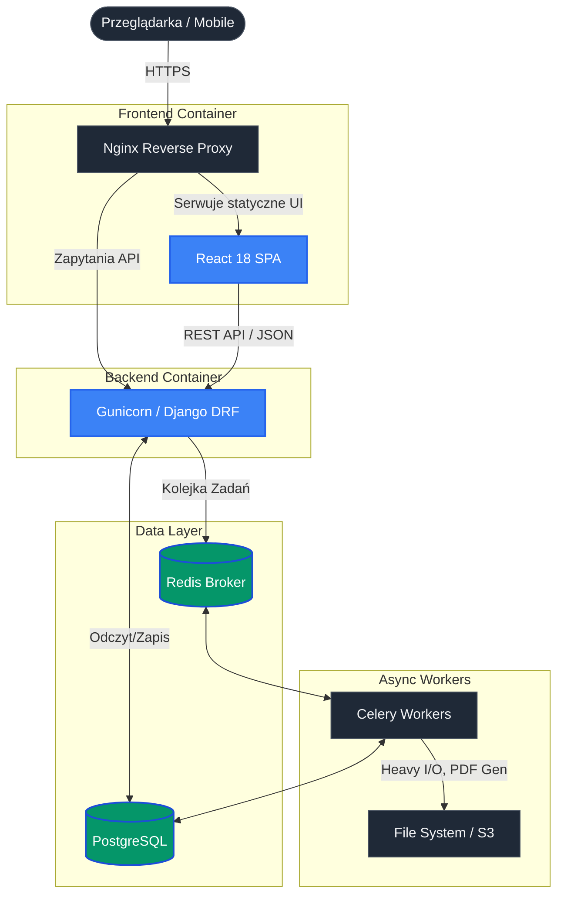

# 🎼 VoctManager | Korporacyjny System Operacyjny i Cyfrowe Doświadczenie dla Chóru

🌍 *Przeczytaj w innych językach: [English](README.md), [Polski](README.pl.md).*


**VoctManager** to wysokowydajna platforma o podwójnej architekturze, zaprojektowana w celu zatarcia granicy między immersyjną narracją cyfrową (storytellingiem) a solidnym systemem planowania zasobów (ERP). Zbudowana jako oficjalna cyfrowa infrastruktura dla profesjonalnego zespołu wokalnego **VoctEnsemble**.

🌐 **Wersja Live (Beta):** [test.voctensemble.com](https://test.voctensemble.com)
🔐 **Panel Enterprise (Wersja Demo):** [test.voctensemble.com/panel](https://test.voctensemble.com/panel)
> **Dane logowania (Demo):** > Login: `daccess` | Hasło: `demoaccess` 
> *(Konto do panelu artysty z uprawnieniami tylko do odczytu)*
---

## 🏛️ Architektura Systemu

Aplikacja opiera się na nowoczesnej, rozproszonej architekturze zaprojektowanej z myślą o wysokiej dostępności, agresywnym buforowaniu (Zero-Layout-Shift) oraz asynchronicznym przetwarzaniu danych w tle.



---

## 🎭 Część I: Strona Publiczna (Immersyjne Doświadczenie Webowe)
Wielce zoptymalizowany, kinowy interfejs zbudowany z myślą o budowaniu marki, dostarczający doświadczenia użytkownika (UX) klasy premium.

* 🎬 **Scrollytelling & Kinematyka:** Złożona matematycznie kinematyka przewijania przy użyciu **Framer Motion**. Elementy dynamicznie reagują na pozycję scrolla, kontrolując skalowanie wideo, maski przezroczystości i architektoniczne siatki.
* 🌊 **Mechanika Płynów (Fluid Mechanics):** Zintegrowana biblioteka **Lenis** zapewniająca gładkie przewijanie w 60 klatkach na sekundę (60FPS), gwarantująca idealną synchronizację animacji na wszystkich urządzeniach.
* 🎛️ **Fizyka Akcelerowana Sprzętowo:** Autorskie, interaktywne hooki (`useMouseAndGyro`, `useScrollyAudio`) łączące dane wejściowe ze sprzętu (żyroskop, prędkość kursora) z mikrointerakcjami interfejsu.
* ♿ **Dostępność (WCAG):** Interfejs zaprojektowany z uwzględnieniem zgodności z Europejskim Aktem o Dostępności (EAA), wykorzystujący semantyczny HTML i atrybuty ARIA dla czytników ekranu.

---

## 🏢 Część II: System Enterprise (Główna Architektura)
Zabezpieczona, skalowalna platforma ERP/CRM, która cyfryzuje i automatyzuje przepływy pracy dla zarządu i artystów chóru.

* 🛡️ **Kontrola Dostępu Oparta na Rolach (RBAC):** Granularne polityki bezpieczeństwa zapewniające ścisłą izolację wrażliwych umów, danych płacowych i własności intelektualnej.
* 🗄️ **Inteligentne Archiwum:** Cyfrowe zarządzanie repertuarem z bezpieczną dystrybucją partytur (PDF) i ścieżek dźwiękowych do ćwiczeń.
* 📅 **Automatyzacja Produkcji:** Zautomatyzowane generowanie złożonych dokumentów, w tym *Call Sheets* i *Umów Dzieło/Zlecenie*, oddelegowane do asynchronicznych workerów **Celery**, co zapobiega blokowaniu głównego wątku aplikacji.
* 🎵 **Mikro-Casting i Setlisty:** Interaktywny kreator programów koncertowych wykorzystujący płynny interfejs Drag & Drop wspierający ekrany dotykowe (`@hello-pangea/dnd`).
* ⚡ **Optimistic UI i Caching:** Głęboka integracja **Zustand** i **React Query** dla agresywnego buforowania stanu serwera. Zapewnia to natychmiastową responsywność aplikacji, nawet przy słabym zasięgu sieci komórkowej za kulisami sceny.

---

## 🔒 Bezpieczeństwo, Prywatność i Zgodność Danych

Przetwarzanie dokumentacji HR, umów finansowych oraz chronionych prawem autorskim materiałów artystycznych wymaga zabezpieczeń klasy Enterprise.

* **Zgodność z RODO (GDPR):** Zaprojektowane z myślą o minimalizacji danych oraz mechanizmach "miękkiego usuwania" (soft-deletion), aby zachować integralność historycznych koncertów przy jednoczesnym przestrzeganiu przepisów o ochronie prywatności.
* **Uwierzytelnianie:** Bezpieczne, bezstanowe uwierzytelnianie wykorzystujące ciasteczka HttpOnly i rotację tokenów JWT.
* **Integralność Danych:** Restrykcyjne ograniczenia (constraints) na poziomie bazy danych połączone z walidacją na poziomie aplikacji, co zapobiega korupcji tabel łącznikowych podczas złożonych operacji castingowych.

---

## 🚦 Monitorowanie i Roadmapa (Wizja 2026)

VoctManager nieustannie ewoluuje w kierunku w pełni zautomatyzowanej i monitorowalnej infrastruktury.

- [x] **Konteneryzacja:** Pełne wsparcie dla Dockera gwarantujące identyczne środowiska Dev/Prod.
- [x] **Przetwarzanie Asynchroniczne:** Wdrożona architektura Celery + Redis.
- [ ] **Telemetria i Śledzenie Błędów:** Wstępnie skonfigurowana integracja z **Sentry** (oczekująca na wdrożenie infrastruktury fundacji) w celu monitorowania błędów frontendu i backendu w czasie rzeczywistym.
- [ ] **Automatyczne Testy (QA):** Wdrożenie pakietów testowych PyTest dla krytycznych ścieżek biznesowych (generowanie umów, kalkulacje płacowe).
- [ ] **Pipelines CI/CD:** Wykorzystanie GitHub Actions do zautomatyzowanego lintowania, budowania obrazów i wdrożeń bez przestojów (zero-downtime deployments).

---

## 📸 Interfejs Systemu

| Główny Dashboard (Bento OS) | Edytor Projektu |
|:---:|:---:|
|  |  |
| **Smart Archive (Zarządzanie Zasoabmi)** | **Macierz Obecności (High-Density)** |
|  |  |

*(Uwaga: Zastąp ścieżki `docs/assets/...` prawdziwymi zrzutami ekranu ze swojej aplikacji)*

---

## 🚀 Szybki Start (Środowisko Lokalne)

Projekt opiera się w pełni na Dockerze, redukując proces uruchomienia do zaledwie kilku komend.

### Wymagania
* Docker oraz Docker Compose
* Node.js (opcjonalnie, do pracy nad frontendem poza kontenerem)
* GNU Make (zalecane)

### Instalacja

1. **Sklonuj repozytorium:**
   ```bash
   git clone [https://github.com/bedikryst/voctmanager.git](https://github.com/bedikryst/voctmanager.git)
   cd voctmanager
   ```

2. **Skonfiguruj zmienne środowiskowe:**
   ```bash
   cp .env.example .env
   cp frontend/.env.example frontend/.env
   ```

3. **Uruchom infrastrukturę:**
   Używając dołączonego pliku `Makefile` (Zalecane):
   ```bash
   make up
   ```
   *(Lub ręcznie: `docker compose --build -d`)*

4. **Zainicjalizuj bazę i wgraj dane testowe:**
   ```bash
   make migrate
   make seed
   make superuser
   ```

4. **Uruchom Frontend lokalnie:**
   ```bash
   cd frontend
   npm install
   npm run dev
   ```

   * API: `http://localhost:8000/api/`
   * Frontend: `http://localhost:5173`

### 📖 Dokumentacja API
Backend udostępnia w pełni interaktywną dokumentację OpenAPI (Swagger). Po uruchomieniu kontenerów jest ona dostępna pod adresem:
👉 **[http://localhost:8000/api/docs](http://localhost:8000/api/docs)**

---

## 👨‍💻 Autor i Główny Inżynier

**Krystian Bugalski**
* [LinkedIn](https://www.linkedin.com/in/krystian-bugalski)
* [GitHub](https://github.com/bedikryst)

*Zaprojektowane z precyzją dla przyszłości zarządzania chórem.*