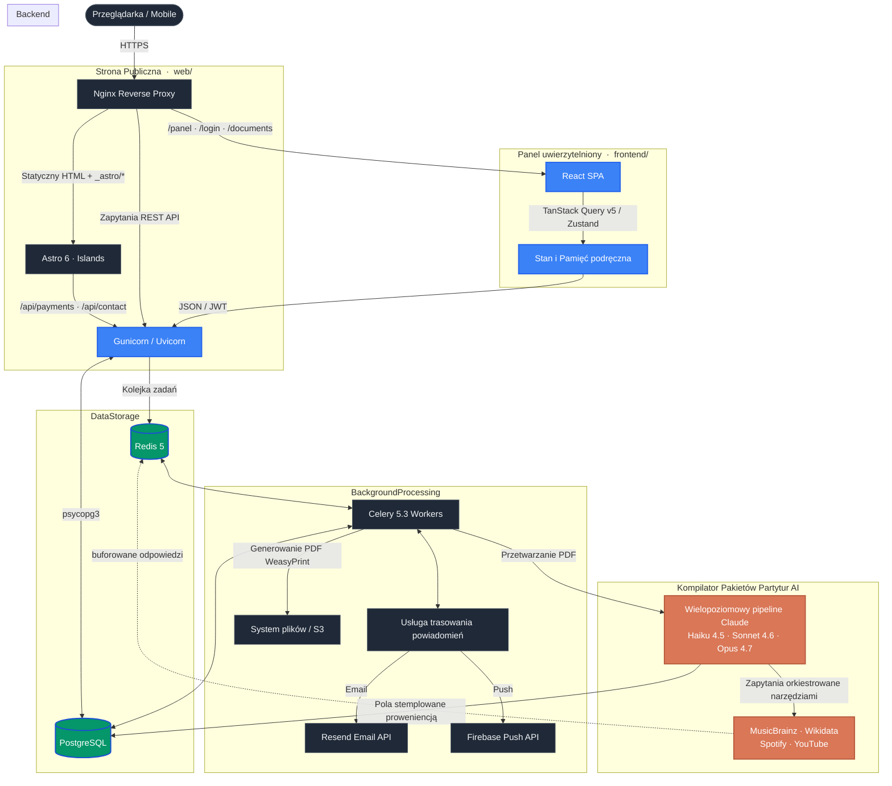

# 🎼 VoctManager | Korporacyjny System Operacyjny dla Chóru i Platforma Operacji Cyfrowych

🌍 *Przeczytaj w innych językach: [English](README.md), [Polski](README.pl.md).*


**VoctManager** to wysokowydajna platforma o podwójnej architekturze, łącząca planowanie zasobów przedsiębiorstwa (ERP) z operacjami cyfrowymi. Zaprojektowana jako oficjalna cyfrowa infrastruktura dla profesjonalnego zespołu wokalnego **VoctEnsemble**, płynnie łączy złożoną logistykę produkcji, bezpieczne zarządzanie zasobami oraz immersyjne, kinowe doświadczenie cyfrowe.

Platforma ściśle przestrzega architektury **Feature-Sliced Design (FSD)**, co zapewnia ogromną skalowalność, separację domeny i solidną długoterminową utrzymywalność.

🌐 **Wersja Publiczna Live:** [test.voctensemble.com](https://voctensemble.com)

---

## 🏛️ Architektura Systemu i Standardy Inżynieryjne

Platforma jest zbudowana na wysoko zdekomponowanej architekturze zaprojektowanej z myślą o wysokiej dostępności, odpornym na offline buforowaniu oraz asynchronicznym przetwarzaniu w tle.



---

## ✨ Podstawowe Funkcje Enterprise

### 1. Dwa frontendy — Panel (React SPA) + Strona publiczna (Astro)

Platforma dostarcza **dwa niezależne frontendy** współdzielące jeden backend Django:

* **Panel SPA — [`frontend/`](frontend/README.pl.md):** uwierzytelniony ERP dla menedżerów, artystów i ekipy (`/panel/*`). React 19 + TanStack Query + Framer Motion, ścisły FSD, system projektowy Ethereal. Odpowiada za kinową, glassmorphic powierzchnię operacyjną.
* **Strona publiczna — [`web/`](web/README.pl.md):** landing voctensemble.com / voctfoundation.pl + podstrony (`/`, `/koncerty`, `/o-nas`, `/kontakt`, `/polityka-prywatnosci`). **Astro 6** (statyczny HTML + wyspy React + natywne View Transitions), płynne przewijanie Lenis, art-direction sakralny minimalizm w duchu *„Nawy światła"*. Crawlable i gotowe pod Ad Grants z założenia.

Filary inżynieryjne frontendu:

- **Architektura Zero-Layout-Shift:** Boundary suspense + `<EtherealLoader>` + rygorystyczne stany skeleton utrzymują CLS na poziomie 0 podczas asynchronicznego pobierania danych — zero przeskoków, zawsze.
- **Kinematyka 60FPS:** Animacje napędzane wyłącznie przez `transform` / `opacity` za pomocą **Framer Motion v12** (panel) i ręcznie pisanej choreografii CSS + pętli rAF w JS (strona publiczna). Strona publiczna używa **Lenis v1.3+** smooth-scrolla na poziomie okna zsynchronizowanego z View Transitions; panel korzysta z natywnego scrolla platformy.
- **Kinowe przejścia między stronami:** Strona publiczna Astro komponuje natywne keyframes `::view-transition-old/new(root)` (sakralny fade + Y-drift + blur, 320ms / 540ms) z shared `view-transition-name: voct-brand`, więc znak świecy morphuje płynnie między nawigacjami zamiast cross-fadeu.
- **Stopniowane panele Bento:** Wszystkie widoki panelu komponowane przez `<StaggeredBentoContainer>` / `<StaggeredBentoItem>` na wspólnym zestawie tokenów glassmorphism (`shadow-glass-ethereal`) — przestrzenne, przewidywalne, sterowane motywem.
- **Dostępność EAA:** Primitywy Radix UI + semantyczny HTML spełniające bazowe wymogi Europejskiego Aktu o Dostępności; strona publiczna dodaje opt-outy `prefers-reduced-motion` na każdej animowanej powierzchni.

### 2. Kompilator Pakietów Partytur napędzany AI
- **Wielopoziomowy pipeline Claude:** Wieloetapowe przetwarzanie skalujące model do zadania — Haiku 4.5 do szybkiej klasyfikacji, Sonnet 4.6 do wzbogacania, Opus 4.7 do najtrudniejszego rozumowania. Adaptacyjne myślenie + parametr `effort` pozwalają Claude dynamicznie alokować moc obliczeniową.
- **Rozwiązywanie tożsamości kanonicznej:** Deduplikacja kompozytorów i utworów przez krzyżowe odniesienia **MusicBrainz MBID** i **Wikidata QID** — AI ekstrahuje, ale nigdy nie halucynuje faktów biograficznych ani identyfikatorów kanonicznych.
- **Wzbogacanie metadanych zewnętrznych:** Orkiestrowane narzędziami zapytania do MusicBrainz, Wikidata, Spotify Web API i YouTube Data API v3, z odpowiedziami buforowanymi w Redis, ponowieniami z wykładniczym backoffem i łagodną degradacją, gdy któreś źródło jest niedostępne.
- **Proweniencja klasy audytowej:** Każde pole pochodzące z AI lub API jest stemplowane `(model, prompt_version, source_reference, confidence, retrieved_at)` w tabeli `ProvenanceRecord` z generycznym kluczem obcym — umożliwiając regenerację jednym kliknięciem i kryminalistyczny przegląd zgodności.
- **Świadomość kosztów w architekturze:** Pełne przetworzenie pojedynczej partytury PDF kosztuje średnio **~0,20 USD** (kompozytor + utwór + nota programowa + IPA + przekład śpiewalny). Twarde limity na encję wymuszane na granicy zadania Celery zapobiegają niekontrolowanym wydatkom; buforowanie promptów Anthropic (`cache_control: ephemeral`) sprawia, że tokeny odczytu z pamięci podręcznej dominują przy powtórnych uruchomieniach, obniżając koszt o ≥80%.
- **Dyrygent w pętli decyzyjnej:** AI sugeruje, dyrygent decyduje. Każda ekstrakcja prezentuje wskaźnik pewności i ekran przeglądu — platforma nigdy po cichu nie modyfikuje kanonicznego repertuaru.

### 3. System Enterprise i Logistyka (Backend)
- **Granularny RBAC:** Głęboka macierz kontroli dostępu opartej na rolach (Admin, Manager, Artysta, Crew), zabezpieczająca endpointy, payloady danych i widoczność interfejsu.
- **Web Push i alerty w czasie rzeczywistym:** Natywno-podobne powiadomienia push w czasie rzeczywistym oparte na standardzie W3C VAPID. Obsługiwane asynchronicznie przez Celery wraz z solidnym transakcyjnym silnikiem email, utrzymujące artystów na bieżąco ze zmianami castingu i harmonogramu.
- **Synchronizacja kalendarzy (iCal):** Bezproblemowa integracja z zewnętrznymi kalendarzami, automatycznie generująca feedy iCal do synchronizacji z Google i Apple Calendar.
- **Optimistic UI:** Agresywne buforowanie stanu serwera przy użyciu **@tanstack/react-query v5.91+**, zapewniające odczucie zerowego opóźnienia dla krytycznych mutacji (potwierdzenie obecności, zmiany castingu).
- **Asynchroniczny silnik dokumentów:** Produkcyjne przepływy pracy, takie jak dynamiczne generowanie umów i kompilacja arkuszy produkcyjnych, są przekazywane do **Celery workers** i **WeasyPrint**, gwarantując, że główny wątek pozostaje nieblokowany.
- **Smart Archive i ochrona zasobów:** Bezpieczna, tokenowana dystrybucja wrażliwych zasobów repertuarowych (PDF-y nut, audio referencyjne) ściśle powiązana z aktywnym obsadzeniem projektu.
- **System mikro-castingu:** Interfejsy Drag & Drop gotowe na dotyk (`@dnd-kit/core`) do budowy złożonych programów koncertowych i zarządzania indywidualnymi przypisaniami artystów.
- **Internacjonalizacja (i18n):** Pełne wsparcie lokalizacyjne (angielski, francuski, polski) przygotowane dla międzynarodowych tras i różnorodnych zespołów artystów.

---

## 🛠️ Stos technologiczny (standardy 2026)

### Panel SPA — [`frontend/`](frontend/README.pl.md)
* **Rdzeń:** React 19.2+, Vite 7.3+, TypeScript 5.9+
* **Architektura:** Feature-Sliced Design (FSD)
* **Styling:** Tailwind CSS v4.2+ (z tokenami Ethereal Design System), `clsx`, `tailwind-merge`
* **Stan i pobieranie:** Zustand 5+, `@tanstack/react-query` v5.91+
* **Ruch i interakcje:** Framer Motion v12+, `@dnd-kit/core` v6+ (TouchSensor)
* **Formularze:** React Hook Form v7+ z Zod v4.3+

### Strona publiczna (Astro) — [`web/`](web/README.pl.md)
* **Rdzeń:** Astro 6.3+ (`build.format: "file"`), `@astrojs/react` 5+, React 19, TypeScript 6+
* **Architektura:** Wyspy Astro — domyślnie server-rendered HTML, React hydratowany tylko dla lejka datków Vault, bramy audio Threshold, sticky chrome i kursora
* **Styling:** Ręcznie pisany CSS w duchu sakralnego minimalizmu — bez Tailwinda, bez żadnego zewnętrznego frameworku CSS. Tokeny przez CSS custom properties (`--candle`, `--ink`, `--paper`), self-hostowane fonty zmienne (ścisłe RODO, zero third-party)
* **Ruch:** `lenis@1.3+` smooth-scroll na poziomie okna, natywne API View Transitions, pipeline reveal sterowany IntersectionObserver, parallax JS rAF (cross-browser fallback dla częściowego wsparcia `animation-timeline`)
* **Treść:** Astro Content Collections (`concerts.yaml`, `repertoire.yaml`) + ręcznie kuratorowane moduły TS (manifest, paths)

### Środowisko backendowe
* **Rdzeń:** Python 3.12+, Django 6.0+, Django REST Framework (DRF) 3.16+
* **Walidacja i typy:** Surowe adnotacje typów Pythona, Pydantic
* **Baza danych:** PostgreSQL (przez sterownik `psycopg` v3)
* **Uwierzytelnianie:** JWT przez `djangorestframework-simplejwt`
* **Broker i workerzy:** Redis 5+, Celery 5.3+
* **Generowanie dokumentów:** WeasyPrint v68+, pypdf v5+
* **AI / Inteligencja repertuarowa:** Anthropic Python SDK (Claude Opus 4.7 / Sonnet 4.6 / Haiku 4.5), adaptacyjne myślenie, buforowanie promptów, ustrukturyzowany output przez schematy Pydantic

### Infrastruktura i DevOps
* **Konteneryzacja:** Docker i Docker Compose (Zero-parity między Dev a Prod)
* **Serwer WWW:** Nginx, Gunicorn 21+ (Uvicorn dla asynchronicznego ruchu)
* **Zarządzanie zasobami statycznymi:** WhiteNoise

---

## 🔒 Bezpieczeństwo, prywatność i zgodność danych

Przetwarzanie umów artystycznych, harmonogramów prób i chronionych materiałów muzycznych wymaga najwyższej klasy zabezpieczeń:

### Uwierzytelnianie i kontrola dostępu
* **Uwierzytelnianie bezstanowe:** Bezpieczna strategia oparta na ciasteczkach `httpOnly` i rotacji tokenów JWT, ograniczająca wektory ataku XSS i CSRF.
* **Granularny RBAC:** Macierze kontroli dostępu oparte na rolach (Admin, Manager, Artysta, Crew) z drobnoziarnistymi restrykcjami na poziomie endpointu i payloadu.
* **Dystrybucja zasobów z zabezpieczeniem tokenem:** Wrażliwe zasoby repertuarowe (PDF-y nut, audio referencyjne) zabezpieczone czasowo ograniczonymi, podpisanymi tokenami powiązanymi wyłącznie z aktywnym uczestnictwem w projekcie.

### Ochrona danych i prywatność
* **Zgodność z RODO:** Wbudowane przepływy minimalizacji danych i mechanizmy miękkiego usuwania, aby zachować historię produkcji, spełniając ścisłe przepisy o prywatności.
* **Szyfrowanie na poziomie pola:** Wrażliwe pola (umowy, dane wynagrodzeń) szyfrowane w spoczynku przy użyciu szyfru FERNET.
* **Dziennik audytu:** Niezmienne logi transakcji dla wszystkich mutacji danych HR i finansowych, umożliwiające analizę kryminalistyczną i raportowanie zgodności.
* **Brak zewnętrznych CDN-ów dla fontów:** Strona publiczna używa wyłącznie samodzielnie hostowanych, zmiennych fontów woff2 (zero transferu IP użytkownika do Google Fonts / Bunny) — zgodnie z deklarowaną polityką prywatności.

### Integralność domeny
* **Ograniczenia relacyjne:** Ścisłe ograniczenia klucza obcego i sprawdzenia na poziomie bazy danych zapobiegają uszkodzeniu danych podczas złożonych operacji wieloentityowych (np. wycofywanie castingu, rozwiązywanie umów).
* **Walidacja Pydantic:** Usługowe DTO wymuszają bezpieczeństwo typów i walidację reguł biznesowych przed utrwaleniem, eliminując cichą degradację danych.

---

## 🚦 Mapa drogowa inżynierii (Wizja 2026)

VoctManager jest zaprojektowany do ciągłej ewolucji w kierunku obserwowalności i odporności klasy produkcyjnej:

- [x] **Podstawowe ERP i logistyka:** Kompletne modele domeny dla projektów, zespołów, umów i planowania.
- [x] **Powiadomienia oparte na zdarzeniach:** Asynchroniczne trasowanie powiadomień z dostawcami Resend (email) i Firebase (push).
- [x] **Konteneryzacja i orkiestracja:** Docker i Docker Compose z zerowym parytetem między środowiskami Dev i Prod.
- [x] **Przetwarzanie asynchroniczne:** Celery + Redis dla zadań w tle (generowanie dokumentów, powiadomienia grupowe, eksport danych).
- [x] **Śledzenie błędów:** Sentry SDK wpięty w Django do przechwytywania błędów produkcyjnych i monitorowania kondycji wydań.
- [x] **Kompilator Partytur AI — Schemat i pipeline przetwarzania:** Kanoniczny schemat domeny (`Composer.mbid`, `Piece.mbid_work`, `ScoreEdition`, `Movement`, `Translation`, `Recording`, `Annotation`, `ProgramNote`, `ProvenanceRecord`) plus działający łańcuch Celery — wielopoziomowy wrapper Claude (adaptacyjne myślenie, śledzenie kosztów, buforowanie promptów) ekstrahujący metadane PDF, rozwiązujący kompozytorów/utwory względem MusicBrainz i Wikidata, generujący noty programowe + IPA + przekłady śpiewalne i prezentujący ekran przeglądu dla dyrygenta. Klienty zewnętrzne (MusicBrainz, Wikidata, Spotify, YouTube) buforowane w Redis.
- [ ] **Kompilator Partytur AI — Montaż koncertu i adnotacje:** Generowanie skoroszytu koncertowego WeasyPrint + pypdf (okładka, spis treści, materiały wstępne per utwór, oryginalne partytury) oraz nakładka adnotacji w przeglądarce PDF.js + Konva (podświetlenie, komentarz, odręczne rysowanie, zmiana kolejności stron) z wersjonowaną, warstwową persystencją i spłaszczaniem przy eksporcie.
- [ ] **Metryki i rozproszone śledzenie:** Dashboardy Prometheus + Grafana oraz instrumentacja OpenTelemetry do śledzenia żądań end-to-end między usługami i zewnętrznymi API.
- [ ] **Automatyczne testowanie:** Pokrycie PyTest dla krytycznych ścieżek biznesowych (generowanie umów, kalkulacje wynagrodzeń, algorytmy castingu).
- [ ] **Pipelines CI/CD:** GitHub Actions do zautomatyzowanego lint, build, test i wdrożeń bez przestojów.
- [ ] **Zaawansowane buforowanie:** Klaster Redis do zarządzania sesją i unieważniania rozproszonej pamięci podręcznej.
- [ ] **Limitowanie szybkości i ochrona DDoS:** Reguły CloudFlare + WAF do zapobiegania nadużywaniu API.
- [ ] **Replikacja bazy danych:** Strumieniowa replikacja PostgreSQL w celu zapewnienia wysokiej dostępności i odzyskiwania po awarii.
- [ ] **SMS i połączenia głosowe:** Integracja Twilio dla przypomnień o próbach i krytycznych alertów harmonogramu.

---

## 🎬 Strona publiczna — `web/` (Astro)

Publiczna powierzchnia voctensemble.com / voctfoundation.pl to aplikacja **Astro 6** zbudowana wokół art-directionu sakralnego minimalizmu („Nawa światła") — domyślnie server-rendered HTML, wyspy React hydratowane tylko tam, gdzie naprawdę żyje stan. Komponuje sekwencję: rytualny preloader (raz na sesję) → brama progowa → sticky chrome → hero → manifest → trzy „interludia eteryczne" przeplatające minione koncerty → finałowe wsparcie → coda. Choreografia działa przy utrzymanych 60 FPS na płynnym przewijaniu Lenis, z natywnym API View Transitions dla przejść między stronami.

Pełne doświadczenie opiera się na kinematyce powiązanej ze scrollem, sygnałach audio, paralaksie, autorskim kursorze z magnetic snap, View Transitions i fizyce bramy progowej. **Statyczne zrzuty ekranu i GIF-y nie oddają tego sprawiedliwie** — łapią klatki, nie przepływ. Strona live jest publicznie dostępna:

### ▶ [voctensemble.com](https://voctensemble.com) — otwórz w przeglądarce desktopowej z włączonym dźwiękiem

> **Dlaczego osobna aplikacja Astro?** Powłoka CSR panelu była regresją SEO/perf dla strony fundacji starającej się o Google Ad Grants. Astro emituje crawlable statyczny HTML, wysyła React tylko tam, gdzie potrzebny (lejek datków Vault, brama audio, sticky chrome), i używa natywnego API View Transitions dla przejść na poziomie Awwwards bez narzutu CSR runtime. Źródło prawdy: [`web/README.pl.md`](web/README.pl.md).

| Sekcja | Na co zwrócić uwagę |
|---|---|
| **Preloader → Brama progowa** | Sakralny rytuał (raz na sesję), wybór audio w localStorage, orkiestracja pierwszego paintu |
| **Hero → Manifest** | Autorski kursor z magnetic snap, oddech variable-font wght + per-word stagger, złoty bloom emanujący z tekstu |
| **Interludia eteryczne I / II / III** | Audio-reaktywna intensywność splotów (analizer Web Audio), motywy łacińskie z cyframi rzymskimi |
| **Ścieżka minionych koncertów** | Stos paralaksy (cross-browser JS), akordeon smooth-details |
| **Finałowe wsparcie / Przepływ Skarbca** | Wieloetapowy panel darowizny, redirect bramki Axepta, modale wdzięczności/niepowodzenia |
| **Nawigacja między stronami** | Natywne keyframes `::view-transition-*` z shared `voct-brand`, znak świecy morphujący między stronami |

> **Źródło:** [`web/src/pages/index.astro`](web/src/pages/index.astro) — komponuje 9 sekcji i 6 wysp React (Preloader, ThresholdGate, AudioController, StickyHeader, SiteCursor, SiteFooter, VaultIsland). Podstrony (`/koncerty`, `/o-nas`, `/kontakt`) reużywają `SiteChrome` + `SiteFooter` i montują tylko wyspę Vault dla datków w miejscu.

> **Źródłowe zdjęcia strony publicznej** (`web/src/assets/photos/*.jpg`) są celowo gitignorowane — to 5-12 MB oryginałów należących do współtwórców, wgrywanych bezpośrednio na host buildu. Patrz [`web/README.pl.md`](web/README.pl.md) §Konwencje dla kontraktu deploya.

---

## 🤖 Kompilator Pakietów Partytur AI

| Przetwarzanie partytury (upload i analiza wielopoziomowa) | Przegląd dyrygenta (repertuar wyekstrahowany przez AI) |
|:---:|:---:|
|  |  |

---

## 📸 Interfejs systemu (Ethereal Design System)

| Główny Dashboard (Staggered Bento OS) | Projekt i edytor logistyki |
|:---:|:---:|
|  |  |
| **Zarządzanie lokalizacjami** | **Centrum powiadomień** |
|  |  |
| **Ustawienia systemu** | **Baza wiedzy** |
|  |  |
| **Atlas Lokalizacji (widok mapy)** | **Archiwum Nut** |
|  |  |

---

## 📊 Budżet wydajności i telemetria kosztów AI

Platforma wymusza jawne budżety zarówno na warstwie frontendu (postrzegana wydajność), jak i backendu (wydatki AI). Poniższe liczby to docelowe pułapy mierzone na produkcji.

### Frontend Lighthouse

Kinowa brama wejściowa jest pomijana parametrem `?nogate`, aby audytor mierzył samą stronę, a nie nakładkę modalu.

| Trasa | Performance | Accessibility | Best Practices | SEO | Źródło |
|---|:---:|:---:|:---:|:---:|---|
| `/home` &nbsp;(`HomePage.tsx`, React 19 SPA) | **90** | 91 | 96 | 92 | [PageSpeed Insights ↗](https://pagespeed.web.dev/analysis?url=https%3A%2F%2Fvoctensemble.com%2Fhome%3Fnogate) |
| `/` &nbsp;(`LandingPage.html`, vanilla static) | 98 | 91 | 100 | 92 | lokalny Lighthouse\* |

<sub>\*Statyczny landing używa własnej, wbudowanej bramy vanilla (osobny klucz localStorage), której PageSpeed nie potrafi pominąć z góry, więc jego wynik pochodzi z lokalnego Lighthouse, a nie z PageSpeed. Obie trasy dzielą ten sam fundament — samodzielnie hostowane fonty zmienne (zero zewnętrznych CDN), `scrollbar-gutter: stable` dla stabilności układu oraz animacje wyłącznie na `transform`/`opacity`. Statyczna strona uzyskuje wyższy wynik, bo pojedyncza ręcznie napisana strona HTML nie ładuje runtime SPA; port React wymienia ~8 punktów wydajności na reużywalność komponentów, bezpieczeństwo typów i utrzymywalność wielostronicowego serwisu VoctEnsemble + VoctFoundation — to świadoma decyzja architektoniczna.</sub>

**Cele czasu renderowania wymuszane niezależnie od trasy:**

| Metryka | Cel | Uwagi |
|---|---|---|
| **CLS** (Cumulative Layout Shift) | < 0,1 | Zmierzone **0,003** na `/home` — przypięte przez `scrollbar-gutter: stable` + `contain` na pełnoekranowych nakładkach |
| **INP** (Interaction to Next Paint) | ≤ 200 ms | |
| **Bundle JS (gzip, dzielony per trasa)** | ≤ 180 kB na chunk trasy | SDK Map (~350 kB) ograniczony wyłącznie do uwierzytelnionego panelu |
| **Liczba klatek animacji** | utrzymane 60 FPS | wyłącznie `transform` / `opacity` |

### Kompilator Partytur AI (przetwarzanie per utwór)

| Etap | Model | Średni koszt | Udział odczytu z cache |
|---|---|---|---|
| Klasyfikacja metadanych PDF | Haiku 4.5 | ~0,01 USD | _placeholder_ |
| Rozwiązanie kompozytora + utworu (MusicBrainz / Wikidata) | Sonnet 4.6 | ~0,04 USD | _placeholder_ |
| Nota programowa + IPA + przekład śpiewalny | Opus 4.7 | ~0,13 USD | _placeholder_ |
| Stemplowanie proweniencji + persystencja | — (bez LLM) | ~0,02 USD (DB/API) | nd. |
| **Średnia end-to-end na PDF** | mieszane | **~0,20 USD** | ≥80% przy powtórnych uruchomieniach |

> Buforowanie promptów Anthropic (`cache_control: ephemeral`) jest włączone na każdym wywołaniu wielopoziomowym, więc tokeny odczytu z cache dominują po pierwszym przetworzeniu danego utworu — drastycznie obniżając koszt krańcowy przy powtórnych uruchomieniach i iteracjach przeglądu.

---

## 🚀 Szybki start (lokalne środowisko)

Projekt wykorzystuje Docker Compose do standaryzowanego środowiska deweloperskiego.

### Wymagania
* Docker oraz Docker Compose (v2)
* GNU Make

### Inicjalizacja

1. **Sklonuj repozytorium:**
   ```bash
   git clone https://github.com/bedikryst/voctmanager.git
   cd voctmanager
   ```

2. **Konfiguracja środowiska:**
   ```bash
   cp .env.example .env
   cp frontend/.env.example frontend/.env
   ```

3. **Orkiestracja infrastruktury:**
   Korzystając z dołączonego Makefile:
   ```bash
   make up
   ```

4. **Provisioning bazy danych:**
   ```bash
   make migrate
   make seed
   make superuser
   ```

5. **Lokalny serwer frontendowy (opcjonalnie dla inżynierii UI):**
   ```bash
   cd frontend
   npm install
   npm run dev
   ```

   * API: `http://localhost:8000/api/`
   * Frontend: `http://localhost:5173`

### 📖 Dokumentacja API
Backend udostępnia w pełni interaktywną, automatycznie generowaną dokumentację OpenAPI (Swagger). Po uruchomieniu kontenerów jest dostępna pod adresem:
👉 **[http://localhost:8000/api/docs](http://localhost:8000/api/docs)**

---

## 👨‍💻 Kierownictwo inżynieryjne

**Krystian Bugalski**
Software Engineer & Specjalista UI/UX
* [LinkedIn](https://www.linkedin.com/in/krystian-bugalski)
* [GitHub](https://github.com/bedikryst)

*Zaprojektowane i zbudowane z rygorystycznym przestrzeganiem dyrektyw AI VoctManager 2026 i zasad projektowych Ethereal.*
