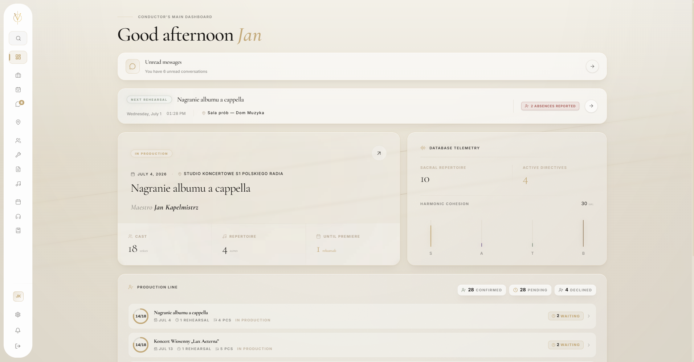
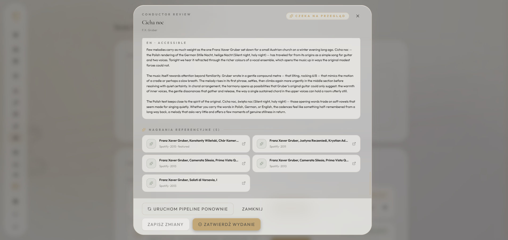
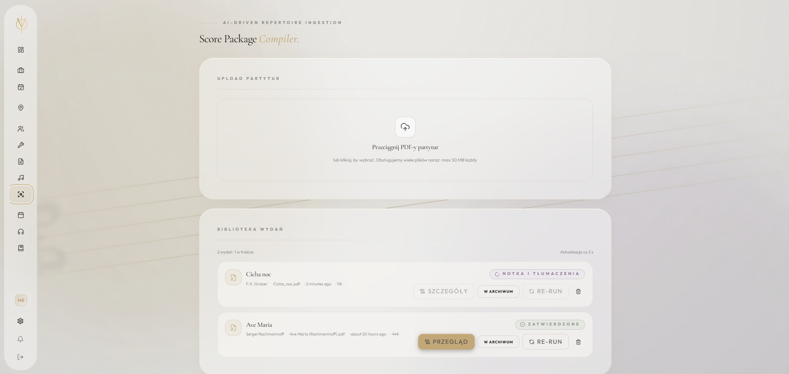
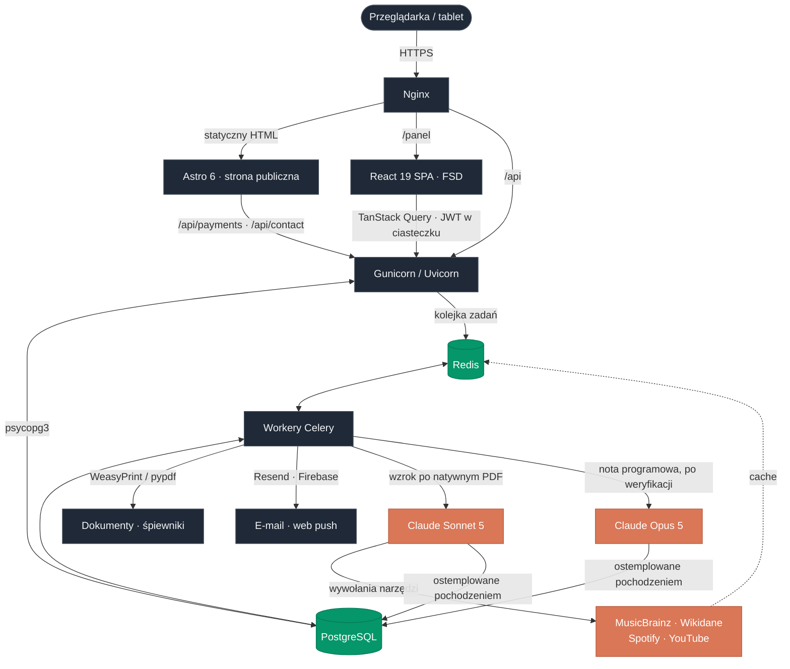

# VoctManager

*Read this in [English](README.md).*


System do zarządzania profesjonalnym zespołem wokalnym i pipeline AI, który kataloguje jego nuty.

Współzałożyłem fundację przy **VoctEnsemble**. Jej dyrektor artystyczny robił ręcznie mnóstwo rzeczy, które powinien robić za niego program: kto śpiewa którą partię, umowy, składanie śpiewnika przed każdym koncertem, przepisywanie metadanych z PDF-ów pole po polu. Więc to zbudowałem.

Jedna osoba, 832 commity, pierwszy 26 lutego 2026.

**Strona publiczna:** [voctensemble.com](https://voctensemble.com) · **Status:** wdrożone i działa, adopcja w toku ([szczegóły](#jak-to-naprawdę-wygląda))

| Pulpit dyrygenta | Weryfikacja wyników AI |
|:---:|:---:|
|  |  |

---

## Pipeline partytur

Wrzucasz PDF z nutami. Kilka minut później w archiwum jest skatalogowany utwór: kompozytor rozwiązany do kanonicznego identyfikatora, rozdzielone części, przepisany tekst śpiewany, IPA dopasowana wers po wersie, tłumaczenia śpiewne. Dyrygent to przegląda, poprawia co trzeba, zatwierdza — i dopiero wtedy powstaje nota programowa, z poprawionego rekordu, a nie z pierwszego strzału modelu. Popołudnie przepisywania zmienia się w kilka minut sprawdzania.

```
upload PDF
  → rusza łańcuch Celery, przeglądarka podpina się pod Server-Sent Events
  → jedno skonsolidowane wywołanie Sonneta 5 czyta cały dokument wzrokowo
    (warstwa tekstowa i skany; tonacja wyczytana z kluczy przykluczowych,
     kompozytor oddzielony od aranżera, części, tekst, IPA, tłumaczenia)
  → kompozytor i utwór rozwiązane wobec MusicBrainz (MBID) i Wikidanych (QID)
  → Spotify i YouTube przeszukane pod kątem nagrań referencyjnych
  → każde pole ostemplowane pochodzeniem, zapis do bazy
  → dyrygent weryfikuje, poprawia, zatwierdza → publikacja
  → notę programową pisze Opus 5, na żądanie, ze zweryfikowanego rekordu
```

### Trzy rzeczy, na które bym wskazał

**Pochodzenie przy każdym polu.** Wszystko, co wyprodukował model albo zewnętrzne API, niesie ze sobą `(model, prompt_version, source_reference, confidence, retrieved_at)` w `ProvenanceRecord`, a ekran weryfikacji pokazuje to osobno dla każdego pola: chip `AI · 95%`, chip `MusicBrainz` albo chip `Zweryfikowane`, gdy człowiek już poprawił wartość. Kanoniczne identyfikatory zawsze pochodzą z MusicBrainz albo Wikidanych, nigdy z modelu. Chodzi o to, żeby dyrygent nie musiał zgadywać, które pola zasługują na drugie spojrzenie. Czy te chipy są na tyle czytelne, żeby to faktycznie umożliwić — jeszcze nie wiem. Nikt ich nie używał pod presją czasu.

**Polityka ponawiania idzie za rachunkiem, nie za kodem HTTP.** Taksonomia wyjątków w [`archive/infrastructure/ai_client.py`](backend/archive/infrastructure/ai_client.py) dzieli błędy jednocześnie na dwa sposoby: czy ponowienie może w ogóle pomóc i czy nieudana próba została zafakturowana?

| Błąd | Zafakturowany? | Polityka |
|---|---|---|
| 529 overloaded / 5xx / 429 / timeout połączenia | nie | Do ponowienia. Czeka dziesiątki sekund do minut i pokazuje stan „usługa zajęta, ponawiam". |
| ucięcie na `stop_reason='max_tokens'` | tak | Podwaja budżet, ponawia do 2 eskalacji, potem odpuszcza. Stały budżet ucina deterministycznie, więc powtórzenie identycznego wywołania kupuje tę samą porażkę drugi raz. |
| 400 / autoryzacja / uprawnienia | nie | Terminalny. Przerywa łańcuch, zamiast palić cykle autoretry na żądaniu, które Anthropic już odrzucił. |

`retry(3)` na wszystkim byłoby o pół dnia mniej pracy. Zamienia też chwilowy brak mocy w burzę ponowień, a jedno ucięcie w trzy identyczne rachunki.

**Trzy sufity kosztowe, egzekwowane na granicy zadania.** Na pojedynczy przebieg, dożywotni na wydanie (nigdy się nie resetuje) i dzienny na całą organizację, który zbija bezpiecznik. Domyślnie $1.50, $7.50 i $20.00. Ponowne wrzucenie PDF-a, który już przeszedł przez pipeline, trafia na kontrolę SHA-256 i całkowicie omija model. Jeden ingest kosztuje **$0.04–0.20**, a rozrzut w tym przedziale bierze się z języka śpiewanego, nie z modelu: partytura w całości polska nie zwraca ani IPA, ani tłumaczenia, więc wychodzi za piątą część tego, co dwujęzyczna. PDF idzie jako natywny blok `document` z `cache_control: ephemeral`, więc jeśli ucięcie wymusi eskalację, druga próba odczytuje go po stawkach cache zamiast płacić za pełne wejście jeszcze raz.



---

## Decyzje

Łącznie z tymi, w których decyzją było czegoś nie budować. Reszta jest w sekcji [Poza zakresem](#poza-zakresem).

**Dwa frontendy.** Panel to SPA w Reakcie. Strona publiczna to osobna aplikacja w Astro. Ten podział wziął się z wniosku o Google Ad Grants: audyt wymagał treści indeksowalnej, a powłoka SPA podawała crawlerom pusty div. Astro emituje statyczny HTML i hydratuje Reacta tylko tam, gdzie jest prawdziwy stan: ścieżka darowizny, bramka audio, przyklejony nagłówek. Dwa buildy, jeden backend, jeden deploy. To więcej ruchomych części, niż chciałem, i podjąłbym tę decyzję ponownie.

**Dwa poziomy modelu i podmiana wersji, która podmianą nie była.** Dokument czyta Sonnet 5. Notę programową — jedyny tekst, który publiczność czyta tu dosłownie, wydrukowany w programie koncertu — pisze Opus 5, za jakiegoś centa więcej na notę. Przejście między generacjami okazało się czymś więcej niż wymianą stałej. Na poprzednim Sonnecie brak klucza `thinking` znaczył, że myślenie jest wyłączone; na Sonnecie 5 znaczy, że adaptacyjne myślenie jest włączone — czyli goła podmiana po cichu włączyłaby je z powrotem w jedynym wywołaniu, które wyłącza je celowo, i kazała mu dzielić budżet wyjścia tego wywołania. A mapa pochodzenia przy nierozpoznanym identyfikatorze modelu spadała do poziomu Opusa, więc każde pole wyprodukowane przez Sonneta dostałoby w kokpicie weryfikacji etykietę „Opus", podczas gdy zapisany `model_version` mówiłby co innego — cicha nieprawda dokładnie na tym ekranie, który powstał po to, żeby dyrygent nie musiał zgadywać.

**Nota programowa wyszła z łańcucha ingestu.** Wcześniej leciała od razu, na końcu pipeline'u, co znaczyło, że tekst dla publiczności powstawał z *niezweryfikowanej* tożsamości od modelu — zły kompozytor albo zła epoka wpisane wprost w zdanie, które czyta słuchacz. Teraz jest osobnym zadaniem na żądanie, odpalanym z kokpitu weryfikacji albo przy zatwierdzeniu, z poprawionymi metadanymi i tekstem śpiewanym jako kontekstem.

**Liveness i readiness odpowiadają na różne pytania.** `/api/health/` nie dotyka niczego i obsługuje healthcheck Dockera. `/api/health/ready/` uderza w Postgresa i Redisa, i zwraca 503, jeśli nie jest w stanie obsłużyć żądania. Trzymanie ich osobno ma większe znaczenie, niż wygląda: zrestartuj kontener dlatego, że Postgres muli, a dostaniesz kontener, który wraca dokładnie tak samo zamulony, po czym `depends_on` przenosi restart na Celery. Sprawdzenie Redisa to zapis i odczyt, a nie `PING`. Redis siedzący na `maxmemory` przy `noeviction` odpowie na `PING` bez zarzutu, jednocześnie odrzucając każdy zapis — i wolę się o tym dowiedzieć z probe'a niż ze zgubionego zadania.

**Alert na ciszę.** Martwy scheduler Celery beat nie rzuca wyjątku. Po prostu przestaje, po cichu, i wszystko poniżej wygląda dobrze, dopóki ktoś nie zauważy, że przestały przychodzić podsumowania. Więc zadanie okresowe pinguje zewnętrzny monitor heartbeat, a alert odpala się wtedy, gdy ping *nie* przyjdzie. To dowód end-to-end: beat musiał je zaplanować, broker dostarczyć, a worker wykonać. Samo zadanie pingujące celowo połyka własne błędy. Rozchwiany monitor nie powinien móc dzwonić do mnie o sobie samym.

---

## Jak to naprawdę wygląda

System jest wdrożony i działa. Czy jest *używany*, to osobne pytanie i szczera odpowiedź brzmi: na razie ledwie.

Przez system przeszedł jeden koncert — u św. Andrzeja Boboli, maj 2026 — i większość tych danych wprowadziłem sam, żeby sprawdzić, czy cały przepływ się trzyma od początku do końca. Trzymał się. Ale dyrektor artystyczny jeszcze go nie przyswoił. Swoją robotę robi bardzo dobrze i ma zerową cierpliwość do uczenia się nowego narzędzia między próbami, co jest całkowicie zrozumiałe i czego w ogóle nie przewidziałem. Przeprowadzenie go od „robi wrażenie" do „otworzyłem to we wtorek" okazało się trudniejsze niż jakakolwiek część inżynierii.

Zadeklarował, że koncert z końca sierpnia poprowadzi już przez system sam. To będzie pierwszy uczciwy test.

Zostawiam tę sekcję, bo to najbardziej użyteczna rzecz, jakiej ten projekt mnie nauczył. Zbudować potrafię. Wprowadzenie tego w czyjeś nawyki pracy to zupełnie inna dyscyplina i mocno ją zlekceważyłem. Funkcje, z których jestem tu najbardziej dumny — chipy pochodzenia, generator śpiewnika, warstwy adnotacji — są warte zero, dopóki ktoś nie otworzy aplikacji we wtorek dlatego, że to łatwiejsze niż jej nieotwieranie. Nie sądzę, żebym to już zbudował.

## Co zrobiłem źle

**Pierwszy pipeline ingestu był łańcuchem małych wywołań modelu.** Tożsamość w jednym, części w drugim, potem tekst, potem tłumaczenia. Każde wywołanie widziało tylko swój wycinek, więc model raz po raz sięgał po to, co wiedział, zamiast po to, co było wydrukowane — przy znanym hymnie produkował tekst kanoniczny zamiast słów faktycznie na stronie, co dla archiwum jest dokładnie odwrotnością tego, o co chodzi. Skonsolidowanie do jednego wywołania czytającego cały dokument naprawiło dokładność i przy okazji ścięło rachunek. Powinienem był to przewidzieć z pierwszych zasad. Nie przewidziałem.

**Zbudowałem harness do pomiarów i przez dwa miesiące go nie nakarmiłem.** Ewaluator na złotym zestawie powstał razem z pipeline'em v2 w czerwcu i do sierpnia nie miał żadnego złotego zestawu — czyli każda deklaracja o jakości tego pipeline'u do tamtej pory, łącznie z tymi, którymi uzasadniałem przepisanie go, opierała się na wyrywkowym sprawdzaniu. Kiedy podmiana modelu w końcu wymusiła pomiar, pomiar zaprzeczył rozumowaniu, na którym tę podmianę oparłem: argumentowałem za Sonnetem 5 jego wyższą rozdzielczością wzroku przy skanach, a archiwum okazało się niemal w całości cyfrowe od urodzenia, gdzie ta dźwignia nie robi nic. Został i tak, z powodu, którego nie podałem: 31% taniej i 2,6× szybciej przy identycznej dokładności, bo dochodzi do tej samej odpowiedzi na 39% mniejszym wyjściu, a rachunek mieszka po stronie wyjścia. Zestaw wyszedł też na 100% w każdej konfiguracji, łącznie ze starym modelem, więc niczego jeszcze nie różnicuje — i dlatego tańsze ustawienie `effort`, które dorównało wszędzie, mimo to nie zostało promowane. Test, który wszystko przechodzi, nie jest dowodem.

**Za długo nie testowałem nudnych ścieżek.** Pokrycie testami rosło najpierw wokół pipeline'u AI, bo tam mieszkały ciekawe awarie. Umowy, obecności, rozliczenia dostały je późno. I to właśnie stamtąd wychodziły prawdziwe błędy.

---

## Jak to powstało i gdzie kończy się AI

Używam Claude Code codziennie. Projekt tej wielkości nie powstaje w pół roku w pojedynkę bez tego, a historia gita mówi to wprost: część commitów ma współautora.

Czego AI nie zrobiło: nie rozdzieliło frontendu po tym, jak wrócił audyt Ad Grants. Nie zdecydowało, że polityka ponawiania ma iść za rozliczeniem, a nie za kodem statusu. Nie zdecydowało, że Prometheus, replika Postgresa i klaster Redisa zostają poza zakresem na wdrożeniu z jednym dropletem i jednym utrzymującym. Nie zdecydowało, że znak wodny na nutach niesie imię i nazwisko śpiewaka, a nigdy jego adres e-mail, bo te kartki się drukuje i zostawia na pulpicie, gdzie każdy może je przeczytać.

Architektura, koszty, priorytety i to, co zostaje na zewnątrz — moje. Z tego warto mnie rozliczać.

---

## Reszta platformy

**Zespół i produkcja.** Cztery role (admin, manager, artysta, ekipa) z dostępem egzekwowanym na endpoincie, w payloadzie i w interfejsie. Obsada przeciąganiem, próby, obecności, budżety i rozliczenia per projekt. Kanały iCal, żeby śpiewacy dostawali terminy do kalendarza, którego i tak używają.

**Dokumenty.** Umowy i run sheety generowane w tle przez Celery i WeasyPrint. Większą robotą jest śpiewnik koncertowy: gotowy do druku skoroszyt złożony z repertuaru projektu, ze stroną tytułową, spisem treści z wiodącymi kropkami, kartą tytułową przed każdym utworem zaciągniętą z archiwum, ciągłą numeracją stron, zakładkami PDF i opcjonalnym trybem dwustronnym, który zaczyna każde rozwarcie od strony nieparzystej. Składanie jest deterministyczne. Na tym etapie nie działa żaden model.

**Ochrona nut licencjonowanych.** To wyszło z prawdziwego ograniczenia, nie z pomysłu projektowego. Chóry kupują określoną liczbę fizycznych egzemplarzy utworów objętych prawem autorskim, a rozdanie śpiewakom PDF-a po cichu to łamie. Więc każde wydanie ma status prawnoautorski, przy czym *niesklasyfikowane* jest domyślnie traktowane jako chronione. Nuty z domeny publicznej eksportują się swobodnie. Chronione zostają dla śpiewaków wyłącznie w aplikacji i dostają znak wodny renderowany po stronie serwera osobno dla każdego odbiorcy — numer egzemplarza, nazwisko, koncert, data — nakładany bez zmiany liczby stron i bez rozbijania kotwic w spisie treści PDF-a, w obu miejscach, którymi plik może opuścić system. Każde wydanie pliku ląduje w logu tylko-do-dopisywania, czyli w tym, o co poprosiłby wydawca. Kokpit budowania ostrzega, gdy licencjonowane wydanie ma zostać oprawione dla większej liczby śpiewaków, niż zespół ma egzemplarzy.

**Cyfrowy pulpit nutowy.** Czytnik PDF na tablet postawiony na pulpicie: strony wczytywane z wyprzedzeniem, żeby nie było loadera w środku frazy, obsługa bluetoothowego pedału, blokada wygaszania ekranu, zoom szczypnięciem wokół punktu skupienia. Na tym siedzi warstwa adnotacji świadoma ról. Dyrygent pisze po warstwie wspólnej, którą widzi każdy śpiewak z obsady, a każdy śpiewak ma dodatkowo warstwę osobistą, której nikt inny nie odczyta, łącznie z managerami — egzekwowane na serwerze, nie schowane w interfejsie. Nanoszenie oznaczeń jest po muzycznemu: oddechy, dynamika, widełki, fermata, cezura, odręczny atrament z routowaniem stylus-first, żeby rysował rysik, a palec przesuwał stronę.

**Wiadomości i powiadomienia.** Wątki między śpiewakami a zarządem plus kanały ogłoszeniowe per projekt, dostarczane w aplikacji, mailem przez Resend i web pushem po VAPID. Managerowie dostają workflow triage. To nie jest czat w czasie rzeczywistym i nim nie zostanie: bez obecności, bez wskaźników pisania. Magazyn wiadomości jest odseparowany od dostarczania, więc wiadomości korzystają z pipeline'u powiadomień, który i tak już istniał.

**Płatności.** Darowizny przez Axepta BNP Paribas, z walidacją podpisu MAC i asynchronicznym uzgadnianiem w Celery.

---

## Stack

**Backend** — Python 3.13, Django 6, DRF, PostgreSQL (psycopg 3), Redis, Celery 5.3, DTO Pydantic na granicy serwisów, JWT w ciasteczkach (`httpOnly` + `Secure` + `SameSite=Lax`, więc SPA nigdy nie dotyka tokenu) z CSRF double-submit. Warstwy: serwisy i selektory.

**Panel** — React 19, Vite 7, TypeScript 5.9, Feature-Sliced Design, TanStack Query v5, Zustand, Tailwind v4, Framer Motion, React Hook Form + Zod, prymitywy Radix.

**Strona publiczna** — Astro 6 z wyspami Reacta, ręcznie pisany CSS, self-hostowane fonty zmienne (żadnego zewnętrznego CDN, więc żadnego wycieku IP użytkownika), natywne View Transitions.

**Dokumenty i AI** — WeasyPrint, pypdf, pypdfium2, SDK Anthropic przypięte do dokładnej wersji, bo pipeline opiera się na domyślnych ustawieniach wrażliwych na wersję: wzrok po natywnym PDF, structured outputs, prompt caching, adaptive thinking.

**Infrastruktura** — Docker Compose z parzystością dev/prod, Nginx, Gunicorn/Uvicorn, GitHub Actions, Sentry.

---

## Jakość i utrzymanie

**Testy.** 939 w backendzie, w roster, archive, payments, messaging, notifications, documents i core. Generowanie umów, kokpit śpiewnika, ochrona nut licencjonowanych i pipeline pochodzenia są pokryte. Obok nich stoi ewaluator na złotym zestawie — komenda, która przepuszcza prawdziwe partytury przez żywy pipeline i punktuje dokładność pole po polu, koszt i czas wobec ręcznie spisanych oczekiwań; to na tej podstawie zapada tu decyzja o zmianie modelu, zamiast na argumentach. Frontend ma 111, i mała liczba jest tu decyzją, a nie stanem rzeczy: harness komponentowy plus dwanaście testów skierowanych wyłącznie na zapisy, których nie da się cofnąć — publikacja projektu wysyła mail do całego chóru, a RSVP, oznaczanie obecności i aktywacja konta zmieniają stan w czyimś imieniu. Resztę panelu nadal sprawdza `tsc`, build i spojrzenie na ekran. Procent pokrycia liczony po 604 plikach źródłowych mierzyłby co innego.

**CI.** Ruff, mypy w trybie strict i pełny zestaw testów na PostgreSQL 16 przy każdym pushu i pull requeście.

**Kopie zapasowe.** Sprawdzone odtworzeniem, a nie założone. [`infra/restore-drill.sh`](infra/restore-drill.sh) odtwarza archiwum z zewnętrznej lokalizacji do jednorazowej bazy i katalogu tymczasowego, po czym sprawdza integralność archiwum, liczby wierszy względem produkcji, kompletność mediów, stan migracji i to, ile całość zajęła. Produkcja nie jest ruszana. Instrukcja w [`docs/backups.md`](docs/backups.md).

**Monitoring.** Sentry, dwa opisane wyżej probe'y, zewnętrzne odpytywanie o dostępność i wygaśnięcie certyfikatu TLS oraz heartbeat beata. Instrukcja w [`docs/monitoring.md`](docs/monitoring.md).

**Spójność danych.** Miękkie usuwanie zachowuje historię produkcyjną, nie wpuszczając usuniętych wierszy do aktywnych zapytań. Klucze obce i ograniczenia `CheckConstraint` pilnują tego na poziomie bazy, a nie w kodzie aplikacji, który da się obejść.

### Poza zakresem

Spisane, żeby nie wracały jako zgłoszenia błędów.

**Prometheus / Grafana / OpenTelemetry.** Metryki odpowiadają na pytanie *ile*. Instalacja single-tenant na jednym dropletcie z jednym utrzymującym nie ma SLO, nie ma dyżurów i nie ma ruchu, żeby to pytanie zadawać. Pytania, które tu faktycznie padają, brzmią „czy leży" i „co rzuciło", a odpowiadają na oba health probe'y i Sentry — ułamkiem kosztu operacyjnego, na hoście, na którym RAM i tak jest wąskim gardłem podczas builda. Warto wrócić, jeśli kiedyś drugi zespół będzie dzielił to wdrożenie.

**Replikacja strumieniowa PostgreSQL.** Hot standby chroni przed utratą instancji. Codzienne kopie poza serwerem już to pokrywają, a w przeciwieństwie do standby'a ich odtworzenie zostało zmierzone. Na jednym dropletcie replika to druga usługa stanowa na tym samym dysku i tym samym zasilaniu, czyli skorelowana awaria przebrana za redundancję.

**Klaster Redisa.** Jedna instancja obsługuje cache i brokera Celery. Klastrowanie rozwiązuje problem koordynacji, którego to wdrożenie nie ma.

### Otwarte

- [ ] Rozbudowa złotego zestawu o przypadki, które faktycznie różnicują konfiguracje modelu
- [ ] Wtopienie wspólnej warstwy adnotacji w śpiewnik na etapie składania
- [ ] Szyfrowanie Fernet w spoczynku dla pól umów i finansowych plus niezmienny log zmian
- [ ] CI frontendu i pokrycie end-to-end w Playwright
- [ ] Rate limiting na brzegu (CloudFlare + WAF) na wierzchu istniejącego throttlingu DRF
- [ ] Automatyczne testy dostępności wobec bazowego poziomu EAA, pod który interfejs jest pisany
- [ ] Deploy bez przestoju

---

## Architektura


```mermaid
graph TD
    Client([Przeglądarka / tablet]) -->|HTTPS| Nginx[Nginx]

    Nginx -->|statyczny HTML| Astro[Astro 6 · strona publiczna]
    Nginx -->|/panel| React[React 19 SPA · FSD]
    Nginx -->|/api| Gunicorn[Gunicorn / Uvicorn]

    Astro -->|/api/payments · /api/contact| Gunicorn
    React -->|TanStack Query · JWT w ciasteczku| Gunicorn

    Gunicorn <-->|psycopg3| DB[(PostgreSQL)]
    Gunicorn -->|kolejka zadań| Redis[(Redis)]

    Redis <--> Celery[Workery Celery]
    Celery <--> DB
    Celery -->|WeasyPrint / pypdf| Files[Dokumenty · śpiewniki]
    Celery -->|Resend · Firebase| Notify[E-mail · web push]

    Celery -->|wzrok po natywnym PDF| Claude[Claude Sonnet 5]
    Claude -->|wywołania narzędzi| Ext[MusicBrainz · Wikidane<br/>Spotify · YouTube]
    Ext -.->|cache| Redis
    Claude -->|ostemplowane pochodzeniem| DB

    Celery -->|nota programowa, po weryfikacji| Opus[Claude Opus 5]
    Opus -->|ostemplowane pochodzeniem| DB

    classDef default fill:#1f2937,stroke:#4b5563,color:#f3f4f6;
    classDef db fill:#059669,stroke:#047857,color:#ffffff;
    classDef ai fill:#D97757,stroke:#b85c3e,color:#ffffff;
    class DB,Redis db;
    class Claude,Ext,Opus ai;
```

Łańcuch ingestu w Celery: `prepare_document → analyze_score → resolve_composer_and_piece → persist_analysis → lookup_spotify → lookup_youtube → finalize_edition`. `generate_program_note` celowo jest poza nim i chodzi jako osobne zadanie po weryfikacji. Postęp leci z asynchronicznego endpointu ASGI pod `GET /api/archive/editions/<id>/events/`, więc produkcja chodzi pod `gunicorn config.asgi -k uvicorn.workers.UvicornWorker`.

Szczegółowy opis pipeline'u: [`docs/archive-ai-ingestion-pipeline.md`](docs/archive-ai-ingestion-pipeline.md).

---

## Uruchomienie lokalne

Potrzebne: Docker, Compose v2 i GNU Make.

```bash
git clone https://github.com/bedikryst/VoctManager.git
cd VoctManager
cp .env.example .env
cp frontend/.env.example frontend/.env
make up
make migrate && make seed && make superuser
```

`make seed` buduje pełny, realistyczny zestaw danych: 28 śpiewaków przez całe spektrum głosów w każdym stanie konta (aktywne, zaproszone bez aktywacji, zarchiwizowane), 2 dyrygentów, 6 osób ekipy, 8 projektów w każdym stanie cyklu życia wraz z ich książkami nutowymi, 14 kompozytorów z częściami, tłumaczeniami i wydaniami przez całe spektrum licencji, warstwy adnotacji dyrygenta, plus bazę wiedzy, wiadomości, płatności, kolejkę ogłoszeń i skrzynkę powiadomień obejmującą każdy typ komunikatu. Jest idempotentny. Loginy: `admin / admin123`, `manager / manager123`, `crew / crew123`.

```bash
python manage.py seed_db --artists 12 --no-media   # mniej danych, szybciej
python manage.py seed_db --clear                   # wyczyść i zasiej od nowa
python manage.py seed_db --seed 2026               # powtarzalnie
```

- API: `http://localhost:8000/api/`
- Dokumentacja OpenAPI: `http://localhost:8000/api/docs`
- Panel: `http://localhost:5173/panel` (`cd frontend && npm install && npm run dev`)
- Strona publiczna: `http://localhost:4321` (`cd web && npm install && npm run dev`)

Build Astro potrzebuje zdjęć źródłowych w `web/src/assets/photos/` i wideo w `web/src/assets/videos/`. Jedno i drugie jest w `.gitignore` — to oryginały należące do współpracowników, które żyją wyłącznie na hoście budującym. Build wywala się z czytelnym błędem, jeśli czegoś brakuje.

---

## Deploy

```bash
cd ~/VoctManager && git pull && make deploy
```

`make deploy` to `gc → build → up -d → migrate → migrate --check → gc`, i każdy krok jest tam z powodu:

- **`build` bez nazwy usługi przebudowuje też backend.** Samo `build frontend` zostawia `web` i `celery` na poprzednim obrazie, więc zmiana w backendzie po cichu nie trafia na produkcję.
- **Nic nie stosuje migracji za ciebie.** Ani `entrypoint.sh` (robi tylko `collectstatic`), ani `up`. Deploy, który kończy się na `up`, zostawia nowy kod na starym schemacie.
- **`migrate --check` to potwierdzenie.** Kod niezerowy, jeśli cokolwiek zostało do zrobienia, więc deploy wywala się głośno, zamiast wyglądać na udany.

Make przerywa na pierwszym błędzie, więc zepsuty build nigdy nie dociera do bazy.

`frontend/Dockerfile` to build trzyetapowy zakotwiczony w korzeniu repo: `panel-builder` (Vite) i `web-builder` (Astro + Sharp) karmią wspólny runtime na `nginx:1.27`, więc jeden obraz wiezie oba frontendy. Na hoście nie ma Node'a. Podczas builda potrzeba ~3 GB wolnego RAM-u — graf rollupa szczytuje w okolicach 2 GB, a Sharp dokłada ~500 MB. [`infra/docker-gc.sh`](infra/docker-gc.sh) chodzi przed buildem i po nim, bo nic samo nie usuwa warstw z poprzedniego.

---

**Krystian Bugalski** — [GitHub](https://github.com/bedikryst) · [LinkedIn](https://www.linkedin.com/in/krystian-bugalski) · krystian@bugalski.dev
