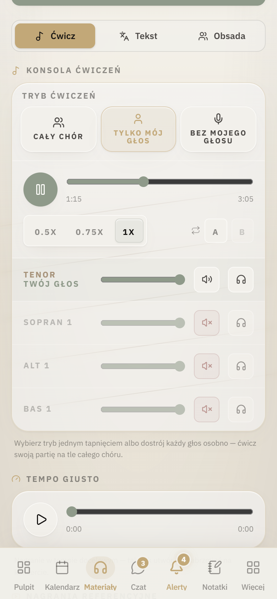
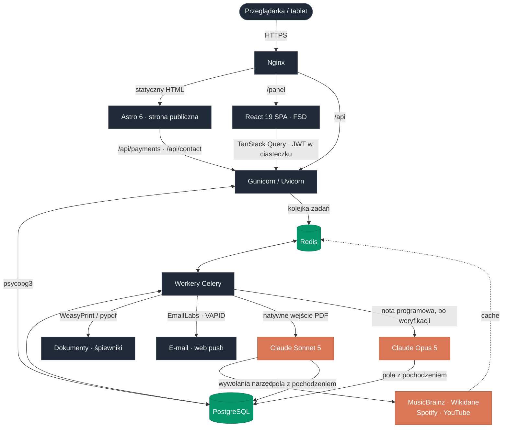

# VoctManager

*Read this in [English](README.md).*


VoctManager obsługuje codzienną pracę VoctEnsemble, zawodowego zespołu wokalnego: obsadę, plany prób, nuty z adnotacjami, umowy i finanse projektów. Ma też pipeline AI, który z PDF-a z nutami robi skatalogowany wpis w archiwum.

Współzałożyłem fundację, która prowadzi zespół, i jestem jedynym programistą tego projektu. Zacząłem w lutym 2026. Wcześniej dyrektor artystyczny, który jest też dyrygentem, robił to wszystko ręcznie: rozpisywał, kto śpiewa którą partię, przygotowywał umowy, składał śpiewnik przed każdym koncertem i przepisywał metadane z PDF-ów.

**Strona publiczna:** [voctensemble.com](https://voctensemble.com) · **Status:** działa na produkcji, zespół korzysta z niego od sierpnia ([szczegóły](#status))

| Pulpit dyrygenta | Weryfikacja wyników AI |
|:---:|:---:|
| <picture><source media="(prefers-color-scheme: dark)" srcset="docs/assets/admin-dashboard-dark.png"></picture> | <picture><source media="(prefers-color-scheme: dark)" srcset="docs/assets/score-compiler-review-dark.png"></picture> |

---

## Status

Pierwszy koncert w systemie (u św. Andrzeja Boboli, maj 2026) to były głównie dane, które wpisałem sam, żeby sprawdzić cały proces. Proces zadziałał, ale dyrygent z niego nie korzystał. Swoją pracę robi świetnie i między próbami nie ma czasu na naukę nowych narzędzi, czego nie przewidziałem. Namówienie go, żeby otworzył aplikację w zwykły wtorek, okazało się trudniejsze niż cała strona techniczna.

Koncert z końca sierpnia poprowadził przez aplikację już sam, a chórzyści korzystali z niej w trakcie koncertu. Teraz trwają próby do kolejnego programu i pracują w niej i dyrygent, i chór. Na bieżąco przysyła mi uwagi, a opisany niżej plan próby powstał z dwóch jego zgłoszeń.

## Co w nim jest

- **Obsada.** Przeciąganiem, z podziałem na sekcje, prowadzącymi sekcji i kolejnością miejsc. Instrumentaliści mają konta i partie tak samo jak śpiewacy.
- **Plany prób.** Kolejność utworów na każdą próbę i osobne okno czasowe dla każdego śpiewaka. [Więcej niżej](#plan-próby).
- **Cyfrowy pulpit.** Czytnik PDF na tablet: kolejne strony wczytane z wyprzedzeniem, pedał Bluetooth, blokada wygaszania ekranu, zoom szczypnięciem. Śpiewacy i dyrygent mogą nanosić na nuty oddechy, dynamikę, widełki, fermaty i odręczne notatki (rysik rysuje, palec przewija). Znaki leżą na czterech warstwach: cały chór, prowadzący próbę, zarząd i prywatna warstwa każdego śpiewaka, której nie widzą nawet managerowie. Pilnuje tego serwer.
- **Ścieżki do ćwiczenia.** Każda linia głosu ma osobne nagranie, a dyrygent może dodać nagranie tempo giusto, czyli swoje wykonanie całego utworu. Śpiewak słucha całego chóru, samego swojego głosu albo wszystkich poza sobą, w tempie 50, 75 albo 100%, z pętlą A/B i kamertonem do dźwięku początkowego.
- **Śpiewniki.** Gotowy do druku skoroszyt z repertuaru projektu: strona tytułowa, spis treści, karta tytułowa przed każdym utworem, ciągła numeracja stron, zakładki PDF, opcjonalnie układ do druku dwustronnego.
- **Nuty licencjonowane.** Każde wydanie ma status prawnoautorski, a niesklasyfikowane traktujemy jak chronione. Chronione nuty zostają w aplikacji i dostają znak wodny generowany na serwerze dla każdego odbiorcy: numer egzemplarza, imię i nazwisko, koncert, data. Znak nie zawiera adresu e-mail, bo te kartki się drukuje i zostawia na pulpitach. Każde pobranie trafia do logu, a przy składaniu śpiewnika system ostrzega, gdy egzemplarzy ma być więcej, niż zespół kupił.
- **Finanse.** Budżety, honoraria, wydatki i granty projektów. [Więcej niżej](#finanse).
- **Wiadomości.** Wątki między śpiewakami a zarządem i kanał ogłoszeń w każdym projekcie, dostarczane w aplikacji, mailem (EmailLabs) i przez web push. Celowo bez statusu obecności i wskaźnika pisania.
- **Darowizny** przez Axepta BNP Paribas, z weryfikacją podpisu MAC i uzgadnianiem płatności w Celery.
- Kalendarze iCal, jasny i ciemny motyw, cztery role (admin, manager, artysta, ekipa) sprawdzane po stronie API.

| Na pulpicie | Ćwiczenie w domu |
|:---:|:---:|
|  | <picture><source media="(prefers-color-scheme: dark)" srcset="docs/assets/materials-singer-dark.png"></picture> |

## Pipeline nut

Po wrzuceniu PDF-a z nutami w ciągu kilku minut w archiwum pojawia się skatalogowany utwór: kompozytor dopasowany do MusicBrainz i Wikidanych, części, tekst śpiewany, IPA wers po wersie i tłumaczenia śpiewne. Dyrygent to przegląda i poprawia. Nota programowa powstaje dopiero potem, z poprawionych danych.

```
upload PDF
  → rusza łańcuch Celery, przeglądarka subskrybuje Server-Sent Events
  → jedno wywołanie Sonneta 5 czyta cały dokument
    (warstwa tekstowa albo skan; tonacja, kompozytor i aranżer,
     części, tekst śpiewany, IPA, tłumaczenia)
  → kompozytor i utwór dopasowane do MusicBrainz (MBID) i Wikidanych (QID)
  → nagrania referencyjne wyszukane w Spotify i YouTube
  → każde pole zapisane razem z pochodzeniem
  → dyrygent sprawdza, poprawia, zatwierdza → publikacja
  → notę programową pisze Opus 5, na żądanie, ze sprawdzonych danych
```

Każde pole, które przyszło z modelu albo z zewnętrznego API, ma zapisane pochodzenie (model, wersja promptu, źródło, pewność, data). Ekran weryfikacji oznacza każde pole kolorową kropką, która mówi, na ile można mu ufać: sprawdzone ręcznie, znalezione w MusicBrainz albo Wikidanych, albo odczytane przez model i jeszcze niesprawdzone. Kliknięcie kropki przy polu, które się zgadza, zatwierdza je bez przepisywania. Pewności, którą podaje sam model, nie pokazujemy, bo wychodziła około 95% niezależnie od tego, czy pole było dobre, czy złe. Kanoniczne identyfikatory pochodzą wyłącznie z MusicBrainz i Wikidanych.

Ponawianie zależy od tego, czy nieudane wywołanie zostało policzone do rachunku ([`ai_client.py`](backend/archive/infrastructure/ai_client.py)):

| Błąd | Płatny? | Co się dzieje |
|---|---|---|
| 529 overloaded, 5xx, 429, timeout połączenia | nie | Ponowienie po kilkudziesięciu sekundach do kilku minut. Interfejs pokazuje „usługa zajęta, ponawiam". |
| Ucięcie na `max_tokens` | tak | Podwojenie budżetu wyjścia i ponowienie, najwyżej dwa razy. Przy tym samym budżecie odpowiedź urwałaby się w tym samym miejscu. |
| 400, autoryzacja, uprawnienia | nie | Łańcuch się zatrzymuje. Ponowienie nic nie da. |

Jeden ingest kosztuje $0.04–0.20. Partytura w całości po polsku jest na dole widełek, bo nie potrzebuje IPA ani tłumaczenia. Są trzy limity wydatków: na jeden przebieg, na wydanie przez cały jego czas życia i dzienny dla całej organizacji, który działa jak bezpiecznik. PDF, który już raz przeszedł przez pipeline, jest rozpoznawany po sumie SHA-256 i model w ogóle nie jest wywoływany. PDF idzie z prompt cachingiem, więc ponowienie po ucięciu czyta go po stawce cache.


<sub>Nagranie prawdziwego przebiegu; 51 sekund pipeline'u skrócone do trzech. Nuty: Giovanni Priuli, <i>Ave dulcissima Maria</i>, skład nutowy <a href="https://www.mutopiaproject.org/">Mutopia Project</a> (CC BY-SA 3.0). Na pulpicie wyżej <i>Ave verum corpus</i> Mozarta w opracowaniu Carla Reineckego, również z Mutopii (CC BY 4.0).</sub>

Szczegóły: [`docs/archive-ai-ingestion-pipeline.md`](docs/archive-ai-ingestion-pipeline.md).

## Plan próby

Dyrygent układa utwory na próbę w kolejności. Każdy wiersz może mieć czas w minutach, notatkę („od t. 40, pierwsze czytanie") i linie głosów, które nie są potrzebne. Sekcyjną definiują litery głosów (S, A, T, B), więc śpiewak dopisany później do obsady jest na nią wołany automatycznie. Z planu każdy śpiewak dostaje własne okno, np. „Twoja część 19:00–20:15", żeby nikt nie czekał na utwory, których nie śpiewa. O to prosił dyrygent. Nazwał to szacunkiem dla czasu ludzi.

Plan trafia do chóru dopiero wtedy, gdy dyrygent go wyśle, a nie przy każdej zmianie. Po próbie odhacza, co zostało zrobione, a siatka utworów i prób pokazuje, ile razy każdy utwór był ćwiczony. Próbę może przekazać asystentowi z konkretnymi uprawnieniami: sprawdzanie obecności, oznaczenia w nutach chóru, otwieranie materiałów.

| Edycja planu | Co widzi tenor |
|:---:|:---:|
|  | <picture><source media="(prefers-color-scheme: dark)" srcset="docs/assets/rehearsal-singer-dark.png"></picture> |

## Finanse

Budżety, honoraria, wydatki i granty projektów w jednej księdze, którą zatwierdza zarząd. Zastąpiła trzy ekrany, z których każdy liczył honoraria po swojemu.

- Każdy zapis idzie przez serwis i trafia do tabeli `FinanceEvent`, do której można tylko dopisywać. Tabela nie ma miękkiego usuwania, więc wpisów nie da się ukryć.
- Umowa zapamiętuje kwotę i wykonawcę z dnia wystawienia. Zmiana któregokolwiek oznacza unieważnienie umowy i wystawienie nowej, a numer unieważnionej przepada.
- Numery umów idą z licznika prowadzonego osobno dla każdego roku i rodzaju umowy, blokowanego przez `select_for_update()` w transakcji wystawienia.
- Pieniądze z grantu przypisuje się do pozycji budżetu i do pojedynczych kosztów. Limity wkładu własnego i kosztów administracyjnych są sprawdzane w ramach każdej umowy dotacyjnej, a plan eksportuje się jako kosztorys do wniosku grantowego.
- Śpiewacy nie widzą w aplikacji żadnych kwot, także swoich.

<picture><source media="(prefers-color-scheme: dark)" srcset="docs/assets/funding-grant-dark.png"></picture>

## Kilka decyzji

**Dwa frontendy.** Panel to SPA w Reakcie, a strona publiczna to osobna aplikacja w Astro. Google Ad Grants wymagał stron, które da się zaindeksować, a SPA pokazywało crawlerom pusty div. Astro generuje statyczny HTML i ładuje Reacta tylko tam, gdzie jest stan: przy darowiźnie, bramce audio i przyklejonym nagłówku.

**Nota programowa powstaje po weryfikacji.** Wcześniej generowała się na końcu pipeline'u z niesprawdzonych danych, więc zły kompozytor albo epoka mogły trafić do drukowanego programu koncertu. Teraz to osobne zadanie, uruchamiane z ekranu weryfikacji albo przy zatwierdzeniu.

**Sonnet 5 czyta, Opus 5 pisze noty.** Nota programowa to jedyny tekst, który publiczność czyta słowo w słowo, więc dostaje mocniejszy model, za około centa więcej na notę. Przejście na nową generację nie sprowadziło się do zmiany stałej: na Sonnecie 5 brak klucza `thinking` oznacza włączone myślenie adaptacyjne, więc zwykła podmiana włączyłaby je z powrotem w jedynym wywołaniu, które je wyłącza.

**Adnotacje odświeżają się przez odpytywanie.** Otwarty pulpit co 20 sekund pyta mały endpoint o odcisk stanu i pobiera znaki tylko wtedy, gdy się zmienił. Przy Server-Sent Events przez całą próbę byłoby otwartych około trzydziestu połączeń, żeby zyskać sekundę czy dwie.

## Co zrobiłem źle

**Pierwszy pipeline był łańcuchem małych wywołań modelu** (tożsamość, części, tekst, tłumaczenia). Każde widziało tylko swój fragment, więc przy znanych hymnach model zwracał tekst kanoniczny zamiast tego, co było wydrukowane. Jedno wywołanie na cały dokument to naprawiło i przy okazji wyszło taniej.

**Przez dwa miesiące mój ewaluator nie miał danych.** Ewaluator na złotym zestawie powstał w czerwcu, a sam zestaw dopiero w sierpniu. Kiedy w końcu zmierzyłem przejście na Sonneta 5, okazało się, że mój powód (lepsze czytanie skanów) nie ma znaczenia, bo archiwum to prawie wyłącznie PDF-y cyfrowe od początku. Sonnet 5 został, bo przy tej samej dokładności był tańszy i szybszy. Zestaw nadal daje 100% w każdej konfiguracji, więc jeszcze ich nie rozróżnia.

**Adnotacje offline nie działały, a byłem pewien, że działają.** Zapisy szły prosto do API. Gdy zapis się nie udał, aktualizacja optymistyczna była cofana, a błąd połykany, więc znak postawiony bez zasięgu po prostu znikał. Pobieranie koncertu na offline pomijało też adnotacje. Teraz identyfikator znaku nadaje klient, więc znak można edytować i zmazać, zanim zobaczy go serwer. Zapisy do tego samego znaku są w kolejce scalane (utworzenie, a po nim zmazanie, nie wysyła nic), a ponowione utworzenie nie przywraca zmazanego znaku. Pełnego cyklu offline i powrotu do sieci na prawdziwym tablecie jeszcze nie sprawdziłem.

**Testy pisałem najpierw do pipeline'u AI**, bo tam były ciekawe błędy. Umowy, obecności i honoraria dostały testy późno, a prawdziwe błędy wychodziły właśnie tam.

## Utrzymanie

- Dwa endpointy zdrowia: `/api/health/` do liveness (niczego nie dotyka) i `/api/health/ready/` do readiness (Postgres i Redis). Redis jest sprawdzany zapisem i odczytem klucza, bo Redis na `maxmemory` z `noeviction` dalej odpowiada na `PING`.
- Zadanie Celery beat pinguje zewnętrzny monitor heartbeat, a alert przychodzi, gdy pingi ustają.
- Sentry, monitoring dostępności i ważności certyfikatu TLS.
- Codzienne kopie zapasowe poza serwerem i próba odtworzenia ([`infra/restore-drill.sh`](infra/restore-drill.sh)), która wgrywa je do tymczasowej bazy i sprawdza liczby wierszy, pliki mediów i stan migracji. Instrukcje: [`docs/backups.md`](docs/backups.md), [`docs/monitoring.md`](docs/monitoring.md).
- CI puszcza ruff, mypy (strict) i testy backendu na PostgreSQL 16 przy każdym pushu.
- Testy frontendu obejmują zapisy, których nie da się cofnąć (publikacja projektu wysyła mail do całego chóru; RSVP, obecności i aktywacja konta działają w czyimś imieniu), oraz logikę, która musi się zgadzać z serwerem, np. liczenie honorariów. Resztę panelu sprawdzam ręcznie.
- Ewaluator na złotym zestawie przepuszcza prawdziwe partytury przez działający pipeline i mierzy dokładność pól, koszt i czas.

## Czego nie robię

- **Prometheus, Grafana, OpenTelemetry.** Jeden droplet, jedna osoba do utrzymania, brak SLO. To, co muszę wiedzieć, mówią mi Sentry i health checki.
- **Replikacja Postgresa.** Replika na tym samym droplecie dzieli z bazą dysk i zasilanie. Utratę instancji pokrywają kopie zapasowe, których odtwarzanie jest przetestowane.
- **Klaster Redisa.** Jedna instancja wystarcza na cache i brokera Celery.

## Otwarte

- [ ] Przypadki w złotym zestawie, które faktycznie różnicują konfiguracje modelu
- [ ] Drukowanie wspólnej warstwy adnotacji w śpiewniku
- [ ] Szyfrowanie Fernet w spoczynku dla pól umów i finansów; niezmienność logu finansów wymuszona na poziomie bazy
- [ ] CI frontendu i testy end-to-end w Playwright
- [ ] Rate limiting na brzegu (Cloudflare + WAF) obok throttlingu DRF
- [ ] Automatyczne testy dostępności wobec wymagań EAA
- [ ] Deploy bez przestoju

## Stack

**Backend:** Python 3.13, Django 6, DRF, PostgreSQL (psycopg 3), Redis, Celery, DTO w Pydanticu na granicy serwisów. Logowanie przez JWT w ciasteczku `httpOnly`, `Secure`, `SameSite=Lax` z CSRF double-submit, więc SPA nie ma dostępu do tokenu.

**Panel:** React 19, Vite 7, TypeScript 5.9, Feature-Sliced Design, TanStack Query v5, Zustand, Tailwind v4, Framer Motion, React Hook Form + Zod, Radix.

**Strona publiczna:** Astro 6 z wyspami Reacta, ręcznie pisany CSS, fonty hostowane u siebie (bez zewnętrznego CDN, więc adresy IP odwiedzających nie trafiają do nikogo trzeciego), View Transitions.

**Dokumenty i AI:** WeasyPrint, pypdf, pypdfium2. SDK Anthropic jest przypięte do konkretnej wersji, bo pipeline zależy od zachowań, które zmieniają się między wersjami: natywnego wejścia PDF, structured outputs, prompt cachingu, myślenia adaptacyjnego.

**Infrastruktura:** Docker Compose (ta sama konfiguracja na dev i prod), Nginx, Gunicorn z workerami Uvicorn, GitHub Actions, Sentry.

## Architektura


```mermaid
graph TD
    Client([Przeglądarka / tablet]) -->|HTTPS| Nginx[Nginx]

    Nginx -->|statyczny HTML| Astro[Astro 6 · strona publiczna]
    Nginx -->|/panel| React[React 19 SPA · FSD]
    Nginx -->|/api| Gunicorn[Gunicorn / Uvicorn]

    Astro -->|/api/payments · /api/contact| Gunicorn
    React -->|TanStack Query · JWT w ciasteczku| Gunicorn

    Gunicorn <-->|psycopg3| DB[(PostgreSQL)]
    Gunicorn -->|kolejka zadań| Redis[(Redis)]

    Redis <--> Celery[Workery Celery]
    Celery <--> DB
    Celery -->|WeasyPrint / pypdf| Files[Dokumenty · śpiewniki]
    Celery -->|EmailLabs · VAPID| Notify[E-mail · web push]

    Celery -->|natywne wejście PDF| Claude[Claude Sonnet 5]
    Claude -->|wywołania narzędzi| Ext[MusicBrainz · Wikidane<br/>Spotify · YouTube]
    Ext -.->|cache| Redis
    Claude -->|pola z pochodzeniem| DB

    Celery -->|nota programowa, po weryfikacji| Opus[Claude Opus 5]
    Opus -->|pola z pochodzeniem| DB

    classDef default fill:#1f2937,stroke:#4b5563,color:#f3f4f6;
    classDef db fill:#059669,stroke:#047857,color:#ffffff;
    classDef ai fill:#D97757,stroke:#b85c3e,color:#ffffff;
    class DB,Redis db;
    class Claude,Ext,Opus ai;
```

Łańcuch ingestu to `prepare_document → analyze_score → resolve_composer_and_piece → persist_analysis → lookup_spotify → lookup_youtube → finalize_edition`. `generate_program_note` działa osobno, po weryfikacji. Postęp płynie z asynchronicznego endpointu ASGI (`GET /api/archive/editions/<id>/events/`), więc produkcja chodzi na `gunicorn config.asgi -k uvicorn.workers.UvicornWorker`.

## Uruchomienie lokalne

Potrzebne: Docker, Compose v2 i GNU Make.

```bash
git clone https://github.com/bedikryst/VoctManager.git
cd VoctManager
cp .env.example .env
cp frontend/.env.example frontend/.env
make up
make migrate && make seed && make superuser
```

`make seed` tworzy realistyczny zestaw danych: 28 śpiewaków w każdym stanie konta (aktywne, zaproszone, zarchiwizowane), organistę i pianistkę, 2 dyrygentów, 5 osób ekipy i 8 projektów na każdym etapie wraz ze śpiewnikami. Jeden z nich, msza za kilka dni, pokazuje nowsze funkcje: skład czytany sekcjami, z liderami sekcji, asystenta dyrygenta, plany prób (dwie odbyte próby odhaczone i opisane, najbliższa wysłana chórowi, próba sekcyjna i generalna z instrumentalistami) oraz nuty z oznaczeniami na wszystkich czterech warstwach. Finanse pokrywają każdy stan budżetu: zakończony koncert z zamkniętym budżetem, podpisanymi umowami o kolejnych numerach i rozliczonym grantem, mszę z zatwierdzonym planem i częścią kosztów zapłaconą oraz projekty robocze na etapie planowania. Do tego wiadomości, darowizny, oczekujące ogłoszenia, powiadomienia i notatnik. Można go uruchamiać wielokrotnie. Loguje się adresem e-mail: `admin@voctmanager.test / admin123`, `manager@voctmanager.test / manager123`, `crew@voctmanager.test / crew123`, a śpiewacy jako `singer00@voctmanager.test / password123` i kolejne. Istniejący już użytkownik `admin` zachowuje swój adres.

```bash
python manage.py seed_db --artists 12 --no-media   # mniej danych, szybciej
python manage.py seed_db --clear                   # wyczyść i zasiej od nowa
python manage.py seed_db --seed 2026               # powtarzalnie
```

- API: `http://localhost:8000/api/`
- Dokumentacja OpenAPI: `http://localhost:8000/api/docs`
- Panel: `http://localhost:5173/panel` (`cd frontend && npm install && npm run dev`)
- Strona publiczna: `http://localhost:4321` (`cd web && npm install && npm run dev`)

Build Astro potrzebuje zdjęć w `web/src/assets/photos/` i filmów w `web/src/assets/videos/`. Oba katalogi są w `.gitignore` (oryginały należą do współpracowników), a bez nich build zatrzymuje się z błędem.

## Deploy

```bash
cd ~/VoctManager && git pull && make deploy
```

`make deploy` wykonuje `gc → build → up -d → migrate → migrate --check → gc` i zatrzymuje się na pierwszym błędzie. Migracje nie uruchamiają się same, a `migrate --check` wywala deploy, jeśli jakaś została. `frontend/Dockerfile` buduje panel (Vite) i stronę publiczną (Astro + Sharp) i serwuje oba z jednego obrazu `nginx:1.27`, więc na serwerze nie ma Node'a. Build potrzebuje około 3 GB wolnego RAM-u, a [`infra/docker-gc.sh`](infra/docker-gc.sh) sprząta stare warstwy przed buildem i po nim.

## Zbudowane z Claude Code

Codziennie pracuję z Claude Code i wiele commitów ma go jako współautora. Decyzje produktowe, architektura, limity kosztów i to, czego nie budujemy, są moje.

---

**Krystian Bugalski** · [GitHub](https://github.com/bedikryst) · [LinkedIn](https://www.linkedin.com/in/krystian-bugalski) · krystian@bugalski.dev
